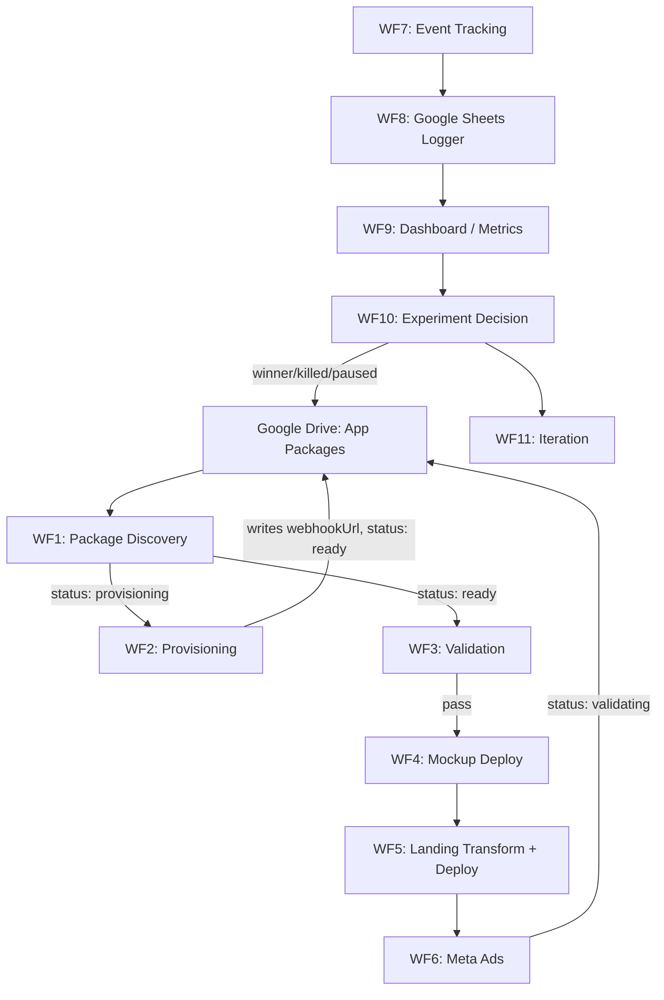

# AI Implementation Guide

This document is written for future AI assistants (ChatGPT, Cursor, Codex, Claude, etc.). Its purpose is to onboard a brand-new chat session onto this project so development can continue without reconstructing prior conversations.

Read this file first. Then read [N8N_PLATFORM_ARCHITECTURE.md](N8N_PLATFORM_ARCHITECTURE.md) for the full system architecture. Follow the canonical documents linked throughout.

---

# Project Vision

We are building a **fully automated validation platform for software ideas**.

The platform should eventually run end-to-end with minimal human intervention:

1. **Create** new App Packages (structured folders describing an app idea)
2. **Generate** interactive mockups (React/Vite prototypes)
3. **Generate** premium landing pages (from package data)
4. **Deploy** mockups and landing pages (Vercel)
5. **Provision** tracking (n8n webhooks, analytics IDs)
6. **Launch** paid ads (Meta/Facebook)
7. **Collect** analytics (webhook events → Google Sheets → dashboard)
8. **Determine** winners and losers (experiment decision rules)
9. **Iterate** automatically (new variants, copy tests, budget adjustments)

**n8n** is the orchestration engine. It reads packages, validates them, deploys artifacts, provisions infrastructure, routes events, and drives experiment lifecycle.

**App Packages** are the Single Source of Truth (SSOT). Every app-specific value—copy, pricing, branding, experiment design, ad creative, tracking IDs—lives in the package. Shared projects (landing template, transform scripts, n8n workflows) translate and render; they never own app data.

---

# Core Philosophy

These architectural principles are already decided. Do not violate them without an explicit spec change.

## App Package owns app-specific data

Each app idea is a folder (`{appId}/`) with `app.json` as the canonical manifest, plus `copy/`, `media/`, `mockup/`, and optional `docs/`. All identity, audience, commerce, branding, experiment, ads, and tracking configuration live here.

## Landing Template renders only

`landing-template/` is a config-driven Next.js site. It reads `app-data/app-config.json` and renders. It does not import mockup source code. It does not contain app-specific copy, benefits, or branding defaults tied to a particular idea.

## n8n orchestrates but does not own app data

n8n workflows read from Google Drive, validate, transform, deploy, write results back to `app.json`, and route events. Workflow logic is generic and metadata-driven. App-specific content is never hardcoded inside n8n nodes.

## Generated files are disposable

`landing-template/app-data/app-config.json` and `app-data/images/` are **outputs** of the transform step. They are regenerated from the App Package on every deploy. Do not treat them as source of truth. Do not edit them directly when working on an app idea—edit the package and re-run the transform.

## Shared projects must never contain app-specific values

`landing-template/scripts/generate-app-config.js`, n8n workflow templates, and any shared tooling must use **generic fallbacks only** (e.g. `"Coming soon to the App Store"` when `platform === "ios"`). Never embed Human Lab copy, Human Lab pricing, or any other app-specific content in shared code.

## Automation is driven by metadata, not hardcoded logic

Branch on `status`, read fields from `app.json`, respect `experiment.decisionRules`, expand `ads.utmTemplate` placeholders. Adding a new app idea should require creating a new App Package—not modifying shared projects.

## appId is immutable after first deploy

`appId` is the folder name, URL slug default, analytics key, and ad campaign anchor. Renaming it breaks links, historical data, and deployed resources.

## Status is the pipeline state machine

`status` on `app.json` drives what n8n does next:

```
draft → provisioning → ready → validating → winner → built
                              ↓           ↓
                           paused      killed
```

## deployment fields are automation write-backs

`deployment.mockup.*`, `deployment.landing.*`, `mockup.previewUrl`, and `tracking.webhookUrl` start as `null`. n8n writes them after provisioning and deploy steps. Humans should not hand-edit these except for recovery.

## Copy lives outside JSON when long-form

`copy/*.md` holds hero, benefits, features, and FAQ prose. `app.json` declares structure and references. This keeps the manifest scannable and AI-friendly.

---

# Repository Overview

The workspace root contains five major projects plus a placeholder for future n8n workflows.

```
App-Validation-System/
├── app-validation-spec/     # Contract and schema (SSOT for data shape)
├── app-package-starter/     # Copy-paste scaffold for new app ideas
├── landing-template/        # Shared Next.js landing page renderer
├── test-app-packages/       # Local App Packages for development
├── n8n-workflows/           # Placeholder — workflows not yet built
└── AI_IMPLEMENTATION_GUIDE.md  # This file
```

## app-validation-spec

**Owns:** The normative App Package contract.

| Asset | Purpose |
|-------|---------|
| `APP_PACKAGE_SPEC.md` | Human-readable field reference (spec version **1.3.0**) |
| `schemas/app.schema.json` | Machine-readable JSON Schema |
| `templates/` | Starter `app.json` and `copy/` files |
| `examples/minimal-app/` | Smallest valid package (Focus Timer, `status: draft`) |
| `examples/full-app/` | Complete reference package (Habit Stack, `status: provisioning`) |
| `docs/` | Design philosophy, workflow mapping, n8n notes, naming, versioning, validator gate |

**Consumes:** Nothing at runtime. This is documentation and contract only.

**Outputs:** The schema and docs that all other projects must follow.

**Key docs to read:**
- `APP_PACKAGE_SPEC.md`
- `docs/design-philosophy.md`
- `docs/workflow.md`
- `docs/n8n-integration-notes.md`
- `docs/validator-gate.md`

## app-package-starter

**Owns:** A reusable scaffold folder for creating new App Packages.

**Consumes:** `app-validation-spec` (schema, spec docs).

**Outputs:** A copied-and-customized App Package (placed in `test-app-packages/` or Google Drive).

**Contents:**
- `app.json` with TODO placeholders
- `copy/` markdown templates
- `mockup/` React + Vite interactive prototype
- `media/` asset placeholders
- `docs/validation-plan.md` internal planning notes
- `START_HERE.md` — rules for AI assistants creating new packages

**Workflow:** Duplicate → rename to `{appId}` → fill placeholders → build mockup → transform to landing config → preview.

## landing-template

**Owns:** The shared Next.js landing page renderer and the App Package → `app-config.json` transform.

**Consumes:**
- `app-data/app-config.json` (generated)
- `app-data/images/` (copied from package `media/`)

**Outputs:**
- Deployable static/SSR landing page (Vercel)
- Webhook POST payloads on user interactions

**Key files:**
- `app-data/app-config.json` — all render-time config (disposable output)
- `scripts/generate-app-config.js` — transform from App Package
- `scripts/APP_PACKAGE_TRANSFORM.md` — field mapping reference
- `lib/tracking.ts` — event types and payload shape
- `components/` — config-driven UI sections

**Does NOT consume:** Mockup source code. Only `mockup.embedUrl` (deployed mockup URL).

## test-app-packages

**Owns:** Local App Packages used for development and testing.

**Current contents:**
- `human-lab/` — reference implementation (`appId: human-lab`, `status: draft`, `specVersion: 1.3.0`)

**Consumes:** Same structure as any App Package on Google Drive.

**Outputs:** Built mockup (`mockup/dist/`), transformed landing config (when transform is run).

**Note:** `docs/` inside a package is internal research only—not consumed by the landing transform or n8n copy loaders.

## n8n-workflows

**Owns:** Future n8n workflow JSON exports.

**Current state:** Empty placeholder directory. No workflows have been built yet.

**Will consume:** App Packages from Google Drive, Vercel/Meta/Sheets APIs.

**Will output:** Deployed artifacts, webhook URLs, Google Sheet rows, `app.json` write-backs, ad campaigns.

---

# Current State

## What is implemented

### Phase 1: App Package Specification (complete)

- Spec version **1.3.0** with JSON Schema
- Normative docs: design philosophy, workflow mapping, n8n integration notes, naming conventions, versioning, validator gate
- Templates and two example packages (minimal and full)
- Status lifecycle including `provisioning` stage
- Nested `deployment.mockup.*` and `deployment.landing.*` write-back model
- Canonical `tracking.webhookUrl` for unified event routing

### Landing Template (functional)

- Config-driven Next.js landing page with Apple-inspired design
- Theme system (`liquid-glass`, `midnight`, accent colors, light/dark mode)
- Sections: hero, benefits, features, screenshots, pricing, email capture, FAQ, mockup embed, footer
- Client-side tracking: `page_view`, `buy_now_clicked`, `email_captured`, `mockup_interacted`
- UTM and referrer capture, visitor/session IDs
- `scripts/generate-app-config.js` — App Package → `app-config.json` transform
- `scripts/APP_PACKAGE_TRANSFORM.md` — complete field mapping documentation
- Local dev workflow: transform package → `npm run dev` in landing-template

### App Package Starter (functional)

- Copy-and-customize scaffold with React + Vite mockup
- `START_HERE.md` with AI authoring rules
- Root `package.json` delegating to `mockup/` for `npm run dev` / `npm run build`
- Embed mode support in mockup (`?embed=1`)

### Reference App Package: human-lab

- Complete `app.json` with all major sections
- File-based copy (`copy/hero.md`, `benefits.md`, `features.md`, `faq.md`)
- Working mockup source
- Internal docs (validation plan, testing strategies)
- `status: draft` — not yet through provisioning pipeline

### Local development workflow (manual)

```bash
# From package root (e.g. test-app-packages/human-lab/)
npm install && npm run dev    # mockup at localhost:5173

# From landing-template/
node scripts/generate-app-config.js ../test-app-packages/human-lab
npm run dev                   # landing page at localhost:3000
```

## What has intentionally NOT been built yet

| Component | Status | Notes |
|-----------|--------|-------|
| n8n workflows | Not started | `n8n-workflows/` is empty |
| Validator CLI | Phase 2 (deferred) | Schema exists; profile gates documented in `validator-gate.md` |
| Google Drive integration | Not started | Documented in n8n integration notes |
| Automated mockup deploy | Not started | `deployCommand` in `app.json` is metadata only |
| Automated landing deploy | Not started | Manual Vercel deploy possible today |
| Webhook provisioning | Not started | `tracking.webhookUrl` stays `null` until n8n runs |
| Meta/Facebook ad creation | Not started | `ads` section is authored but not consumed |
| Google Sheets event logging | Not started | Column order documented; no workflow |
| Analytics dashboard | Not started | `analytics.*` IDs are placeholders |
| Automated iteration | Not started | Decision rules exist in spec only |
| Real screenshot binaries in examples | Intentionally omitted | Paths documented; placeholders used |

## Repository as it exists today

This is a **contract + renderer + starter** foundation. The data model, landing page, transform pipeline, and one reference package work locally. The automation layer (n8n) does not exist yet. No package has progressed past `draft` in production.

---

# Upcoming Phase

The immediate next phase is building the **n8n automation platform**. Expected build order:

| Step | Workflow | Purpose |
|------|----------|---------|
| 1 | **Package discovery** | Poll Google Drive parent folder; list `{appId}/` folders; read `app.json`; branch on `status` |
| 2 | **Validation** | JSON Schema check; file existence; profile gates (`experiment` complete, analytics IDs present); block deploy on failure |
| 3 | **Provisioning** | Create n8n webhook endpoint; write `tracking.webhookUrl`; promote `status` from `provisioning` → `ready` |
| 4 | **Deployment** | Build and deploy mockup to Vercel; run landing transform; deploy landing page to Vercel; write back `deployment.*` URLs |
| 5 | **Tracking** | Receive landing webhook POSTs; normalize payloads; route by `eventType` |
| 6 | **Google Sheets** | Append one row per event to a unified sheet; canonical column order |
| 7 | **Dashboard** | Aggregate sheet data; compare against `experiment.successCriteria` and `decisionRules` |
| 8 | **Meta advertising** | Create campaigns from `ads` section; destination = `deployment.landing.url` + expanded UTM; respect `experiment.testBudget` |
| 9 | **Automated iteration** | Evaluate experiment outcomes; set `status` to `winner` / `killed` / `paused`; optionally spawn variant packages |

Each step should be a discrete n8n workflow or sub-workflow, callable independently for testing.

---

# Expected n8n Architecture

## High-level workflow graph



## Workflow responsibilities

### WF1: Package Discovery

- Schedule trigger (poll every N minutes) or manual trigger by `appId`
- List child folders of configured Drive parent (`App Validation/{appId}/`)
- Read `app.json`; confirm `appId === folderName`
- Route by `status`:
  - `provisioning` → WF2
  - `ready` → WF3
  - `validating` → WF9 (monitoring)
  - `draft`, `paused`, `winner`, `killed`, `built` → skip (unless manual override)

### WF2: Provisioning

- Trigger: `status === "provisioning"`
- Create n8n Webhook node URL
- Merge-write `tracking.webhookUrl` to `app.json` on Drive
- Set `status: "ready"`
- Gate: full `experiment`, `ads`, and `analytics` sections must be complete (validator checks)

### WF3: Validation

- JSON Schema validation against `schemas/app.schema.json`
- Verify referenced files exist (`copy/*.md`, `media/*`, `mockup/` source)
- Verify `tracking.webhookUrl` is non-null
- On success: fire `tracking.webhooks.validationComplete` (if set); proceed to deploy
- On failure: notify author; do not deploy; leave `status` at `ready` or revert to `draft`
- Optionally set `status: "validating"` when ads launch

### WF4: Mockup Deploy

- Read `mockup.installCommand`, `buildCommand`, `deployCommand`
- Build from `mockup.sourcePath`
- Deploy to Vercel (one project per mockup)
- Write back:
  - `mockup.previewUrl`
  - `deployment.mockup.url` (must match `previewUrl`)
  - `deployment.mockup.vercelProjectId`
  - `deployment.mockup.lastDeployedAt`

### WF5: Landing Transform + Deploy

- Run equivalent of `generate-app-config.js` against package
- Copy `media/screenshots/*`, logo, og-image to landing build
- Set `mockup.embedUrl` from `deployment.mockup.url`
- Deploy landing-template to Vercel (one project per landing page)
- Write back:
  - `deployment.landing.url` (canonical public URL — ad destination)
  - `deployment.landing.deploymentUrl` (latest Vercel deployment URL)
  - `deployment.landing.vercelProjectId`
  - `deployment.landing.lastDeployedAt`
- Fire `tracking.webhooks.deployComplete` (if set)

### WF6: Meta Ads

- Read `ads.campaignName`, `headlines`, `primaryTexts`, `platforms`, `utmTemplate`
- Destination: `deployment.landing.url` + expanded UTM params
- Budget: `experiment.testBudget.amount`, `durationDays`
- Use `media.ogImage` and screenshots for creatives

### WF7: Event Tracking

- Webhook trigger receiving landing page POSTs
- Validate payload shape (`eventType`, `appId`, attribution fields)
- Fan out to Google Sheets and optional per-event webhooks

### WF8: Google Sheets Logger

- Append one row per event
- Canonical column order (see Tracking Philosophy below)
- Never discard events — store everything

### WF9: Dashboard / Metrics

- Read sheet data filtered by `experimentId`, `experimentRunId`
- Compute CPA, conversion rates, mockup interaction rate
- Compare against `experiment.successCriteria` and `decisionRules`

### WF10: Experiment Decision

- Evaluate `winnerThreshold`, `killThreshold`, `minSampleSize`
- Write `status: "winner"` or `status: "killed"` or `status: "paused"` to `app.json`
- Stop or scale ads accordingly

### WF11: Iteration (future)

- Clone package with new `landingVariantId` or copy changes
- Re-enter pipeline at `ready` or `provisioning`

## Package write-backs

n8n **merges** updates into `app.json` on Drive. Never replace the entire file blindly. Never modify `appId` or `specVersion`.

| After step | Fields written |
|------------|----------------|
| Provisioning | `tracking.webhookUrl`, `status: "ready"` |
| Mockup deploy | `mockup.previewUrl`, `deployment.mockup.*` |
| Landing deploy | `deployment.landing.*`, optionally `deployment.githubRepoUrl` |
| Ads launch | `status: "validating"` |
| Decision | `status: "winner"` / `"killed"` / `"paused"` |

Write-back safety: read full file → merge in memory → upload atomically → log previous values.

## Deployment lifecycle

**v1 model:** one Vercel project per mockup, one Vercel project per landing page.

```
1. Package at status: ready
2. Validate → deploy mockup → write deployment.mockup.*
3. Transform package → deploy landing → write deployment.landing.*
4. deployment.landing.url becomes ad destination
5. Mockup URL embedded in landing via mockup.embedUrl (from deployment.mockup.url)
6. Landing never imports mockup source — iframe only
```

---

# Tracking Philosophy

## Fake-door validation

The platform validates demand **before building a real product**. The landing page presents a polished app concept with pricing, a live mockup embed, and purchase CTAs—but no actual App Store product exists. User actions (email signup, Buy Now click) measure intent, not completed purchases.

## Buy Now vs Keep Me Updated

Two conversion paths with different signal strength:

| Path | UI | `eventType` | Signal |
|------|-----|-------------|--------|
| **Buy Now** | Pricing section fake-door form (email + purchase intent) | `buy_now_clicked` | Strong — user believes they are buying |
| **Keep Me Updated** | Waitlist / email capture section | `email_captured` | Moderate — interest without purchase intent |

Both capture email. Buy Now also records `price` from the pricing block. These map to `commerce.cta.buyNowText` and `commerce.cta.waitlistText` in the App Package.

## Event types

All events share the same JSON payload shape. Differentiate by `eventType`:

| eventType | When fired |
|-----------|------------|
| `page_view` | Once on landing page load |
| `buy_now_clicked` | Pricing fake-door form submit |
| `email_captured` | Waitlist / Keep Me Updated form submit |
| `mockup_interacted` | First expand or click on embedded mockup |

Defined in `landing-template/lib/tracking.ts` as `TRACKING_EVENTS`.

## Attribution

Every event carries attribution fields for experiment analysis:

| Field | Source |
|-------|--------|
| `experimentId` | `analytics.experimentId` — experiment family |
| `experimentRunId` | `analytics.experimentRunId` — immutable run for one validation cycle |
| `projectId` | `analytics.projectId` — analytics project |
| `landingVariantId` | `analytics.landingVariantId` — copy/layout variant |
| `mockupVersionId` | `analytics.mockupVersionId` — mockup build variant |
| `deploymentId` | `deployment.landing.vercelProjectId` or deployment URL |
| `landingVersion` | `deployment.landing.lastDeployedAt` |
| `campaignName` | `ads.campaignName` |
| `visitorId` | Client-generated (localStorage) |
| `sessionId` | Client-generated (sessionStorage) |
| `utmSource/Medium/Campaign/Content/Term` | Parsed from URL on page load |
| `referrer` | `document.referrer` |
| `timeOnPageSeconds` | Client-computed session metric |
| `mockupInteracted` | Boolean session flag |

UTM params come from `ads.utmTemplate` (structured object preferred; legacy string supported). Placeholders: `{{appId}}`, `{{headline_variant}}`.

## Google Sheet usage

n8n appends **one row per webhook payload** to a unified Google Sheet. All event types share one sheet; filter and pivot by `eventType`.

Canonical column order:

```
timestamp | eventType | appId | appName | experimentId | experimentRunId | projectId | deploymentId | landingVersion | landingVariantId | mockupVersionId | campaignName | visitorId | sessionId | email | price | pageUrl | referrer | utmSource | utmMedium | utmCampaign | utmContent | utmTerm | timeOnPageSeconds | mockupInteracted
```

## Why everything is stored

- **No sampling.** Every event is logged for audit and re-analysis.
- **Raw data preservation.** Dashboard metrics are computed from stored rows, not live-only aggregates.
- **Attribution debugging.** UTM, referrer, and session fields enable post-hoc analysis when campaigns underperform.
- **Variant comparison.** `landingVariantId` and `mockupVersionId` enable A/B analysis across iterations.
- **Decision reproducibility.** `experimentRunId` ties all events to one validation cycle for winner/kill decisions.

## Webhook routing

- **Canonical:** `tracking.webhookUrl` — all four event types POST here (preferred since spec 1.3.0)
- **Legacy fallbacks:** `tracking.webhooks.buyNowClicked`, `tracking.webhooks.emailCaptured`
- **Pipeline webhooks (n8n-only):** `validationComplete`, `deployComplete` — not sent by landing page

---

# AI Development Rules

Future AI assistants must follow these rules when modifying this codebase.

## Don't reinvent existing systems

Before creating new fields, workflows, folders, or transform mappings, verify the feature does not already exist. Search these sources first:

| Source | What to check |
|--------|---------------|
| [app-validation-spec/APP_PACKAGE_SPEC.md](app-validation-spec/APP_PACKAGE_SPEC.md) | Field definitions, section structure, lifecycle rules |
| [app-validation-spec/schemas/app.schema.json](app-validation-spec/schemas/app.schema.json) | Machine-readable schema, enums, required fields |
| [landing-template/scripts/APP_PACKAGE_TRANSFORM.md](landing-template/scripts/APP_PACKAGE_TRANSFORM.md) | Package → `app-config.json` mappings and known gaps |
| [landing-template/scripts/generate-app-config.js](landing-template/scripts/generate-app-config.js) | Actual transform implementation |
| [landing-template/lib/appData.ts](landing-template/lib/appData.ts) | Config types and runtime fields |
| [app-validation-spec/docs/n8n-integration-notes.md](app-validation-spec/docs/n8n-integration-notes.md) | Intended n8n workflows, write-backs, Sheet schema |
| [N8N_PLATFORM_ARCHITECTURE.md](N8N_PLATFORM_ARCHITECTURE.md) | Architecture, data flow, n8n Definition of Done |

If the capability already exists, **extend or wire it up**—do not duplicate it under a new name, folder, or field. New spec fields require a coordinated update to schema, spec doc, templates, examples, transform, and CHANGELOG.

## Never introduce app-specific values into shared projects

Do not add Human Lab copy, pricing, branding, or feature text to `landing-template/`, `generate-app-config.js`, or n8n workflow templates. App-specific content belongs only in App Packages.

## Verify existing architecture before changing contracts

Read `APP_PACKAGE_SPEC.md`, `schemas/app.schema.json`, and `APP_PACKAGE_TRANSFORM.md` before adding fields or changing mappings. Schema and spec must stay synchronized.

## Keep App Package as SSOT

When adding a new landing page field, add it to the spec first, then the package, then the transform, then the landing template. Never add render-only fields that cannot round-trip to the package.

## Prefer extending metadata over adding hardcoded logic

New behavior should be driven by `app.json` fields, `status` transitions, or `experiment.decisionRules`—not `if (appId === "human-lab")` branches.

## Keep documentation synchronized with implementation

When changing the transform, update `APP_PACKAGE_TRANSFORM.md`. When changing the spec, update `APP_PACKAGE_SPEC.md`, `app.schema.json`, `CHANGELOG.md`, templates, and examples together.

## Treat architecture documents as canonical

These docs override informal assumptions:

| Document | Authority |
|----------|-----------|
| `N8N_PLATFORM_ARCHITECTURE.md` | System architecture, n8n design, data flow |
| `app-validation-spec/APP_PACKAGE_SPEC.md` | Field definitions |
| `app-validation-spec/schemas/app.schema.json` | Machine validation |
| `app-validation-spec/docs/design-philosophy.md` | Design decisions |
| `app-validation-spec/docs/workflow.md` | Pipeline stages |
| `app-validation-spec/docs/n8n-integration-notes.md` | n8n wiring |
| `app-validation-spec/docs/validator-gate.md` | Pre-deploy checks |
| `landing-template/scripts/APP_PACKAGE_TRANSFORM.md` | Transform mapping |
| `app-package-starter/START_HERE.md` | Package authoring rules |

## If uncertain, preserve extensibility over short-term convenience

Add optional fields with defaults. Do not remove fields without a spec version bump. Do not collapse `experiment` and `analytics` into one section. Do not embed mockup source in the landing template.

## Package authoring rules (when creating new App Packages)

- Read `app-package-starter/START_HERE.md` first
- Ask the user for app name, audience, pricing, features, theme, hypothesis before generating
- Use generic folder names: `copy/`, `media/`, `mockup/`, `docs/`
- Record framework in `app.json` → `mockup.framework` only
- Leave `deployment.*`, `tracking.webhookUrl`, and `mockup.previewUrl` as `null`
- Keep `status: draft` until the package is complete

## Transform rules

- `generate-app-config.js` translates only—no app-specific content
- Generic fallbacks are allowed (documented in `APP_PACKAGE_TRANSFORM.md`)
- Copy `media/screenshots/*` to `app-data/images/` during transform
- `mockup.embedUrl` comes from `deployment.mockup.url` or `mockup.previewUrl`

---

# Before Making Changes

Every AI assistant should complete this checklist before modifying code or specs.

## 0. Verify nothing already exists

Before adding a new field, workflow, folder, or mapping:

- [ ] Searched `APP_PACKAGE_SPEC.md` and `app.schema.json` for an existing field or section
- [ ] Searched `APP_PACKAGE_TRANSFORM.md` and `generate-app-config.js` for an existing mapping
- [ ] Searched `landing-template/` for existing component or config support
- [ ] Searched `app-validation-spec/docs/` and `N8N_PLATFORM_ARCHITECTURE.md` for documented behavior
- [ ] Confirmed the change is not duplicating an existing capability under a different name

## 1. Read architecture docs

- [ ] `AI_IMPLEMENTATION_GUIDE.md` (this file)
- [ ] `N8N_PLATFORM_ARCHITECTURE.md`
- [ ] `app-validation-spec/APP_PACKAGE_SPEC.md`
- [ ] `app-validation-spec/docs/design-philosophy.md`
- [ ] Relevant section of `app-validation-spec/docs/workflow.md`

## 2. Verify schema

- [ ] Check `app-validation-spec/schemas/app.schema.json` for field names, types, and required sections
- [ ] Confirm `specVersion` is **1.3.0**
- [ ] If adding fields: update schema, spec, templates, examples, and CHANGELOG together

## 3. Verify transform

- [ ] Read `landing-template/scripts/APP_PACKAGE_TRANSFORM.md`
- [ ] Confirm new package fields have a mapping to `app-config.json` (or document as intentionally unmapped)
- [ ] Run transform locally: `node scripts/generate-app-config.js <package-path>`

## 4. Verify starter

- [ ] Check `app-package-starter/START_HERE.md` for authoring conventions
- [ ] Confirm folder structure matches spec (`copy/`, `media/`, `mockup/`)
- [ ] Confirm mockup builds: `npm run build` from package root

## 5. Verify landing

- [ ] Confirm `landing-template` reads from `app-config.json` only
- [ ] No app-specific hardcoding in components or transform
- [ ] Tracking events match `lib/tracking.ts` constants
- [ ] Preview works: `npm run dev` in landing-template after transform

## 6. Confirm SSOT

- [ ] App-specific data is in the App Package, not shared projects
- [ ] Generated `app-data/` files are treated as disposable outputs
- [ ] `appId` is not being renamed on an existing deployed package

## 7. Avoid duplicate contracts

- [ ] Do not define field meanings in multiple places inconsistently
- [ ] n8n notes, transform docs, and spec must agree on write-back fields and event types
- [ ] If docs disagree, trust `APP_PACKAGE_SPEC.md` and `app.schema.json`

---

# Long-Term Vision

The end goal is a platform where someone can **create a new App Package** and have the entire validation pipeline run automatically with minimal manual work:

1. Author completes `app.json`, `copy/`, `mockup/`, and `media/`
2. Sets `status: provisioning`
3. n8n provisions webhooks, validates, deploys mockup and landing page, launches Meta ads
4. Traffic flows to the landing page; events stream to Google Sheets
5. Dashboard evaluates results against `experiment.decisionRules`
6. Winner is promoted (`status: winner`); losers are killed (`status: killed`)
7. Iteration spawns new variants automatically (new copy, new mockup, new `landingVariantId`)
8. Winning app proceeds to real development (`status: built`; `appStore` metadata populated)

The human's job shrinks to **idea quality**: writing a compelling hypothesis, choosing audience and pricing, reviewing generated copy and mockups. The system's job is everything operational—deploy, track, measure, decide, iterate.

**App Packages remain the SSOT throughout.** n8n orchestrates. Landing template renders. Nothing app-specific lives in shared code.

---

## Quick reference links

| Resource | Path |
|----------|------|
| Platform architecture | `N8N_PLATFORM_ARCHITECTURE.md` |
| App Package spec | `app-validation-spec/APP_PACKAGE_SPEC.md` |
| JSON Schema | `app-validation-spec/schemas/app.schema.json` |
| n8n integration | `app-validation-spec/docs/n8n-integration-notes.md` |
| Pipeline stages | `app-validation-spec/docs/workflow.md` |
| Validator gate | `app-validation-spec/docs/validator-gate.md` |
| Transform mapping | `landing-template/scripts/APP_PACKAGE_TRANSFORM.md` |
| Package starter | `app-package-starter/START_HERE.md` |
| Reference package | `test-app-packages/human-lab/` |
| Landing template | `landing-template/README.md` |
