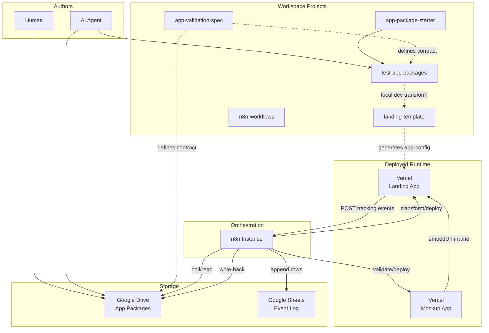
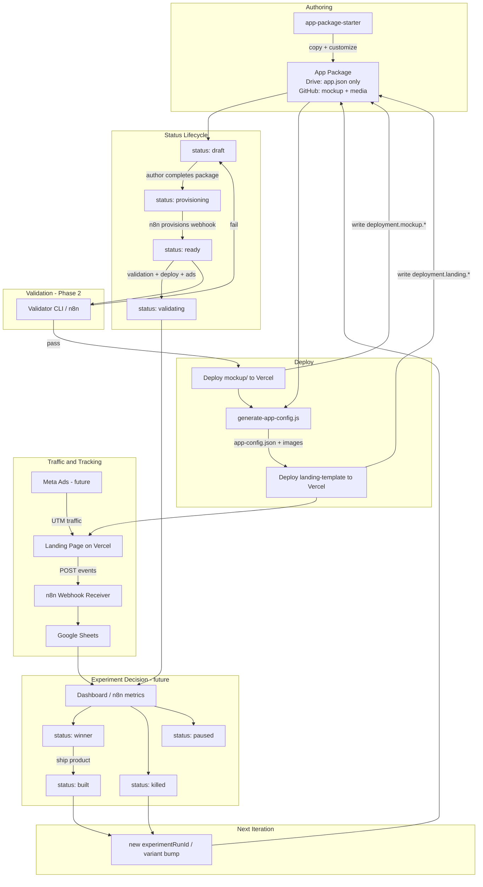
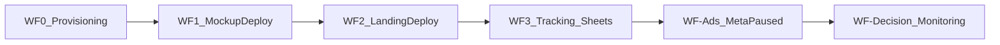
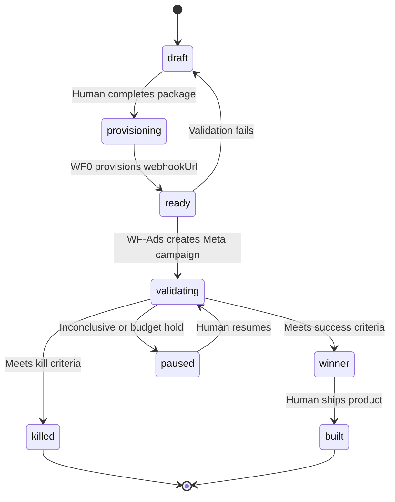

# N8N Platform Architecture

**Status:** Canonical architecture and implementation handoff  
**Audience:** Future AI agents (Cursor, ChatGPT, Codex, n8n builders)  
**Spec version:** App Package Specification 1.5.0  
**Last verified:** 2026-07-07

This document is the **single entry point** for understanding the automated iOS app validation platform. It explains what the platform is, how every project fits together, where data originates, what may and may not be modified, and how automation is expected to work. It is **not** a user guide.

For exhaustive field-level definitions, see [app-validation-spec/APP_PACKAGE_SPEC.md](app-validation-spec/APP_PACKAGE_SPEC.md).

---

## Guiding Principles

When multiple implementation options exist, prefer the one that keeps the platform **generic**, **metadata-driven**, and **scalable to hundreds or thousands of apps with zero app-specific changes**.

| Principle | Meaning |
|-----------|---------|
| **Scale through metadata, not branches** | New apps are new App Packages—not new `if (appId === …)` logic in shared code or n8n workflows. |
| **Author once, consume everywhere** | App-specific content lives in the App Package only. Downstream systems translate. |
| **Gates before spend** | No deploy, no ad spend, no status promotion without passing validation. |
| **Disposable generated artifacts** | `app-config.json` and deploy outputs are regenerated; never treated as SSOT. |
| **Automation writes infrastructure** | n8n provisions webhooks and deployment URLs; humans write product intent. |
| **Recoverable by default** | Every workflow failure leaves the system in a state that can be retried or rolled back without data loss. |

These principles apply to every project in this workspace. When in doubt, choose extensibility over short-term convenience.

---

## Table of Contents

- [Guiding Principles](#guiding-principles)

1. [Platform Vision](#1-platform-vision)
2. [Repository Overview](#2-repository-overview)
3. [Complete Data Flow](#3-complete-data-flow)
4. [Source Of Truth](#4-source-of-truth)
5. [Folder Responsibilities](#5-folder-responsibilities)
6. [Tracking Architecture](#6-tracking-architecture)
7. [n8n Architecture](#7-n8n-architecture)
8. [Deployment Model](#8-deployment-model)
9. [Future A/B Testing](#9-future-ab-testing)
10. [Validator Responsibilities](#10-validator-responsibilities)
11. [Known Future Work](#11-known-future-work)
12. [Architecture Decisions](#12-architecture-decisions)
13. [Reading Order For New AI Agents](#13-reading-order-for-new-ai-agents)
14. [Current Architecture Status](#14-current-architecture-status)

---

## 1. Platform Vision

### 1.1 Overall Goal

The platform validates iOS app ideas **before** building a real product. It automates the full validation loop:

1. Package an app idea as structured files (App Package)
2. Deploy an interactive mockup and a premium fake-door landing page
3. Drive paid social traffic to the landing page
4. Capture conversion signals (email signups, purchase intent, mockup engagement)
5. Aggregate events into analytics storage
6. Decide whether to build, kill, or iterate

The platform exists to answer: **"Will people pay attention and express intent for this app idea?"** — not to ship production apps.

### 1.2 End-to-End Automation Philosophy

| Principle | Meaning |
|-----------|---------|
| **Author once, consume everywhere** | Humans and AI write app-specific content into the App Package only. All downstream systems translate — they do not own content. |
| **Gates before spend** | No Vercel deploy, no ad spend, no status promotion without passing validation gates. |
| **Automation writes infrastructure** | n8n provisions webhooks, deploys artifacts, writes URLs back to `app.json`. Humans write product intent. |
| **Disposable generated config** | `app-config.json` is regenerated on every landing deploy. Never treat it as SSOT. |
| **Observable by default** | Every landing visit and conversion emits a structured event with experiment attribution. |

Humans and AI **author**. n8n **orchestrates**. Validators **gate**. Landing template **renders**. Google Drive **stores**. Google Sheets **records**. Vercel **hosts**.

### 1.3 System Roles

#### App Package as SSOT (Single Source of Truth)

An App Package’s **control-plane SSOT on production Drive** is `App Validation/{appId}/app.json` only (spec **1.5.0**). Local/GitHub authoring may still use `copy/`, `media/`, `mockup/`, and `docs/` scaffolds; those folders are **not** uploaded to production Drive.

**SSOT means:** All app-specific identity, inline landing copy (`landingPage.content` + `sections[].inline`), media refs (`url`/`githubPath`), experiment design, ad copy, analytics IDs, and `source.*` live in `app.json` (plus mockup/media binaries in the full app GitHub repo). No other project may become the authoritative store for this content.

**SSOT does NOT include:** Generated deploy URLs, webhook URLs, or Vercel project IDs — those are automation write-backs into `deployment.*` and `tracking.webhookUrl` (**WF0** owns the webhook URL).

#### landing-template as Renderer

`landing-template/` is a reusable Next.js 15 application. It reads `app-data/app-config.json` at build/runtime and renders a premium fake-door landing page. It owns UI structure, themes, and client-side tracking — **never** app-specific content.

The transform script `scripts/generate-app-config.js` maps App Package → `app-config.json`. The landing page **never** reads `app.json` or Google Drive at runtime.

#### n8n as Orchestrator

n8n is the automation layer that:

- Discovers App Packages on Google Drive
- Provisions webhooks during `provisioning`
- Validates packages (Phase 2+)
- Deploys mockup and landing to Vercel
- Writes deployment metadata back to `app.json`
- Receives tracking webhooks from deployed landings
- Appends events to Google Sheets
- (Future) Creates Meta/Facebook ads
- (Future) Evaluates experiment metrics and sets terminal `status`

No n8n workflow JSON exists in the repository yet. [`n8n-workflows/`](n8n-workflows/) contains **WF1 and WF2 blueprints and AI builder prompts** (no exported workflow JSON yet).

#### Google Drive as Package Storage

Production App Packages live under a configured parent folder (**spec 1.5.0 — `app.json` only**):

```txt
App Validation/
└── {appId}/
    └── app.json              # Only file allowed
```

No `copy/`, `media/`, `mockup/`, `docs/`, `logs/`, `reports/`, README, package files, or lockfiles on Drive.

Drive is the **control-plane I/O target** (n8n reads `app.json` and writes back `deployment.*`, `tracking.webhookUrl`, `validation.*`, and `status`). Mockup source and media binaries live in GitHub (`source.mockupGithubRepo` / optional `assetsGithubRepo`).

Local development uses `test-app-packages/{appId}/` (or the starter) as a fuller package layout before syncing inline fields to Drive.

#### Google Sheets as Analytics / Event Storage

v1 analytics uses **one unified Google Sheet**. Every tracking event from every landing page appends one row. Rows are differentiated by `eventType`, `experimentId`, and `appId` — not by separate sheets per app.

There is no separate dashboard implementation today. The Sheet **is** the v1 analytics store; a dashboard (future) will read from it.

#### Vercel Deployment Model

Each app idea gets **two independent Vercel projects**:

| Project | Source | Written to |
|---------|--------|------------|
| Mockup | Full app GitHub repo; Vercel root = `source.mockupRootDirectory` (e.g. `mockup/`) | `deployment.mockup.*` |
| Landing | `landing-template/` + generated `app-data/` in `{org}/{appId}-landing` GitHub repo | `deployment.landing.*` |

Mockup deploys first. Landing embeds the mockup URL in an iframe. Ad destination URLs always point to `deployment.landing.url`.

### 1.4 System Context Diagram



---

## 2. Repository Overview

The workspace at `App-Validation-System/` is a **multi-project folder**. There is no root-level git repository. `app-validation-spec/` and `landing-template/` each maintain separate `.git` repos.

### 2.1 Top-Level Projects

| Project | Purpose |
|---------|---------|
| [`app-validation-spec/`](app-validation-spec/) | Normative contract: JSON Schema, field reference, pipeline docs, templates, examples |
| [`app-package-starter/`](app-package-starter/) | Copy-and-customize scaffold for new app ideas |
| [`test-app-packages/`](test-app-packages/) | Local sandbox for real App Packages used in development |
| [`landing-template/`](landing-template/) | Config-driven Next.js fake-door landing page renderer |
| [`n8n-workflows/`](n8n-workflows/) | WF1/WF2 blueprints and AI prompts; workflow JSON exports pending |

### 2.2 app-validation-spec

| Dimension | Detail |
|-----------|--------|
| **Purpose** | Defines what an App Package is. Ships JSON Schema, normative docs, templates, and minimal/full examples. Phase 1 (docs only) is complete at v1.4.0. |
| **Owns** | `schemas/app.schema.json`, `APP_PACKAGE_SPEC.md`, `docs/*`, `templates/`, `examples/` |
| **Consumes** | Nothing at runtime — it is the contract layer |
| **Outputs** | Schema and documentation consumed by validators, AI agents, n8n builders, and transform scripts |
| **Should never own** | Real app instances, deployed URLs, webhook endpoints, generated landing config, or n8n workflow implementations |

**Key files:**

- [`schemas/app.schema.json`](app-validation-spec/schemas/app.schema.json) — machine-readable contract
- [`APP_PACKAGE_SPEC.md`](app-validation-spec/APP_PACKAGE_SPEC.md) — human-readable field reference
- [`docs/n8n-integration-notes.md`](app-validation-spec/docs/n8n-integration-notes.md) — n8n implementation guidance
- [`docs/validator-gate.md`](app-validation-spec/docs/validator-gate.md) — pre-deploy validation rules
- [`docs/workflow.md`](app-validation-spec/docs/workflow.md) — pipeline stages mapped to spec fields

### 2.3 app-package-starter

| Dimension | Detail |
|-----------|--------|
| **Purpose** | Reusable scaffold. Copy to `test-app-packages/{appId}/` or Google Drive, rename folder, replace `your-app-id` placeholders, fill TODOs. |
| **Owns** | Template `app.json`, empty `copy/` files, `docs/` planning templates, minimal React+Vite mockup scaffold, [`START_HERE.md`](app-package-starter/START_HERE.md) |
| **Consumes** | Spec conventions from `app-validation-spec` |
| **Outputs** | New App Package instances (via copy) |
| **Should never own** | Deployed URLs, webhooks, validation logic, or landing template code |

**Workflow:** Duplicate starter → rename to `{appId}` → customize → keep `status: draft` until complete → set `provisioning` when ready for automation.

### 2.4 test-app-packages

| Dimension | Detail |
|-----------|--------|
| **Purpose** | Local development and testing sandbox for real App Packages. |
| **Owns** | App Package instances (currently [`human-lab/`](test-app-packages/human-lab/) only) |
| **Consumes** | Spec contract; referenced by `generate-app-config.js` for local landing preview |
| **Outputs** | Validated (eventually) packages ready for Drive upload; transform input for landing-template |
| **Should never own** | Platform contract changes, landing UI code, or n8n workflows |

**Reference package:** `human-lab` — science-backed self-experimentation iOS app concept with full multi-screen mockup, complete `experiment` and `ads` sections, `status: draft`. Use it as the canonical example of a filled package.

### 2.5 landing-template

| Dimension | Detail |
|-----------|--------|
| **Purpose** | Premium fake-door landing page for iOS app validation. All content driven by `app-data/app-config.json`. |
| **Owns** | Next.js app shell, React components, theme system (`lib/themes.ts`), client tracking (`lib/tracking.ts`, `components/TrackingProvider.tsx`), transform script (`scripts/generate-app-config.js`), build scripts |
| **Consumes** | Generated `app-data/app-config.json`, `app-data/images/`, external mockup URL (`mockup.embedUrl`) |
| **Outputs** | Deployable static/SSR landing site; tracking webhook POSTs |
| **Should never own** | App-specific copy, pricing, experiment IDs, SEO text, or mockup source code |

**Critical rule:** `app-data/app-config.json` is **generated and disposable**. Content changes MUST originate in the App Package and flow through the transform — not through direct edits to `app-config.json` (except temporary local dev).

### 2.6 n8n-workflows

| Dimension | Detail |
|-----------|--------|
| **Purpose** | Version-controlled n8n workflow blueprints, AI builder prompts, and (future) workflow JSON exports for discovery, provisioning, validation, deploy, tracking, and experiment decision. |
| **Owns** | Workflow definitions and build handoff docs |
| **Consumes** | App Package spec, landing transform script, Vercel/Meta/Sheets APIs |
| **Outputs** | Running automation; write-backs to Drive `app.json`; Sheet rows |
| **Should never own** | App-specific content, landing UI, or the JSON Schema |

**Current state:** Blueprint docs exist for WF1 (mockup deploy) and WF2 (landing deploy). Exported workflow JSON is not yet committed. See [Section 7](#7-n8n-architecture) and:

- [n8n-workflows/WF1-DEPLOY-PIPELINE-BLUEPRINT.md](n8n-workflows/WF1-DEPLOY-PIPELINE-BLUEPRINT.md)
- [n8n-workflows/WF2-LANDING-DEPLOY-PIPELINE-BLUEPRINT.md](n8n-workflows/WF2-LANDING-DEPLOY-PIPELINE-BLUEPRINT.md)

### 2.7 Cross-Project Ownership Rules

| Data | Owner | Consumers (read-only translate) |
|------|-------|--------------------------------|
| App copy, pricing, SEO, experiment hypothesis | App Package | Transform, landing, n8n, ads |
| JSON Schema and validation rules | app-validation-spec | Validator, n8n |
| UI components and themes | landing-template | — |
| Webhook URLs, deploy URLs, Vercel IDs | n8n writes into App Package | Transform, landing |
| Event rows | Google Sheets (via n8n) | Dashboard (future) |
| Generated `app-config.json` | Transform (ephemeral) | landing-template |

**MUST NOT:** Hardcode app-specific values in `landing-template/components/`, `generate-app-config.js`, or n8n Code nodes.

---

## 3. Complete Data Flow

This section traces one app idea from creation through experiment decision and next iteration.

### 3.1 Stage-by-Stage Narrative

#### Stage A: Starter → App Package

1. Author copies [`app-package-starter/`](app-package-starter/) to a local/GitHub app repo (or `test-app-packages/{appId}/`).
2. Folder name MUST equal `appId` (kebab-case).
3. Author fills `app.json` (inline `landingPage`), local `copy/`/`media/`/`mockup/` scaffolds as needed, then syncs **production Drive** to `{appId}/app.json` only (convert file copy → inline; media → `url`/`githubPath`).
4. Push full app repo to GitHub (`source.mockupGithubRepo`) with `/mockup` as Vercel root.
5. `status` remains `draft` during authoring.

#### Stage B: Package Completion → Provisioning

1. Author completes `experiment`, `ads`, and `analytics` sections.
2. Author sets `status: provisioning`.
3. n8n provisioning workflow detects `provisioning` packages (Drive poll).
4. n8n creates a Webhook node URL and writes `tracking.webhookUrl` to `app.json`.
5. n8n sets `status: ready`.

**Gate:** `tracking.webhookUrl` MUST be non-null before `ready`.

#### Stage C: Validation

1. n8n (or Phase 2 validator CLI) picks up `status: ready` packages.
2. Validates JSON Schema, file existence, lifecycle gates per [validator-gate.md](app-validation-spec/docs/validator-gate.md).
3. On failure: no deploy, notify author, leave `status` at `ready` or revert to `draft`.
4. On success: proceed to deploy stages.

#### Stage D: Mockup Deploy (WF1 v1)

**Prerequisite:** GitHub repo and Vercel project for the mockup are already provisioned and connected. Human fills `source.*` in `app.json` before WF1 runs.

1. **WF1** manual trigger with `appId`; read `App Validation/{appId}/app.json` from Drive.
2. Gate on `status === "ready"`; validate `source.mockupGithubRepo`, `source.mockupBranch`, `source.mockupRootDirectory`, and Vercel project ID or name.
3. Trigger Vercel deployment API using `gitSource` from `source.*` (Vercel builds from GitHub — n8n never runs `npm` or pushes code).
4. Poll until `readyState === "READY"`.
5. Resolve public production alias (not raw deployment hostname); verify incognito-safe and iframe-safe.
6. Merge-write to `app.json` (only if verification passes):
   - `mockup.previewUrl`
   - `deployment.mockup.vercelProjectId`
   - `deployment.mockup.url` (public alias)
   - `deployment.mockup.deploymentUrl` (raw deployment hostname; debug only)
   - `deployment.mockup.lastDeployedAt`

`mockup.previewUrl` and `deployment.mockup.url` MUST match (public alias only). `status` stays `ready`.

See [n8n-workflows/WF1-DEPLOY-PIPELINE-BLUEPRINT.md](n8n-workflows/WF1-DEPLOY-PIPELINE-BLUEPRINT.md) for the normative WF1 v1 flow.

#### Stage E–F: Landing Deploy (WF2 v1)

**Prerequisite:** WF1 has written `deployment.mockup.url` or `mockup.previewUrl`. Vercel team GitHub integration installed (platform one-time). Landing repo and Vercel project are **created by WF2** on first run — no manual per-app vercel.com steps.

1. **WF2** manual trigger with `appId`; read `App Validation/{appId}/app.json` from Drive (**only** file).
2. Gate on `status === "ready"` and WF1 mockup URL present.
3. Read landing copy from inline `landingPage.sections[].inline` + `landingPage.content` (never Drive `copy/`).
4. Resolve media via `url` / `githubPath` from `source.assetsGithubRepo ?? source.mockupGithubRepo` (declared assets only — never mockup source).
5. Transform package → `app-data/app-config.json` (equivalent of `generate-app-config.js`); set `mockup.embedUrl` from WF1 output.
6. Bootstrap landing GitHub repo from `landingTemplateRepo` if missing; push `app-data/` (GitHub PAT; n8n does not run npm).
7. Trigger Vercel deployment API with `name` + `gitSource` (creates Vercel project on first run).
8. Poll until `readyState === "READY"`.
9. Merge-write to `app.json`:
   - `deployment.landing.vercelProjectId`
   - `deployment.landing.url` (canonical public URL — ad destination)
   - `deployment.landing.deploymentUrl` (latest Vercel deployment URL)
   - `deployment.landing.lastDeployedAt`
   - `deployment.githubRepoUrl` (if still null)
10. Leave `status` as `"ready"`.

See [n8n-workflows/WF2-LANDING-DEPLOY-PIPELINE-BLUEPRINT.md](n8n-workflows/WF2-LANDING-DEPLOY-PIPELINE-BLUEPRINT.md) for the normative WF2 v1 flow.

#### Stage G: Ads (Future)

1. n8n reads `ads.*`, expands `ads.utmTemplate` with `{{appId}}` placeholders.
2. Destination URL: `deployment.landing.url` + UTM query string.
3. Creates campaigns on `ads.platforms` (e.g. facebook, instagram).
4. Respects `experiment.testBudget.amount` and `durationDays`.

#### Stage H: Tracking

1. User visits `deployment.landing.url` (possibly with UTM params from ads).
2. Landing fires `page_view` on load.
3. User interactions fire `email_captured`, `buy_now_clicked`, or `mockup_interacted`.
4. Browser POSTs JSON to `tracking.webhookUrl` (from `app-config.json`).
5. n8n webhook receiver appends one row per event to Google Sheets.

#### Stage I: Dashboard → Experiment Decision (Future)

1. Dashboard (or n8n decision workflow) aggregates Sheet rows by `experimentId`.
2. Compares metrics against `experiment.successCriteria` and `experiment.decisionRules`.
3. Sets terminal `status`:
   - `winner` — met success criteria
   - `killed` — met kill criteria
   - `paused` — inconclusive, manual review
4. After shipping real app: `built`.

#### Stage J: Next Iteration

1. Author creates new `analytics.experimentRunId` (e.g. `run_human-lab_2026q3_001`).
2. Optionally bumps `landingVariantId` or `mockupVersionId` for A/B tests.
3. Updates inline landing copy in `app.json` (and GitHub media if needed).
4. Re-enters pipeline at `provisioning` or `ready` depending on whether webhook reuse is acceptable.

### 3.2 End-to-End Data Flow Diagram



---

## 4. Source Of Truth

This section documents **where every important value originates**, who writes it, and who consumes it. When in doubt, check this table before adding a field or hardcoding a value.

### 4.1 Identity and Lifecycle

| Value | Origin | Written by | Consumed by |
|-------|--------|------------|-------------|
| `appId` | Human at package creation; MUST match folder name | Human (immutable after first deploy) | Drive path, transform, tracking, ads, analytics prefixes |
| `specVersion` | Human copies from current spec | Human at package creation | Validator schema selection |
| `status` | Lifecycle state machine | Human (`draft`, `provisioning`, `paused`, `built`); n8n (`ready`, `validating`, `winner`, `killed`) | n8n branching, validator gates |
| `identity.appName` | Human / AI authoring | Human | Transform → `appName`; tracking payloads; ads fallbacks |
| `identity.tagline` | Human / AI authoring | Human | Transform → hero fallback; SEO; ads |
| `identity.badgeText` | Human / AI authoring | Human | Transform → `badgeText` (or platform-based generic fallback) |
| `identity.description` | Human / AI authoring | Human | Transform → `solution`; SEO description fallback |
| `identity.category` | Human | Human | Metadata; not heavily used in landing today |
| `identity.platform` | Human | Human | Badge fallback logic in transform |
| `landingPage.slug` | Human; defaults to `appId` | Human | Vercel URL path |

### 4.2 Audience and Commerce

| Value | Origin | Written by | Consumed by |
|-------|--------|------------|-------------|
| `audience.primary` | Human / AI | Human | Internal; `landingPhrase` preferred for landing |
| `audience.landingPhrase` | Human / AI | Human | Transform → `targetAudience` |
| `audience.painPoints[]` | Human / AI | Human | Transform → `problem` (first item) |
| `commerce.pricing.*` | Human / AI | Human | Transform → `pricing.price`, `pricing.billingLabel` |
| `commerce.cta.buyNowText` | Human / AI | Human | Transform → `pricing.ctaText` |
| `commerce.cta.waitlistText` | Human / AI | Human | Transform → `emailCapture.buttonText` |
| `commerce.cta.primaryText` | Human / AI | Human | Transform → `primaryCtaText` |
| `commerce.cta.secondaryText` | Human / AI | Human | Transform → `secondaryCtaText` |
| Pricing section inline copy | `landingPage.sections[pricing].inline` | Human | Transform → `pricing.headline`, `pricing.subheadline` |
| CTA section inline copy | `landingPage.sections[cta].inline` | Human | Transform → `emailCapture.headline`, placeholder |

### 4.3 Copy and Media

| Value | Origin | Written by | Consumed by |
|-------|--------|------------|-------------|
| Hero copy | `landingPage.sections[hero].inline` (production); local `copy/hero.md` is local-dev only | Human / AI | Transform → `heroHeadline`, `heroSubheadline`, `heroBody` |
| Benefits | `landingPage.content.benefits` (production) | Human / AI | Transform → `benefits[]` |
| Features | `landingPage.content.features` | Human / AI | Transform → `features[]` |
| FAQ | `landingPage.content.faq` | Human / AI | Transform → `faq.items[]` |
| Screenshots | `media.screenshots[]` in `app.json` + binary files | Human | Transform copies to `app-data/images/` |
| Logo, OG image | `media.logo`, `media.ogImage` | Human | Transform → images + `seo.ogImageUrl` |
| Footer text | `landingPage.sections[footer].inline.body` | Human | Transform → `footer.text` |
| SEO | `landingPage.seo` | Human | Transform → `seo.title`, `seo.description`, `seo.keywords` |

### 4.4 Branding and Mockup

| Value | Origin | Written by | Consumed by |
|-------|--------|------------|-------------|
| Theme style | `branding.theme.landingStyle` or derived from `mode` | Human | Transform → `theme.style` |
| Accent color | `branding.theme.accentName` or hex | Human | Transform → `theme.accentColor` |
| `branding.theme.fontFamily` | Human | Human | **Not applied in landing CSS yet** (gap) |
| Mockup source | `mockup/` folder | Human / AI | n8n build/deploy only |
| `mockup.baseWidth/Height/clipBottomPx` | Human | Human | Transform → `mockup.*` embed dimensions |
| `mockup.previewUrl` | Deploy output | n8n after mockup deploy | Transform → `mockup.embedUrl` |
| `mockup.embedUrl` (in app-config) | Derived from `deployment.mockup.url` or `mockup.previewUrl` | Transform (from package) | Landing iframe `LiveMockupEmbed` |

### 4.5 Experiment, Analytics, and Ads

| Value | Origin | Written by | Consumed by |
|-------|--------|------------|-------------|
| `experiment.*` | Human experiment design | Human | n8n decision workflow; dashboard (future) |
| `experiment.experimentName` | Human-readable label | Human | Notifications; dashboard display |
| `analytics.projectId` | Human; convention `proj_{appId}` | Human at authoring | Transform → `tracking.projectId` → payloads → Sheets |
| `analytics.experimentId` | Human; convention `exp_{appId}_{period}_{seq}` | Human at authoring | Transform → tracking → Sheets; dashboard grouping |
| `analytics.experimentRunId` | Human; convention `run_{appId}_{period}_{seq}` | Human; new ID per validation cycle | Transform → tracking → Sheets |
| `analytics.landingVariantId` | Human; e.g. `v1`, `v2` | Human; bump for A/B tests | Transform → tracking → Sheets |
| `analytics.mockupVersionId` | Human; e.g. `v1`, `v2` | Human; bump when mockup changes | Transform → tracking → Sheets |
| `analytics.funnelName` | Human | Human | Dashboard routing (future) |
| `ads.campaignName` | Human | Human | Transform → `tracking.campaignName` → payloads → Sheets |
| `ads.*` (copy, platforms, UTM) | Human | Human | n8n ad creation (future) |
| UTM params on landing URL | `ads.utmTemplate` expanded by n8n | n8n at ad creation | Browser captures from query string → tracking payload |

### 4.6 Deployment and Tracking Infrastructure

| Value | Origin | Written by | Consumed by |
|-------|--------|------------|-------------|
| `source.mockupGithubRepo` | Human at infra setup | Human | WF1 (Vercel `gitSource`) |
| `source.mockupBranch` | Human at infra setup | Human | WF1 (Vercel `gitSource.ref`) |
| `source.mockupRootDirectory` | Human at infra setup; must match Vercel settings | Human | WF1 validation; Vercel build |
| `source.vercelMockupProjectId` | Human from Vercel dashboard | Human | WF1 (Vercel deploy API) |
| `source.vercelMockupProjectName` | Human from Vercel dashboard | Human | WF1 (Vercel deploy API fallback) |
| `deployment.mockup.vercelProjectId` | Vercel API response | n8n WF1 after mockup deploy | Infrastructure reference |
| `deployment.mockup.url` | Vercel deploy URL | n8n WF1 after mockup deploy | WF2 transform → `mockup.embedUrl` |
| `deployment.mockup.lastDeployedAt` | Deploy timestamp (ISO 8601) | n8n WF1 after mockup deploy | Audit; not used in tracking |
| Landing GitHub repo `{org}/{appId}-landing` | Derived from n8n Config Set + `appId` | Human provisions; WF2 pushes `app-data/` | Vercel `gitSource` |
| Vercel landing project `{appId}-landing` | Derived from n8n Config Set + `appId` | Human provisions | WF2 Vercel deploy API |
| `repoOverrides` (per-app) | n8n Config Set | Human | Nonstandard repo/project names |
| `deployment.landing.vercelProjectId` | Vercel API response | n8n WF2 after landing deploy | Transform → `tracking.deploymentId` |
| `deployment.landing.url` | Canonical public URL | n8n after landing deploy | Ad destination; human sharing |
| `deployment.landing.deploymentUrl` | Latest Vercel deployment URL | n8n after landing deploy | Transform → `tracking.deploymentId` fallback |
| `deployment.landing.lastDeployedAt` | Deploy timestamp (ISO 8601) | n8n after landing deploy | Transform → `tracking.landingVersion` |
| `landingVersion` (in app-config / payloads) | **Derived** from `deployment.landing.lastDeployedAt` | Transform at generation time | Tracking payloads → Sheets |
| `deploymentId` (in payloads) | **Derived** from `deployment.landing.vercelProjectId` or `deploymentUrl` | Transform at generation time | Tracking payloads → Sheets |
| `tracking.webhookUrl` | n8n Webhook node URL | n8n during `provisioning` | Transform → `app-config.tracking.webhookUrl` → browser POST |
| `tracking.webhooks.*` (legacy) | n8n (optional) | n8n | Transform → per-event fallback URLs |
| `visitorId` | Browser `localStorage` key `avs_visitor_id` | Client (landing) | Tracking payloads → Sheets |
| `sessionId` | Browser `sessionStorage` key `avs_session_id` | Client (landing) | Tracking payloads → Sheets |

### 4.7 What MUST NEVER Be Hardcoded

The following MUST NOT appear as app-specific literals in `landing-template` components, `generate-app-config.js`, or n8n Code nodes:

| Category | Examples |
|----------|----------|
| Identity | App names, taglines, descriptions |
| Copy | Headlines, benefits, features, FAQ answers |
| Commerce | Prices, CTA labels, billing periods |
| Experiment | `experimentId`, `experimentRunId`, thresholds |
| Infrastructure | Webhook URLs, Vercel URLs, project IDs |
| Campaign | `campaignName`, UTM campaign values |
| Theme per app | Accent colors, style presets tied to a specific app |
| SEO | Page titles, meta descriptions per app |

**Allowed:** Generic fallbacks when a package omits a field (documented in [APP_PACKAGE_TRANSFORM.md](landing-template/scripts/APP_PACKAGE_TRANSFORM.md)), e.g. `"Coming soon to the App Store"` when `badgeText` is omitted and `platform === "ios"`.

**Allowed in test fixtures:** `human-lab` content in `test-app-packages/` and the currently generated `app-data/app-config.json` — these are outputs of the transform, not hardcoded in template source.

---

## 5. Folder Responsibilities

Every meaningful folder in the workspace, with data ownership and modification rules.

### 5.1 Workspace Root

| Folder | Owns data | Reads | Writes | Must never modify |
|--------|-----------|-------|--------|-------------------|
| `app-validation-spec/` | Spec contract, schema, examples | — | Spec maintainers only | App Package instance data |
| `app-package-starter/` | Scaffold template | Spec conventions | Authors copying scaffold | Deployed URLs; other apps' data |
| `test-app-packages/` | Local App Package instances | Spec; landing transform | Authors; n8n (when synced to Drive) | Spec schema; landing components |
| `landing-template/` | UI shell, themes, tracking client | Generated `app-data/` | Transform script; build | App Package SSOT content |
| `n8n-workflows/` | Workflow JSON (future) | Spec; APIs | n8n exporters | App content |
| `N8N_PLATFORM_ARCHITECTURE.md` | Platform architecture | All projects | Architecture maintainers | — |

### 5.2 app-validation-spec/

| Folder | Owns data | Reads | Writes | Must never modify |
|--------|-----------|-------|--------|-------------------|
| `schemas/` | JSON Schema | — | Spec maintainers | App instances |
| `templates/` | Starter `app.json` and copy templates | — | Spec maintainers | `_comment` keys in real packages |
| `examples/minimal-app/` | Focus Timer minimal example | — | Spec maintainers | — |
| `examples/full-app/` | Habit Stack full example | — | Spec maintainers | — |
| `docs/` | Pipeline and integration docs | — | Spec maintainers | — |

### 5.3 App Package Folders (starter / local / GitHub vs production Drive)

**Local starter & GitHub full app repo** (`app-package-starter/`, `test-app-packages/{appId}/`, `source.mockupGithubRepo`):

| Folder / File | Owns data | Reads | Writes | Notes |
|---------------|-----------|-------|--------|-------|
| `app.json` | Canonical manifest | Validator, transform, n8n | Human/AI; n8n write-backs | Sync to Drive for production |
| `copy/` | Local-dev markdown scaffolds | Local transform only | Human/AI | Convert to `landingPage.content` / `sections[].inline` before Drive |
| `docs/` | Internal planning notes | Humans only | Human/AI | **Not** on production Drive |
| `media/` | Binaries referenced via `githubPath` | WF2 / WF-Ads fetch declared paths | Human/AI | On GitHub; not on production Drive |
| `mockup/` | Interactive prototype source | Vercel (root dir) | Human/AI | Full app repo; exclude `node_modules`/`dist` |
| `package.json` | Root script delegation to mockup | npm | Human | — |
| `README.md` | Human notes | Humans | Human | **Not** on production Drive |

**Production Google Drive** (`App Validation/{appId}/`):

| Folder / File | Owns data | Reads | Writes | Must never modify |
|---------------|-----------|-------|--------|-------------------|
| `app.json` | Control-plane SSOT | Validator, n8n | Human/AI (authoring); n8n (`deployment.*`, `tracking.webhookUrl`, `validation.*`, `status`) | `appId` after deploy; secrets; extra sibling files |

**Forbidden on production Drive:** `copy/`, `media/`, `mockup/`, `docs/`, `logs/`, `reports/`, README, package/lockfiles.

### 5.4 landing-template/

| Folder | Owns data | Reads | Writes | Must never modify |
|--------|-----------|-------|--------|-------------------|
| `app/` | Next.js pages and layout | `app-data/app-config.json` via `lib/appData.ts` | Template maintainers (generic UI only) | App-specific content |
| `components/` | React UI components | Config props | Template maintainers | App-specific copy |
| `lib/` | Types, themes, tracking, session | `app-config.json` | Template maintainers | App-specific values |
| `app-data/` | Generated landing config | — | `generate-app-config.js`; n8n | **Do not treat as SSOT** |
| `app-data/images/` | Copied media assets | — | Transform; `copy-app-data-images.js` | Original App Package media |
| `public/app-data/images/` | Build-time image mirror | — | `predev`/`prebuild` scripts | — |
| `scripts/` | Transform and build scripts | App Packages | Script maintainers | App-specific mapping logic |
| `.next/` | Build output | — | `next build` | — |

### 5.5 n8n-workflows/

| Folder | Owns data | Reads | Writes | Must never modify |
|--------|-----------|-------|--------|-------------------|
| `n8n-workflows/` | Blueprint docs and exported workflow JSON | Spec; APIs | n8n maintainers | App Package content |

---

## 6. Tracking Architecture

### 6.1 Overview

Tracking is **client-side only**. The landing page POSTs JSON directly from the browser to n8n. There are no Next.js API routes for analytics. This keeps Vercel deploys simple and avoids server-side session management.

**Flow:** Landing component → `TrackingProvider` → `createTrackingPayload()` → `postTrackingEvent()` → `tracking.webhookUrl` → n8n → Google Sheets append.

### 6.2 Canonical Events

| eventType | Trigger | Component | Fires |
|-----------|---------|-----------|-------|
| `page_view` | Once on page load | `TrackingProvider` (`useEffect`) | Every visit |
| `buy_now_clicked` | Pricing fake-door form submit | `BuyNowTracker` | User expresses purchase intent |
| `email_captured` | Waitlist form submit | `EmailCapture` | User submits email |
| `mockup_interacted` | First mockup expand or click | `LiveMockupEmbed` | Once per session (first interaction) |

**Buy Now is a fake-door:** The pricing CTA captures email + purchase intent. No App Store link, no payment processing. This measures demand without building commerce infrastructure.

### 6.3 Event-Specific Payload Fields

All events share the same JSON shape. Event-specific fields:

| eventType | `email` | `price` | Notes |
|-----------|---------|---------|-------|
| `page_view` | `""` | `""` | Passive; includes UTM and referrer |
| `buy_now_clicked` | User email from form | Display price string (e.g. `"$6.99"`) | Strongest conversion signal |
| `email_captured` | User email from form | `""` | Waitlist / keep-me-updated |
| `mockup_interacted` | `""` | `""` | `mockupInteracted: true` on this and subsequent events in session |

All events include `timeOnPageSeconds` (elapsed since page load) and `mockupInteracted` (whether user has interacted with mockup this session).

### 6.4 Full Payload Schema

Defined in [`landing-template/lib/tracking.ts`](landing-template/lib/tracking.ts). Every field is always present (empty string or zero for unused).

```typescript
{
  eventType: string;           // page_view | buy_now_clicked | email_captured | mockup_interacted
  appId: string;
  appName: string;
  experimentId: string;
  experimentRunId: string;
  projectId: string;
  deploymentId: string;
  landingVersion: string;
  landingVariantId: string;
  mockupVersionId: string;
  campaignName: string;
  visitorId: string;
  sessionId: string;
  email: string;
  price: string;
  pageUrl: string;
  referrer: string;
  utmSource: string;
  utmMedium: string;
  utmCampaign: string;
  utmContent: string;
  utmTerm: string;
  timeOnPageSeconds: number;
  mockupInteracted: boolean;
  timestamp: string;           // ISO 8601
}
```

### 6.5 Field Meanings

| Field | Meaning | Origin |
|-------|---------|--------|
| `eventType` | Event classifier for Sheet pivots | Client constant |
| `appId` | Stable app identifier | `app-config.json` ← `app.json` |
| `appName` | Display name | `app-config.json` ← `identity.appName` |
| `experimentId` | Experiment family ID for dashboard grouping | `app-config.tracking` ← `analytics.experimentId` |
| `experimentRunId` | Immutable ID for one validation cycle | `app-config.tracking` ← `analytics.experimentRunId` |
| `projectId` | Analytics project scope | `app-config.tracking` ← `analytics.projectId` |
| `deploymentId` | Landing Vercel project ID or deployment URL | `app-config.tracking` ← `deployment.landing.*` |
| `landingVersion` | Landing deploy timestamp (NOT a manual version number) | `app-config.tracking` ← `deployment.landing.lastDeployedAt` |
| `landingVariantId` | Landing copy/layout variant slug | `app-config.tracking` ← `analytics.landingVariantId` |
| `mockupVersionId` | Mockup build variant slug | `app-config.tracking` ← `analytics.mockupVersionId` |
| `campaignName` | Ad campaign name for attribution | `app-config.tracking` ← `ads.campaignName` |
| `visitorId` | Persistent anonymous browser ID | `localStorage` key `avs_visitor_id` |
| `sessionId` | Per-tab session ID | `sessionStorage` key `avs_session_id` |
| `email` | User email when captured | Form input |
| `price` | Display price at click time | Pricing section |
| `pageUrl` | Full URL including UTM query string | `window.location.href` |
| `referrer` | HTTP referrer | `document.referrer` |
| `utmSource` | UTM source param | Parsed from URL |
| `utmMedium` | UTM medium param | Parsed from URL |
| `utmCampaign` | UTM campaign param | Parsed from URL |
| `utmContent` | UTM content param (ad variant) | Parsed from URL |
| `utmTerm` | UTM term param | Parsed from URL |
| `timeOnPageSeconds` | Seconds since page load | Client timer |
| `mockupInteracted` | Whether mockup was engaged this session | Client flag |
| `timestamp` | Event time ISO 8601 | `new Date().toISOString()` |

### 6.6 Google Sheet Schema

**One unified sheet** for all apps and experiments. n8n appends one row per webhook POST.

**Canonical column order** (MUST match this order for dashboard compatibility):

```
timestamp | eventType | appId | appName | experimentId | experimentRunId | projectId | deploymentId | landingVersion | landingVariantId | mockupVersionId | campaignName | visitorId | sessionId | email | price | pageUrl | referrer | utmSource | utmMedium | utmCampaign | utmContent | utmTerm | timeOnPageSeconds | mockupInteracted
```

**Row semantics:**

- One row = one event. A single visitor may produce multiple rows (`page_view`, then `mockup_interacted`, then `email_captured`).
- Filter by `eventType` for funnel analysis.
- Group by `experimentId` + `experimentRunId` for experiment isolation.
- Compare across `landingVariantId` for A/B tests.
- `landingVersion` changes on each landing redeploy — use for deploy-level debugging, not as primary experiment dimension.

**Sheet owner:** n8n webhook receiver workflow. Humans do not edit Sheet schema without updating this document and `tracking.ts`.

### 6.7 Webhook Routing

Priority order in `resolveWebhookUrl()`:

1. If `tracking.webhookUrl` is set (non-empty) → **all events** use this unified URL.
2. Else legacy per-event routing:
   - `buy_now_clicked` → `tracking.buyNowWebhookUrl`
   - `email_captured` → `tracking.emailWebhookUrl`
   - `page_view`, `mockup_interacted` → first available legacy URL
3. If no URL configured → dev console log; UI still succeeds (`{ ok: true }`).

**v1 standard:** Provision single `tracking.webhookUrl` during `provisioning`. Legacy per-event URLs exist for backward compatibility only.

### 6.8 Pipeline Webhooks (n8n-Only)

These keys in `tracking.webhooks` are **not** used by the landing template:

| Key | When fired | Fired by |
|-----|------------|----------|
| `validationComplete` | Package passes validation | n8n validation workflow |
| `deployComplete` | Mockup and landing URLs live | n8n deploy workflow |
| `emailCaptured` | (Legacy) Landing event | Replaced by unified `webhookUrl` |
| `buyNowClicked` | (Legacy) Landing event | Replaced by unified `webhookUrl` |

---

## 7. n8n Architecture

No workflow JSON is implemented. This section defines **intended** workflows that future agents MUST implement consistently.

**Canonical workflow order:** WF0 → WF1 → WF2 → WF3 → WF-Ads → WF-Decision



### 7.1 Workflow Inventory

| Workflow | Trigger | Input | Output / Side Effects |
|----------|---------|-------|---------------------|
| **WF0 Provisioning** | `status: provisioning` (poll or manual `appId`) | Complete `app.json` | `tracking.webhookUrl` written; `status: ready` |
| **WF1 Mockup Deploy** (v1) | Manual (`appId`); gate `status: ready` | Drive `app.json` with `source.*` | Vercel deploy; `deployment.mockup.*` + `mockup.previewUrl`; `status` stays `ready` |
| **WF2 Landing Deploy** (v1) | Manual (`appId`); gate WF1 mockup URL | Drive package + WF1 mockup URL | Transform + GitHub push `app-data/`; Vercel deploy; `deployment.landing.*`; `status` stays `ready` |
| **WF3 Tracking** | Always-on POST from landing | Tracking payload JSON | Append row to Google Sheets; return 200 fast |
| **WF-Ads Meta** | Manual (`appId`) after WF2 | `ads.*`, `deployment.landing.url` | Meta campaign **paused**; `ads.meta.*`; `status: validating` |
| **WF-Decision Monitoring** | Schedule during `validating` | Sheets + Meta API + `experiment.*` | `validation.*` (+ `latestReportUrl`); root `status` (`winner`/`killed`/`paused`); no Drive `reports/` |
| **Package discovery** (future) | Schedule (poll every N min) | Drive parent folder | List of `{appId}/` folders with `status` |
| **Dashboard feed** (future) | Schedule or on-demand | Google Sheets | Human-readable metrics view |

**Pre-deploy validation** is a documented gate before WF1 (see [Section 10](#10-validator-responsibilities)) — not a numbered workflow.

**WF0 note:** Provisions `tracking.webhookUrl` during `provisioning` → `ready`. See [WF0-PROVISIONING-PIPELINE-BLUEPRINT.md](n8n-workflows/WF0-PROVISIONING-PIPELINE-BLUEPRINT.md).

**WF1 v1 note:** GitHub is the deployable code SSOT; WF1 does not create repos, push code, or download `mockup/` from Drive. See [WF1-DEPLOY-PIPELINE-BLUEPRINT.md](n8n-workflows/WF1-DEPLOY-PIPELINE-BLUEPRINT.md).

**WF2 v1 note:** Landing repo and Vercel project derived from Config Set; WF2 bootstraps on first run. See [WF2-LANDING-DEPLOY-PIPELINE-BLUEPRINT.md](n8n-workflows/WF2-LANDING-DEPLOY-PIPELINE-BLUEPRINT.md).

**WF3 note:** Webhook receiver + Sheets logger. See [WF3-TRACKING-PIPELINE-BLUEPRINT.md](n8n-workflows/WF3-TRACKING-PIPELINE-BLUEPRINT.md).

**WF-Ads note:** Campaign created paused by default. See [WF-ADS-META-PIPELINE-BLUEPRINT.md](n8n-workflows/WF-ADS-META-PIPELINE-BLUEPRINT.md).

**WF-Decision note:** Uses `validation.*` and root `status` — never `validation.status`. See [WF-DECISION-MONITORING-PIPELINE-BLUEPRINT.md](n8n-workflows/WF-DECISION-MONITORING-PIPELINE-BLUEPRINT.md).

### 7.2 Workflow Responsibilities (Detail)

#### Package Discovery

- List child folders of configured Drive parent (e.g. `App Validation/`).
- For each folder, read `app.json`.
- Verify `app.json.appId === folderName` (warn on mismatch).
- Route to downstream workflows based on `status`.

**Drive limitation:** No native push webhooks. Use scheduled polling, manual trigger, or external Drive webhook if available.

#### WF0 Provisioning

- **Trigger:** `status: provisioning` (schedule poll or manual `appId`)
- Validate package completeness (`experiment`, `analytics`, `ads`)
- Create n8n Webhook node URL for landing events
- Merge-write `tracking.webhookUrl` into `app.json` on Drive
- Set `status: ready`
- **Gate:** Do not set `ready` without non-null `tracking.webhookUrl`

#### Pre-Deploy Validation (gate, not numbered)

- **Trigger:** Before WF1 (manual or Phase 2 validator)
- Run Phase 2 validator checks (see [Section 10](#10-validator-responsibilities))
- On success: fire `tracking.webhooks.validationComplete` if set; proceed to WF1
- On failure: do not deploy; notify author; keep `status: ready` or revert to `draft`

#### Deploy Mockup (WF1 v1)

**Trigger:** Manual with `appId` input.

**Prerequisites (human, one-time):** GitHub repo exists; Vercel project connected with root directory matching `source.mockupRootDirectory`; `source.*` populated in `app.json`.

**Flow:**

1. Read `App Validation/{appId}/app.json` from Drive.
2. Gate: `status === "ready"`.
3. Validate `source.mockupGithubRepo`, `source.mockupBranch`, `source.mockupRootDirectory`, and at least one of `source.vercelMockupProjectId` or `source.vercelMockupProjectName`.
4. `POST` Vercel `/v13/deployments` with `gitSource` from `source.*`.
5. Poll until `readyState === "READY"`.
6. Resolve public production alias; verify unauthenticated access (200, no SSO redirect, no `X-Frame-Options: DENY`).
7. Merge-write only (if verification passes):
   ```json
   {
     "mockup": { "previewUrl": "<publicAlias>" },
     "deployment": {
       "mockup": {
         "vercelProjectId": "<id>",
         "url": "<publicAlias>",
         "deploymentUrl": "<rawDeploymentUrl>",
         "lastDeployedAt": "<iso8601>"
       }
     }
   }
   ```
8. Leave `status` as `ready`. Do not modify `source.*`.

**Out of scope for WF1:** GitHub repo creation, code push, Drive `mockup/` download, Vercel project creation, landing deploy, webhooks, Google Sheets.

`previewUrl` MUST equal `deployment.mockup.url`.

**Credentials:** Google Service Account + Vercel Bearer token only (no GitHub PAT for WF1).

#### Deploy Landing (WF2 v1)

**Trigger:** Manual with `appId` input.

**Prerequisites (platform, one-time):** Vercel team GitHub integration. n8n Credentials (Google SA, Vercel token, GitHub PAT). WF1 completed for the app.

**Flow:**

1. Read `App Validation/{appId}/app.json` from Drive (**only** file).
2. Gate: `status === "ready"`.
3. Gate: WF1 mockup URL present (`deployment.mockup.url` or `mockup.previewUrl`).
4. Resolve landing repo and Vercel project name from Config Set + `appId` (or `repoOverrides`).
5. Read inline `landingPage` copy; fetch media via `url`/`githubPath` (never Drive `copy/`/`media/`).
6. Transform → `app-data/app-config.json` + images (port `generate-app-config.js`).
7. Bootstrap landing GitHub repo if missing; commit `app-data/`.
8. `POST` Vercel `/v13/deployments` with `name` + `gitSource` (creates project on first run).
9. Poll until `readyState === "READY"`.
10. Merge-write only:
    ```json
    {
      "deployment": {
        "landing": {
          "vercelProjectId": "<id>",
          "url": "<canonical>",
          "deploymentUrl": "<latest>",
          "lastDeployedAt": "<iso8601>"
        },
        "githubRepoUrl": "https://github.com/<org>/<repo>"
      }
    }
    ```
11. Leave `status` as `ready`. Do not modify `deployment.mockup.*` or `mockup.previewUrl`.

**Out of scope for WF2:** Mockup deploy, WF1 re-run, webhook provisioning (**WF0**), Google Sheets, Meta ads, npm in n8n, changing package copy, Drive `copy/`/`media/` downloads, setting `status: validating`.

**Credentials:** Google Service Account + Vercel Bearer token + GitHub PAT (WF2 only).

#### WF3 Tracking (webhook receiver + Sheets)

- **Trigger:** HTTP POST `application/json` from landing page to `tracking.webhookUrl`
- Validate `eventType` is one of four canonical values
- Map payload fields to Sheet columns in canonical order
- Append row to unified Google Sheet
- Return 200 quickly — do not block client

**Runtime only:** WF3 does not routinely write `app.json` except optional health/debug fields on `tracking`.

**Credentials:** Google Service Account + Sheet ID in Config Set.

#### WF-Ads Meta (paused by default)

- **Trigger:** Manual with `appId` after WF2; gate `deployment.landing.url`
- Read `ads.*` (copy), `ads.targeting`, `experiment.testBudget`
- **Creative priority:** `ads.media[]` → `media.ogImage` → **fail** (no silent text-only unless Meta format supports it)
- Expand `ads.utmTemplate` → destination URL
- Create Meta campaign, ad set, creative, ad — all **PAUSED**
- Merge-write `ads.meta.*` only; set `status: validating`
- Campaign remains paused until human activates in Meta Ads Manager

#### WF-Decision Monitoring

- **Trigger:** `status: validating`; schedule (e.g. every 6–12 hours)
- Pull Meta metrics (spend, impressions, clicks) and Sheets signups
- Compute `validation.metrics`; compare `experiment.thresholds` and `decisionRules`
- Merge-write `validation.*` summary; set `validation.latestReportUrl` (Sheets / external) — **do not** write Drive `reports/`
- Set root `status` to `winner`, `killed`, or `paused` when criteria met
- On `killed`: pause/stop Meta ads via API

**Do not** write `validation.status` — use root `status` only.

### 7.3 Status State Machine

**Canonical values** from `app.schema.json`:

```
draft → provisioning → ready → validating → winner → built
                              ↓           ↓
                           paused      killed
```



#### Who Sets Each Transition

| Transition | Set by |
|------------|--------|
| → `draft` | Human (initial); n8n/validator (revert on failure) |
| → `provisioning` | Human (package complete) |
| → `ready` | **WF0** (after webhook provisioned) |
| → `validating` | **WF-Ads** (Meta campaign created; may still be paused) |
| → `paused` | Human or **WF-Decision** (budget hold, inconclusive) |
| → `winner` | **WF-Decision** or human |
| → `killed` | **WF-Decision** or human |
| → `built` | Human (after shipping real app) |

#### Terminology Mapping (Non-Canonical Names)

Some documents use alternate terms. **Only the enum values above are valid in `app.json`.**

| Informal term | Canonical `status` |
|---------------|-------------------|
| `running` | `validating` |
| `completed` | No single value — use `winner`, `killed`, or `built` depending on outcome |
| `archived` | **Not implemented** — `killed` is the logical archive state; no `archived` enum exists |

### 7.4 n8n Branching on Status

| Status | Default behavior |
|--------|------------------|
| `draft` | Skip — no automation |
| `provisioning` | Run **WF0** provisioning |
| `ready` | Pre-deploy validation gate; manual WF1 → WF2 → WF-Ads |
| `validating` | Run **WF-Decision**; monitor budget |
| `paused` | Skip ad changes; optional alert |
| `winner` | Notify build team; optional `appStore` prep |
| `killed` | Stop ads; archive; notify author |
| `built` | No validation pipeline |

### 7.5 Write-Back Safety Rules

When n8n writes to `app.json` on Drive:

1. Read full `app.json` first.
2. Merge updates in memory — update only changed keys.
3. Upload atomically (replace file).
4. Log previous values for audit.
5. **NEVER** modify `appId` or `specVersion` during automation.

### 7.6 Definition of Done for n8n Workflows

A workflow is not complete until it meets all of the following criteria:

| Criterion | Requirement |
|-----------|-------------|
| **No hardcoded app values** | All app-specific content comes from `app.json` and package files. No literal app names, copy, prices, URLs, or experiment IDs in workflow nodes. |
| **Idempotent** | Re-running the workflow on the same package state produces the same outcome. Safe to trigger multiple times without duplicate side effects (e.g. double deploys, duplicate Sheet rows from pipeline steps). |
| **Safe retries** | Transient failures (network, API rate limits) retry with backoff. Retries do not corrupt `app.json` or leave partial deploys unrecoverable. |
| **Merge-only write-backs** | Read full `app.json` before write; update only changed keys; preserve all author content. Never replace the file with a partial object. |
| **Independently testable** | Runnable against local example packages (`examples/minimal-app/`, `examples/full-app/`) or `test-app-packages/human-lab/` without production Drive or ad spend. |
| **Recoverable failure state** | On failure: do not advance `status` inappropriately; log context; notify when relevant; leave the package in a state where an operator or retry can continue (e.g. `ready` after validation failure, not a stuck intermediate). |

Workflow JSON exports in [`n8n-workflows/`](n8n-workflows/) should include a brief comment or companion note stating which criteria were verified.

### 7.7 Workflow Write-Back Ownership

| Workflow | Merge-writes | Never modifies |
|----------|--------------|----------------|
| **WF0** | `tracking.webhookUrl`, `status` → `ready` | `deployment.*`, `ads.meta`, `validation` |
| **WF1** | `deployment.mockup.*`, `mockup.previewUrl` | `source.*`, `deployment.landing.*`, author content |
| **WF2** | `deployment.landing.*`, `deployment.githubRepoUrl` | `deployment.mockup.*`, `landingPage`, `copy` |
| **WF3** | *(runtime)* Google Sheets rows | Author `ads` copy |
| **WF-Ads** | `ads.meta.*`, `status` → `validating` | `ads.headlines`, `experiment`, `deployment.*` |
| **WF-Decision** | `validation.*`, root `status` | Author sections; no `validation.status` |

---

## 8. Deployment Model

### 8.1 Nested Deployment Structure (v1.3.0+) and Validation Runtime (v1.4.0)

```json
"deployment": {
  "mockup": {
    "vercelProjectId": null,
    "url": null,
    "lastDeployedAt": null
  },
  "landing": {
    "vercelProjectId": null,
    "url": null,
    "deploymentUrl": null,
    "lastDeployedAt": null
  },
  "githubRepoUrl": null
}
```

All fields are `null` in new packages. n8n populates them after deploy.

### 8.2 deployment.mockup

| Field | Purpose |
|-------|---------|
| `vercelProjectId` | Vercel project identifier for mockup app |
| `url` | **Public production alias** — iframe target (e.g. `https://human-lab.vercel.app`) |
| `deploymentUrl` | Latest raw Vercel deployment URL (debug only; may be SSO-protected) |
| `lastDeployedAt` | ISO 8601 timestamp of last mockup deploy |

**Also written:** `mockup.previewUrl` at top level — MUST match `deployment.mockup.url` (public alias only).

**Deploy input (human-set):** `source.mockupGithubRepo`, `source.mockupBranch`, `source.mockupRootDirectory`, and Vercel project ID or name in `source.*`.

**Build source:** GitHub repo referenced by `source.mockupGithubRepo`; Vercel builds from the connected project (root directory = `source.mockupRootDirectory`). WF1 does not upload package `mockup/` from Drive.

### 8.3 deployment.landing

| Field | Purpose |
|-------|---------|
| `vercelProjectId` | Vercel project identifier for landing app |
| `url` | **Canonical public URL** — ad destination, sharing link |
| `deploymentUrl` | Latest Vercel deployment URL (may differ during preview deploys) |
| `lastDeployedAt` | ISO 8601 timestamp; becomes `tracking.landingVersion` in transform |

**Source:** `landing-template/` tree in per-app GitHub repo `{org}/{appId}-landing`, with generated `app-data/` pushed by WF2. Vercel builds via GitHub (separate project from mockup).

### 8.4 Why Two Deployments

| Reason | Explanation |
|--------|-------------|
| **Independent lifecycles** | Mockup can redeploy without rebuilding landing; landing can redeploy for copy changes without touching mockup. |
| **Different tech stacks** | Mockup is React+Vite; landing is Next.js 15. |
| **Embed boundary** | Landing never imports mockup source — only `mockup.embedUrl` iframe. Clean separation of concerns. |
| **Separate Vercel projects** | Isolated env, domains, and deploy hooks per artifact. |
| **Deploy ordering** | Mockup MUST deploy before landing transform so `embedUrl` is known. |

### 8.5 URL Usage Rules

| URL | Use for |
|-----|---------|
| `deployment.landing.url` | Ad destination, UTM base, public sharing |
| `deployment.landing.deploymentUrl` | Debugging specific deploy; fallback for `tracking.deploymentId` |
| `deployment.mockup.url` | iframe `embedUrl` only (public production alias) |
| `deployment.mockup.deploymentUrl` | Debug only; WF2/WF3 never consume |
| `deployment.githubRepoUrl` | Source repo link if n8n creates per-app landing repo |

### 8.6 Legacy Flat Fields (Backward Compatibility)

Packages at spec 1.0.x may use flat deployment fields. The transform script still reads:

- `deployment.mockupUrl` → `mockup.embedUrl`
- `deployment.lastDeployedAt` → `tracking.landingVersion`

**New packages MUST use nested structure only.**

---

## 9. Future A/B Testing

The platform includes attribution dimensions for split testing. Full A/B orchestration is not implemented.

### 9.1 Attribution Dimensions

| Field | Location | Purpose | When to change |
|-------|----------|---------|----------------|
| `landingVariantId` | `analytics.landingVariantId` | Identifies landing copy/layout variant | New hero, pricing layout, or theme test |
| `mockupVersionId` | `analytics.mockupVersionId` | Identifies mockup build | Material mockup flow changes |
| `experimentRunId` | `analytics.experimentRunId` | Immutable run identifier | **Every new validation cycle** |
| `landingVersion` | Derived from `deployment.landing.lastDeployedAt` | Deploy-level timestamp | Auto-updates on each landing deploy |
| `campaignName` | `ads.campaignName` | Ad campaign attribution | Per campaign or experiment |
| UTM `content` / `term` | `ads.utmTemplate` | Ad creative variant | Per ad variant within campaign |

### 9.2 Experiment vs Run vs Variant

```
projectId (proj_human-lab)
  └── experimentId (exp_human-lab_2026q2_001)     ← experiment family
        └── experimentRunId (run_human-lab_2026q2_001)  ← one validation cycle
              ├── landingVariantId (v1, v2, ...)   ← landing A/B
              └── mockupVersionId (v1, v2, ...)    ← mockup A/B
```

- **`experimentId`:** Groups related runs of the same idea. Stable across iterations unless the idea fundamentally changes.
- **`experimentRunId`:** New ID for each validation cycle. Never reuse within the same run.
- **`landingVariantId`:** Bump when testing different landing copy while holding other variables constant.
- **`landingVersion`:** Not manually set — auto-derived from deploy timestamp. Distinguishes redeploys of the same variant.

### 9.3 Future Split Testing Workflow (Planned)

1. Author creates variant B copy in `landingPage` inline fields (or local `copy/` then sync to Drive).
2. Author bumps `analytics.landingVariantId` to `v2`.
3. n8n runs transform + landing deploy.
4. Ads split traffic between URLs or use UTM `content` to distinguish creatives.
5. Dashboard compares conversion rates by `landingVariantId` within same `experimentRunId`.
6. Decision workflow picks winner variant.

### 9.4 Campaign Attribution

- `ads.utmTemplate` expands with `{{appId}}` and `{{headline_variant}}` placeholders.
- Landing captures UTM params from URL into every tracking payload.
- Join ad platform data with Sheet rows on `utmCampaign` + `utmContent` + `experimentId`.

---

## 10. Validator Responsibilities

The validator gates all deploy and ad spend. Phase 2 CLI is planned; rules are normative today in [validator-gate.md](app-validation-spec/docs/validator-gate.md).

### 10.1 Implemented Today

| Capability | Status | Location |
|------------|--------|----------|
| JSON Schema definition | ✅ Done | `app-validation-spec/schemas/app.schema.json` |
| Normative validation rules documentation | ✅ Done | `app-validation-spec/docs/validator-gate.md` |
| Validation profiles (minimal, ready, full) | ✅ Documented | `APP_PACKAGE_SPEC.md` |
| Validator CLI | ❌ Not implemented | — |
| n8n validation nodes | ❌ Not implemented | — |
| Manual schema validation | ✅ Possible | Any JSON Schema validator against `app.schema.json` |

### 10.2 Planned (Phase 2 Validator CLI)

#### Lifecycle Gates

| Transition | Required before promotion |
|------------|-------------------------|
| `draft` → `provisioning` | Full `experiment`; complete `ads`; analytics IDs; inline landing + media `url`/`githubPath`; mockup on GitHub |
| `provisioning` → `ready` | `tracking.webhookUrl` non-null URI |
| `ready` → pipeline | All checks below pass |

#### Schema Checks

- `app.json` validates against schema at package `specVersion`
- Reject unsupported `specVersion` (e.g. `2.0.0` before schema exists)
- `appId` matches folder name
- No `_comment` keys in real packages

#### Copy Checks

- Every `landingPage.sections[]` with `source: "file"` and `enabled: true` resolves to existing file
- `landingPage.content.benefits` present when landing expects benefits (production); local `copy/benefits.md` for local-dev only

#### Media Checks

- Every path in `media.screenshots`, `media.logo`, `media.icon`, `media.ogImage` resolves to file

#### Mockup Checks

- When `mockup` present: `sourcePath`, `entryPoint` resolve
- `mockup.buildCommand` succeeds in CI/automation

#### Landing Generation Checks

- `generate-app-config.js <package-path>` produces valid `app-config.json` without errors

#### Analytics Checks (before `provisioning`)

| Field | Required |
|-------|----------|
| `analytics.projectId` | Yes |
| `analytics.experimentId` | Yes |
| `analytics.experimentRunId` | Yes |
| `analytics.landingVariantId` | Yes (default `v1`) |
| `analytics.mockupVersionId` | Yes (default `v1`) |

#### Webhook Checks (before `ready`)

- `tracking.webhookUrl` non-null URI

#### Deployment Checks

- **Before deploy:** `deployment.mockup.*` and `deployment.landing.*` are `null`
- **After mockup deploy:** `deployment.mockup.url`, `vercelProjectId`, `lastDeployedAt` populated; `mockup.previewUrl` matches
- **After landing deploy:** `deployment.landing.url`, `vercelProjectId`, `deploymentUrl`, `lastDeployedAt` populated

#### On Failure

- Do not deploy, provision ads, or spend budget
- Notify author with section-scoped errors
- Leave `status` unchanged or revert to `draft`

#### On Success

- Provisioning workflow: write `tracking.webhookUrl`, set `status: ready`
- Main pipeline: mockup deploy → landing generate → landing deploy → ads

---

## 11. Known Future Work

### 11.1 Required Before First Production n8n Workflow

These MUST be implemented before running real experiments with ad spend:

| Item | Why blocking |
|------|--------------|
| Phase 2 validator CLI (or n8n equivalent enforcing `validator-gate.md`) | Prevents broken packages from deploying |
| Google Drive integration (poll parent folder, read/write `app.json`) | Package discovery and write-back |
| Provisioning workflow | `tracking.webhookUrl` required before `ready` |
| Mockup deploy workflow + Vercel API integration | Mockup URL required for landing embed |
| Landing transform in n8n (or subprocess calling `generate-app-config.js`) | Generates `app-config.json` |
| Landing deploy workflow + Vercel API integration | Publishes landing page |
| Webhook receiver → Google Sheets append | Records conversion events |
| Google Sheet created with canonical column schema | Analytics storage |
| Media binaries in test packages | `human-lab` declares screenshot paths but has no PNG files on disk — validation will fail file checks |

### 11.2 Can Wait Until Later

| Item | Notes |
|------|-------|
| Meta/Facebook ads workflow | Can launch experiments with manual ads initially |
| Analytics dashboard beyond Sheets | Sheets sufficient for v1 decisions |
| A/B variant orchestration automation | Manual variant bumps work initially |
| `appStore` section population workflow | Only needed after `built` |
| `copy/how-it-works.md` parser | `howItWorks` section stays disabled |
| `copy/testimonials.md` parser | `testimonials.items` stays empty |
| `socialProof` inline mapping | Headline/body not mapped when testimonials enabled |
| `branding.theme.fontFamily` in landing CSS | Font family ignored in transform/CSS today |
| `archived` status or Drive archival automation | `killed` suffices for v1 |
| n8n workflow JSON exports in `n8n-workflows/` | Documentation-first is acceptable until workflows stabilize |
| Server-side tracking API routes | Client-side direct POST is intentional |
| Real payment / App Store integration | Fake-door is intentional |

---

## 12. Architecture Decisions

Each decision includes rationale so future agents understand **why**, not just **what**.

### 12.1 Buy Now Is a Fake-Door

**Decision:** The pricing CTA captures email and purchase intent but does not link to the App Store or process payments.

**Why:** Measures demand signal without building commerce, App Store Connect, or payment infrastructure. A click on "Buy Now" with email is a strong validation signal. Real purchase integration comes only after `winner` → `built`.

### 12.2 One Google Sheet

**Decision:** All events from all apps append to one unified sheet.

**Why:** Simple to implement in n8n; easy to pivot with `eventType`, `appId`, and `experimentId` filters. Avoids per-app sheet proliferation and credential sprawl. Dashboard (future) reads from one source.

### 12.3 Unified tracking.webhookUrl

**Decision:** Single canonical webhook for all four event types. Legacy per-event URLs are fallback only.

**Why:** One Webhook node per app during provisioning is simpler than four. n8n differentiates by `eventType` in payload. Reduces provisioning complexity and failure modes.

### 12.4 App Package Is SSOT

**Decision:** All app-specific content lives in App Package files. Downstream systems translate only.

**Why:** One authoring surface for humans, AI, validator, n8n, and landing. Eliminates drift between "source" and "deployed config." Makes packages portable across Drive, local dev, and CI.

### 12.5 Landing Never Owns App Data

**Decision:** `landing-template` contains zero app-specific copy in components. All content from `app-config.json`.

**Why:** One template serves unlimited app ideas. n8n swaps `app-data/` per deploy. Components are stable; config changes.

### 12.6 app-config.json Is Disposable

**Decision:** `app-data/app-config.json` is regenerated on every transform/deploy. Never edit for content changes.

**Why:** Prevents SSOT drift. Package edit → re-run transform → redeploy is the only valid content update path.

### 12.7 Nested deployment Structure

**Decision:** `deployment.mockup` and `deployment.landing` are separate nested objects (v1.3.0).

**Why:** Mockup and landing are independent Vercel projects with different deploy cadences, URLs, and project IDs. Flat fields conflated two concerns and complicated write-back.

### 12.8 provisioning Status Exists

**Decision:** Separate `provisioning` state between author completion and automation readiness.

**Why:** Author signals "package complete" with `provisioning`. n8n provisions infrastructure (`tracking.webhookUrl`). Only then is `ready` valid. Prevents validation pipeline from running without a webhook endpoint.

### 12.9 JSON for app.json (Not YAML)

**Decision:** Manifest is JSON, not YAML or TOML.

**Why:** n8n parses JSON natively. JSON Schema validation is mature. AI models generate valid JSON reliably. Long prose lives in `copy/*.md`.

### 12.10 experiment vs analytics Separation

**Decision:** `experiment` (hypothesis, budget, rules) and `analytics` (machine IDs) are separate sections.

**Why:** Different audiences — humans write experiment narrative; machine IDs follow naming conventions. `experiment.experimentName` is human-readable; `analytics.experimentId` is for dashboards. Related by convention, not FK.

### 12.11 appId Immutable After First Deploy

**Decision:** `appId` never changes after first deploy. New idea = new package.

**Why:** `appId` is Drive folder name, URL slug default, analytics prefix, and campaign anchor. Renaming breaks historical data, links, and deployed resources.

### 12.12 Client-Side Tracking (No API Routes)

**Decision:** Browser POSTs directly to n8n webhook. No Next.js API routes.

**Why:** Static-friendly Vercel deploy. No server session management. n8n is the event ingress. Simpler security model (webhook URL is the gate).

### 12.13 copy/benefits.md Outside sections[]

**Decision:** Benefits live in `copy/benefits.md`, not referenced in `landingPage.sections[].file`.

**Why:** Benefits appear in hero and benefit grid. Independent consumption avoids bloating `app.json` and simplifies transform. Transform always reads `copy/benefits.md` when present.

### 12.14 docs/ Not in Pipeline

**Decision:** `docs/` folder is for internal planning only. Not validated. Not consumed by transform or n8n.

**Why:** Separates internal research (`validation-plan.md`, experiment canvas) from consumer-facing copy. Authors mirror key fields into `app.json` → `experiment` manually.

---

## 13. Reading Order For New AI Agents

Read these files **in order** before making changes to any project in this workspace.

### 13.1 Required (Always Read First)

| Order | File | Why |
|-------|------|-----|
| 1 | **`N8N_PLATFORM_ARCHITECTURE.md`** (this document) | Platform intent, ownership, data flow |
| 2 | [`app-validation-spec/APP_PACKAGE_SPEC.md`](app-validation-spec/APP_PACKAGE_SPEC.md) | Exhaustive field reference |
| 3 | [`app-validation-spec/schemas/app.schema.json`](app-validation-spec/schemas/app.schema.json) | Machine-readable contract |
| 4 | [`app-package-starter/START_HERE.md`](app-package-starter/START_HERE.md) | Authoring rules and SSOT constraints |

### 13.2 Required for App Package Work

| Order | File | Why |
|-------|------|-----|
| 5 | [`test-app-packages/human-lab/app.json`](test-app-packages/human-lab/app.json) | Filled reference package |
| 6 | [`app-validation-spec/docs/naming-conventions.md`](app-validation-spec/docs/naming-conventions.md) | `appId`, analytics ID patterns |
| 7 | [`app-validation-spec/docs/validator-gate.md`](app-validation-spec/docs/validator-gate.md) | What validation will enforce |

### 13.3 Required for Landing Template Work

| Order | File | Why |
|-------|------|-----|
| 5 | [`landing-template/scripts/APP_PACKAGE_TRANSFORM.md`](landing-template/scripts/APP_PACKAGE_TRANSFORM.md) | Transform field mapping contract |
| 6 | [`landing-template/lib/appData.ts`](landing-template/lib/appData.ts) | Config types and loaders |
| 7 | [`landing-template/lib/tracking.ts`](landing-template/lib/tracking.ts) | Event payload shape |

### 13.4 Required for n8n Workflow Work

| Order | File | Why |
|-------|------|-----|
| 5 | [`app-validation-spec/docs/n8n-integration-notes.md`](app-validation-spec/docs/n8n-integration-notes.md) | Drive layout, parse paths, write-back |
| 6 | [`app-validation-spec/docs/workflow.md`](app-validation-spec/docs/workflow.md) | Pipeline stages |
| 7 | [`landing-template/scripts/generate-app-config.js`](landing-template/scripts/generate-app-config.js) | Reference transform implementation |

### 13.5 Context-Specific

| Task | Additional files |
|------|------------------|
| Status lifecycle changes | `design-philosophy.md`, `app.schema.json` status enum |
| Deploy automation | `CHANGELOG.md` (1.3.0 nested deployment), `human-lab/app.json` deployment section |
| Tracking changes | `components/TrackingProvider.tsx`, `lib/session.ts`, `components/BuyNowTracker.tsx`, `components/EmailCapture.tsx`, `components/LiveMockupEmbed.tsx` |
| New copy section support | `generate-app-config.js`, `APP_PACKAGE_TRANSFORM.md`, `appData.ts` |
| Spec version bump | `versioning.md`, `CHANGELOG.md` |

### 13.6 Do Not Read First

These are secondary references — consult when needed, not before understanding architecture:

- `Phase-1-Build-Plan.md` (historical; omits `provisioning` status)
- Individual component files before reading `appData.ts` and transform docs
- `human-lab/docs/*` (internal research, not pipeline input)

---

## 14. Current Architecture Status

### 14.1 What Is Implemented Today

| Component | Status | Evidence |
|-----------|--------|----------|
| App Package Specification v1.5.0 | ✅ Complete | `app-validation-spec/`, `schemas/app.schema.json` |
| JSON Schema with status enum, nested deployment | ✅ Complete | `app.schema.json` |
| Normative docs (workflow, validator-gate, n8n notes, design philosophy) | ✅ Complete | `app-validation-spec/docs/` |
| app-package-starter scaffold | ✅ Complete | `app-package-starter/` |
| human-lab reference package (full mockup, experiment, ads) | ✅ Complete | `test-app-packages/human-lab/` |
| landing-template Next.js 15 app | ✅ Complete | `landing-template/` |
| Theme system (7 styles × 6 accents) | ✅ Complete | `lib/themes.ts` |
| Four tracking events + payload builder | ✅ Complete | `lib/tracking.ts`, `TrackingProvider.tsx` |
| Mockup iframe embed | ✅ Complete | `LiveMockupEmbed.tsx` |
| generate-app-config.js transform | ✅ Complete | Tested with human-lab |
| APP_PACKAGE_TRANSFORM.md mapping doc | ✅ Complete | `landing-template/scripts/` |
| Separate git repos (spec, landing) | ✅ Active | `.git` in subprojects |

### 14.2 What Is Intentionally Not Implemented

| Component | Status | Notes |
|-----------|--------|-------|
| WF0 / WF1 / WF2 / WF3 / WF-Ads / WF-Decision blueprint docs | ✅ Complete | `n8n-workflows/WF0-*`, `WF1-*`, `WF2-*`, `WF3-*`, `WF-ADS-*`, `WF-DECISION-*` |
| n8n workflow JSON | ❌ Not started | Blueprints exist; JSON export pending |
| Phase 2 validator CLI | ❌ Not started | Rules documented only |
| Google Drive automation | ❌ Not started | Local `test-app-packages/` used for dev |
| Vercel deploy automation | ❌ Not started | Manual deploy possible |
| Meta/Facebook ads automation | ❌ Not started | Documented in workflow.md |
| Google Sheets integration | ❌ Not started | Schema documented |
| Analytics dashboard | ❌ Not started | Sheets is planned v1 store |
| Server-side tracking / API routes | ❌ By design | Client POST to n8n |
| Runtime App Package reads in landing | ❌ By design | Transform-only |
| A/B orchestration | ❌ Not started | Attribution fields exist |

### 14.3 Remaining Known Gaps

| Gap | Impact | Workaround |
|-----|--------|------------|
| human-lab has no media PNG binaries | Transform/validation file checks will fail | Add placeholder images or run `generate-placeholder-images.js` |
| human-lab `mockup.embedUrl` empty | Landing shows mockup placeholder | Deploy mockup manually; write URL to package |
| human-lab `tracking.webhookUrl` null | Events log to console only in dev | Configure webhook in app-config for local testing |
| Transform gaps: how-it-works, testimonials, socialProof inline, fontFamily | Those landing sections stay disabled or unstyled | Enable only mapped sections |
| No validator enforcement | Invalid packages can reach manual deploy | Manual review until Phase 2 |

### 14.4 Documented Inconsistencies and Hidden Assumptions

Future agents MUST be aware of these cross-document conflicts:

| Issue | Detail | Canonical source |
|-------|--------|------------------|
| **Status: `provisioning` omitted in Phase-1-Build-Plan** | `Phase-1-Build-Plan.md` lifecycle table skips `provisioning` | `APP_PACKAGE_SPEC.md` and `app.schema.json` |
| **workflow.md human sets `ready`** | ~~Stage table said Human sets `ready`~~ | **Resolved in 1.4.0:** Human → `provisioning`; WF0 → `ready` |
| **`running` / `completed` / `archived` not in schema** | Informal terms sometimes used in planning | Use `validating`, `winner`/`killed`/`built`, and `killed` respectively |
| **Dashboard referenced but unbuilt** | Multiple docs mention "analytics dashboard" | v1 analytics = Google Sheets rows |
| **No root git repo** | Workspace is a folder collection | `app-validation-spec` and `landing-template` have separate repos |
| **benefits.md not in sections[]** | Hidden assumption that transform always reads it | Documented in n8n-integration-notes and APP_PACKAGE_TRANSFORM |
| **Legacy deployment flat fields** | Transform supports 1.0.x flat fields | New packages use nested `deployment.mockup` / `deployment.landing` only |
| **experiment optional in schema, required in lifecycle** | Drafts validate without `experiment` | Phase 2 enforces before `provisioning` |
| **BuyNowTracker is fake-door** | Not obvious from `commerce.cta.buyNowText` alone | See Section 12.1 |
| **landingVersion is deploy timestamp** | Name suggests manual version number | Derived from `deployment.landing.lastDeployedAt` |
| **deploymentId is landing-only** | Name is generic | Mockup has separate `deployment.mockup.vercelProjectId` not in tracking payload |
| **TrackingProvider in components/, README says lib/** | Minor path inconsistency in README | Actual path: `components/TrackingProvider.tsx` |
| **WF1 v1 pre-provisioned model** | Older docs assumed WF1 downloads `mockup/` from Drive and pushes to GitHub | [WF1-DEPLOY-PIPELINE-BLUEPRINT.md](n8n-workflows/WF1-DEPLOY-PIPELINE-BLUEPRINT.md) v1.5.0: Drive `app.json` only; full app GitHub repo; WF1 triggers Vercel API only |
| **WF2 v1 config-derived landing repo** | Older docs downloaded Drive `copy/`/`media/` | [WF2-LANDING-DEPLOY-PIPELINE-BLUEPRINT.md](n8n-workflows/WF2-LANDING-DEPLOY-PIPELINE-BLUEPRINT.md) v1.5.0: inline `landingPage` + GitHub/HTTP media; repo/project derived from Config Set |
| **WF2 no manual Vercel per app** | Older WF2 docs required manual Vercel project + first deploy | WF2 v1: first `POST /v13/deployments` with `name` + `gitSource` creates project when team GitHub integration is installed |
| **WF2 leaves status at ready** | Stage F previously said "optionally sets validating" | WF2 v1 does not change `status`; WF-Ads or operator promotes to `validating` later |

### 14.5 Verification Checklist

This document was cross-checked against:

- [x] `app.schema.json` status enum: `draft`, `provisioning`, `ready`, `validating`, `paused`, `winner`, `killed`, `built`
- [x] `tracking.ts` `TrackingPayload` — 25 fields matching Sheet column order
- [x] `human-lab/app.json` — nested deployment, analytics IDs, four tracking events declared
- [x] `APP_PACKAGE_TRANSFORM.md` — field mapping and generic fallbacks
- [x] `n8n-integration-notes.md` — Sheet columns, write-back conventions, webhook shape
- [x] `validator-gate.md` — lifecycle gates and check categories
- [x] `WF0-PROVISIONING-PIPELINE-BLUEPRINT.md` — provisioning v1 flow
- [x] `WF1-DEPLOY-PIPELINE-BLUEPRINT.md` — mockup deploy v1 flow
- [x] `WF2-LANDING-DEPLOY-PIPELINE-BLUEPRINT.md` — landing deploy v1 flow
- [x] `WF3-TRACKING-PIPELINE-BLUEPRINT.md` — tracking + Sheets flow
- [x] `WF-ADS-META-PIPELINE-BLUEPRINT.md` — Meta ads paused-by-default flow
- [x] `WF-DECISION-MONITORING-PIPELINE-BLUEPRINT.md` — validation monitoring flow

---

## Appendix A: Quick Reference — App Package Layout

**Production Drive (1.5.0):**

```txt
App Validation/{appId}/
└── app.json              # Only file allowed
```

**Local / GitHub full app repo (authoring + mockup deploy):**

```txt
{appId}/
├── app.json              # Required manifest (sync to Drive)
├── copy/                 # Local-dev scaffolds → convert to landingPage.content / inline
│   ├── hero.md
│   ├── benefits.md
│   ├── features.md
│   └── faq.md
├── docs/                 # Internal only — NOT on Drive / NOT in pipeline
├── media/                # Binaries; reference via githubPath or url
│   └── screenshots/
├── mockup/               # Vercel root (source.mockupRootDirectory)
├── package.json          # Delegates to mockup/
└── README.md             # Human notes — NOT on Drive
```

Detailed validation reports live in **Google Sheets** / `validation.latestReportUrl` — not Drive `reports/`.
## Appendix B: Quick Reference — Transform Command

```bash
cd landing-template
node scripts/generate-app-config.js ../test-app-packages/human-lab
npm run dev
```

## Appendix C: Quick Reference — Status Progression

```
draft → provisioning → ready → validating → winner → built
                              ↓           ↓
                           paused      killed
```

---

*This document is the canonical architecture reference. When it conflicts with informal chat history, **this document wins**. When it conflicts with `APP_PACKAGE_SPEC.md` on field definitions, **the spec wins**. Update this document when architecture changes.*
