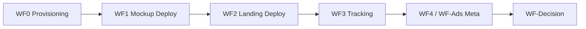

# n8n Workflows — App Validation Platform

**Status:** Blueprints + AI prompts + **some exported JSON**. Live sandboxes proven for WF0–WF4 (Human Lab). WF-Decision still future.

Canonical workflow order for the App Validation Platform (spec **1.5.0**).

## Spec 1.5.0 notes

- **Production Drive:** `App Validation/{appId}/app.json` **ONLY** — no `copy/`, `media/`, `mockup/`, `docs/`, `logs/`, `reports/`, README, or lockfiles
- **Landing copy:** inline `landingPage.sections[].inline` + `landingPage.content`
- **Media:** `url` / `githubPath` from `source.assetsGithubRepo ?? source.mockupGithubRepo`
- **Mockup GitHub:** full app repo; Vercel root = `source.mockupRootDirectory` (e.g. `/mockup`)
- **WF0** sole owner of `tracking.webhookUrl` (shared webhook URL for all apps)
- **WF4 / WF-Ads:** create-paused stays **PAUSED**; human activates in Ads Manager
- **WF-Decision:** `validation.latestReportUrl` (not Drive `reports/`) — not required for PAUSED create
- **WF3 auth:** default `webhookAuthSecret: null`; secrets never in Drive `app.json`

## New-app operator flow (no extra templates)

1. Duplicate **`app-package-starter`** only → fill package → push to GitHub app repo
2. Create Vercel **mockup** project (root = `mockup`) + empty **landing** GitHub/Vercel shells
3. Drive `app.json` only → run **WF0 → WF1 → WF2** with Config `appId`
4. Smoke **WF3** (events → Sheet) → **WF4** dry_run / create-paused → Ads Manager activate

Details: [`app-package-starter/START_HERE.md`](../app-package-starter/START_HERE.md)

## Workflow map

| Workflow | Trigger | Writes to `app.json` |
|----------|---------|----------------------|
| [WF0 — Provisioning](./WF0-PROVISIONING-PIPELINE-BLUEPRINT.md) | Manual; Config `appId`; Drive `status: provisioning` | `tracking.webhookUrl`, `status` → `ready` |
| [WF1 — Mockup Deploy](./WF1-DEPLOY-PIPELINE-BLUEPRINT.md) | Manual `appId` | `deployment.mockup.*`, `mockup.previewUrl` |
| [WF2 — Landing Deploy](./WF2-LANDING-DEPLOY-PIPELINE-BLUEPRINT.md) | Manual `appId` (landing repo/project must exist) | `deployment.landing.*`, `deployment.githubRepoUrl` |
| [WF3 — Tracking](./WF3-TRACKING-PIPELINE-BLUEPRINT.md) | Landing webhook POST | Google Sheets rows (runtime) |
| [WF-Ads — Meta](./WF-ADS-META-PIPELINE-BLUEPRINT.md) / live WF4 sandbox | Manual `appId` + approval for create-paused | `ads.meta.*` / variants |
| [WF-Decision — Monitoring](./WF-DECISION-MONITORING-PIPELINE-BLUEPRINT.md) | Schedule during `validating` | `validation.*` (+ `latestReportUrl`), root `status` |

## Write-back ownership

Each workflow may read the full `app.json` but must **merge-write only its owned keys**. See [APP_PACKAGE_SPEC.md](../app-validation-spec/APP_PACKAGE_SPEC.md#workflow-write-back-ownership).

## AI builder prompts

| Workflow | Prompt doc | Status |
|----------|------------|--------|
| WF1 | [WF1-N8N-AI-PROMPT.md](./WF1-N8N-AI-PROMPT.md) | Available |
| WF2 | [WF2-N8N-AI-PROMPT.md](./WF2-N8N-AI-PROMPT.md) | Available |
| WF0, WF3, WF-Ads, WF-Decision | — | Blueprint / sandbox-led (see `rehearsals/`) |

## Prerequisites

- [PLATFORM_SETUP_VALUES.md](../PLATFORM_SETUP_VALUES.md) — credentials and config tracker
- [N8N_PLATFORM_ARCHITECTURE.md](../N8N_PLATFORM_ARCHITECTURE.md) — canonical architecture
- [app-validation-spec/docs/workflow.md](../app-validation-spec/docs/workflow.md) — pipeline stages
- [NEED_TO_DO.md](../NEED_TO_DO.md) — deferred polish (multi-copy Meta, etc.)

## Pre-deploy validation

JSON Schema and production-profile checks before WF1 are documented in [validator-gate.md](../app-validation-spec/docs/validator-gate.md) — not a numbered workflow.

## Exported / live artifacts

| Artifact | Location |
|----------|----------|
| WF0 export | [`WF0-provisioning.json`](./WF0-provisioning.json) |
| WF1 export | [`WF1-mockup-deploy.json`](./WF1-mockup-deploy.json) |
| WF2 source | [`wf2-landing-deploy.workflow.ts`](./wf2-landing-deploy.workflow.ts) |
| WF3 / WF4 sandboxes | `rehearsals/wf3-human-lab-sandbox/`, `rehearsals/wf4-meta-ads-sandbox/` |

Production-named exports for WF3 / WF-Ads / WF-Decision may still be promoted from sandbox folders during the Spec 1.5.0 pass.
