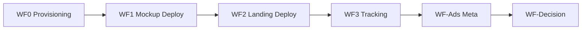

# n8n Workflows — App Validation Platform

**Status:** Blueprints and AI prompts only — **no workflow JSON exported yet**

Canonical workflow order for the App Validation Platform (spec **1.4.0**).

## Workflow map

| Workflow | Trigger | Writes to `app.json` |
|----------|---------|----------------------|
| [WF0 — Provisioning](./WF0-PROVISIONING-PIPELINE-BLUEPRINT.md) | `status: provisioning` | `tracking.webhookUrl`, `status` → `ready` |
| [WF1 — Mockup Deploy](./WF1-DEPLOY-PIPELINE-BLUEPRINT.md) | Manual `appId` | `deployment.mockup.*`, `mockup.previewUrl` |
| [WF2 — Landing Deploy](./WF2-LANDING-DEPLOY-PIPELINE-BLUEPRINT.md) | Manual `appId` | `deployment.landing.*`, `deployment.githubRepoUrl` |
| [WF3 — Tracking](./WF3-TRACKING-PIPELINE-BLUEPRINT.md) | Landing webhook POST | Google Sheets rows (runtime) |
| [WF-Ads — Meta](./WF-ADS-META-PIPELINE-BLUEPRINT.md) | Manual `appId` | `ads.meta.*`, `status` → `validating` |
| [WF-Decision — Monitoring](./WF-DECISION-MONITORING-PIPELINE-BLUEPRINT.md) | Schedule during `validating` | `validation.*`, root `status` |

## Write-back ownership

Each workflow may read the full `app.json` but must **merge-write only its owned keys**. See [APP_PACKAGE_SPEC.md](../app-validation-spec/APP_PACKAGE_SPEC.md#workflow-write-back-ownership).

## AI builder prompts

| Workflow | Prompt doc | Status |
|----------|------------|--------|
| WF1 | [WF1-N8N-AI-PROMPT.md](./WF1-N8N-AI-PROMPT.md) | Available |
| WF2 | [WF2-N8N-AI-PROMPT.md](./WF2-N8N-AI-PROMPT.md) | Available |
| WF0, WF3, WF-Ads, WF-Decision | — | Blueprint only (prompts TBD) |

## Prerequisites

- [PLATFORM_SETUP_VALUES.md](../PLATFORM_SETUP_VALUES.md) — credentials and config tracker
- [N8N_PLATFORM_ARCHITECTURE.md](../N8N_PLATFORM_ARCHITECTURE.md) — canonical architecture
- [app-validation-spec/docs/workflow.md](../app-validation-spec/docs/workflow.md) — pipeline stages

## Pre-deploy validation

JSON Schema and file-existence checks before WF1 are documented in [validator-gate.md](../app-validation-spec/docs/validator-gate.md) — not a numbered workflow.

## Exported workflow JSON (future)

When built, export to:

- `WF0-provisioning.json`
- `WF1-mockup-deploy.json`
- `WF2-landing-deploy.json`
- `WF3-tracking.json`
- `WF-Ads-meta.json`
- `WF-Decision-monitoring.json`
