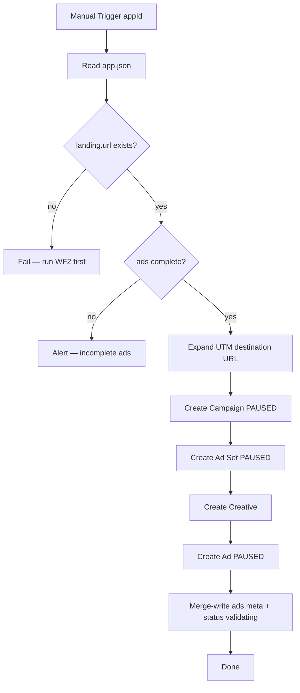
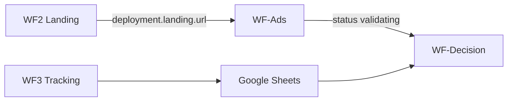

# WF-Ads — Meta/Facebook Ad Creation Pipeline

**Blueprint for n8n AI / human workflow builders**  
**Status:** Blueprint only — no workflow JSON yet  
**Spec version:** 1.4.0  
**Last updated:** 2026-07-07  
**n8n target:** n8n Cloud  
**Upstream:** [WF2 — Landing Deploy](./WF2-LANDING-DEPLOY-PIPELINE-BLUEPRINT.md) must have written `deployment.landing.url`

---

## 1. Purpose

WF-Ads creates a **paused** Meta/Facebook ad campaign that sends traffic to the deployed landing page. No ad spend occurs until a human activates the campaign in Meta Ads Manager.

**WF-Ads does:**

1. Manual trigger with input `appId`
2. Read `App Validation/{appId}/app.json` from Google Drive
3. Gate: `deployment.landing.url` exists (HTTPS)
4. Read `ads.*` (copy), `ads.targeting`, `experiment.testBudget`
5. Expand `ads.utmTemplate` → destination URL
6. Create Meta campaign, ad set, creative, ad — all **PAUSED**
7. Merge-write `ads.meta.*` only
8. Set `status` to `"validating"`

**WF-Ads does NOT:**

| Out of scope | Owned by |
|--------------|----------|
| Deploy mockup or landing | **WF1**, **WF2** |
| Overwrite `ads.headlines`, `primaryTexts`, etc. | Human author |
| Write `validation.*` | **WF-Decision** |
| Modify `deployment.*` | **WF1**, **WF2** |
| Activate ads (spend money) | Human in Meta Ads Manager |

---

## 2. Where each value goes

| Value | n8n Credentials | Config Set node | Drive `app.json` |
|-------|-----------------|-----------------|------------------|
| Meta API access token | ✅ | — | — |
| Meta ad account ID | ✅ | ✅ | — |
| `ads.*` (copy) | — | — | ✅ human sets |
| `ads.targeting` | — | — | ✅ human sets |
| `ads.meta.*` | — | — | ✅ **written by WF-Ads** |
| `deployment.landing.url` | — | — | ✅ read (WF2 writes) |
| `status` | — | — | WF-Ads sets `validating` |

---

## 3. Workflow config (Set node — no secrets)

```json
{
  "driveParentFolderId": "1O3RHwYFhJlPRBygNKxc7HGHmWtfiaB5A",
  "metaApiVersion": "v21.0",
  "defaultDailyBudget": null
}
```

`defaultDailyBudget` is fallback only — prefer `experiment.testBudget.amount / durationDays` or explicit package value.

---

## 4. Flow



---

## 5. Node inventory

| # | Node | Type |
|---|------|------|
| 1 | Manual Run | Manual Trigger (`appId`) |
| 2 | Workflow Config | Set |
| 3 | Read app.json | Google Drive |
| 4 | Gate landing URL | Code + IF |
| 5 | Validate ads section | Code + IF |
| 6 | Expand UTM | Code |
| 7 | Create Campaign | HTTP Request (Meta API) |
| 8 | Create Ad Set | HTTP Request |
| 9 | Create Ad Creative | HTTP Request |
| 10 | Create Ad | HTTP Request |
| 11 | Re-read app.json | Google Drive |
| 12 | Merge-Write app.json | Code + Drive Upload |
| 13 | Notify Failure | HTTP (optional) |

---

## 6. Validation

| Gate | Rule |
|------|------|
| `deployment.landing.url` | Non-empty HTTPS URI |
| `ads.campaignName` | Non-empty |
| `ads.platforms` | Includes `facebook` and/or `instagram` |
| `ads.headlines`, `ads.primaryTexts` | At least one variant each |
| `experiment.testBudget` | `amount` > 0, `durationDays` set |
| `ads.targeting` | Recommended: locations, ageMin, ageMax |

**Destination URL:**

```javascript
const destination = `${app.deployment.landing.url}?${utmParams}`;
```

Never use a top-level `landing.url` field — canonical path is `deployment.landing.url`.

---

## 7. Meta API (paused by default)

On campaign, ad set, and ad creation, set status to **PAUSED**:

- Campaign: `status: PAUSED` (or equivalent Meta API field)
- Ad set: `status: PAUSED`
- Ad: `status: PAUSED`

Human activates in Meta Ads Manager after reviewing copy, targeting, and landing page.

**Daily budget:** derive from `experiment.testBudget.amount / experiment.testBudget.durationDays` unless package specifies otherwise.

---

## 8. Write-back (merge only)

```json
{
  "ads": {
    "meta": {
      "status": "created_paused",
      "campaignId": "123456789",
      "adSetId": "987654321",
      "creativeId": "111222333",
      "adId": "444555666",
      "landingUrl": "https://human-lab-landing.vercel.app?utm_source=facebook&utm_medium=paid_social&utm_campaign=human-lab-validation",
      "dailyBudget": 35.71,
      "createdAt": "2026-07-07T12:00:00.000Z",
      "lastSyncedAt": null
    }
  },
  "status": "validating"
}
```

**Never modify:** `ads.headlines`, `ads.primaryTexts`, `experiment`, `deployment.*`, `validation`.

---

## 9. Error handling

| Error | Action |
|-------|--------|
| Missing landing URL | Fail: "Run WF2 first" |
| Incomplete `ads` | Alert; no Meta API calls |
| Meta API error | Retry 3× with backoff; do not change `status` |
| Partial Meta create | Log IDs created; alert for manual cleanup |
| Drive write-back fail | **Critical alert** — ads may exist but SSOT stale |

---

## 10. Testing

**Prerequisites:**

1. WF2 completed — `deployment.landing.url` live
2. Complete `ads` + `ads.targeting` on Drive
3. Meta credentials in n8n

**Test steps:**

1. Manual trigger WF-Ads with `appId=human-lab`
2. Verify `ads.meta` on Drive with all IDs
3. Verify `status: validating`
4. Confirm in Meta Ads Manager: campaign **paused**, destination URL correct
5. Confirm `ads.headlines` unchanged on Drive

---

## 11. Related workflows



---

## 12. Definition of done

- [ ] Manual trigger with `appId`
- [ ] Gates on `deployment.landing.url`
- [ ] Reads author `ads` copy; writes `ads.meta` only
- [ ] UTM expansion from `ads.utmTemplate`
- [ ] Creates campaign/ad set/ad **PAUSED**
- [ ] Sets `status: validating`
- [ ] Never overwrites `deployment.*` or author ad copy
- [ ] Export JSON to `n8n-workflows/WF-Ads-meta.json` when built

---

*Normative contract: [APP_PACKAGE_SPEC.md](../app-validation-spec/APP_PACKAGE_SPEC.md). UTM: [n8n-integration-notes.md](../app-validation-spec/docs/n8n-integration-notes.md).*
