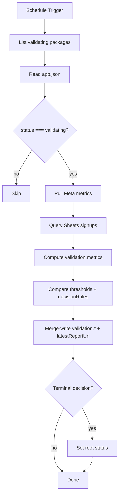
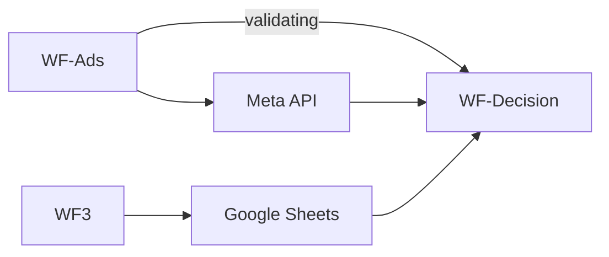

# WF-Decision — Validation Monitoring Pipeline

**Blueprint for n8n AI / human workflow builders**  
**Status:** Blueprint only — no workflow JSON yet  
**Spec version:** 1.5.0  
**Last updated:** 2026-07-09  
**n8n target:** n8n Cloud  
**Upstream:** [WF-Ads](./WF-ADS-META-PIPELINE-BLUEPRINT.md) sets `status: validating`; [WF3](./WF3-TRACKING-PIPELINE-BLUEPRINT.md) populates Google Sheets

---

## 1. Purpose

WF-Decision monitors whether the validation experiment is working. It aggregates Meta ad metrics and landing signup data, compares against thresholds, writes a **summary** to `validation.*` in Drive `app.json`, and may set terminal root `status`.

**Detailed raw data** stays in Google Sheets or an external report URL — set `validation.latestReportUrl` when a browser-accessible link exists. Do **not** write Drive `reports/` folders or `latestReportFile`.

**Production Drive (1.5.0):** `App Validation/{appId}/app.json` only.

**WF-Decision does:**

1. Schedule trigger (e.g. every 6–12 hours) during `status: validating`
2. Read `app.json` for each active `appId` (or single `appId` in v1)
3. Pull Meta metrics via `ads.meta.campaignId` / ad set / ad IDs
4. Pull signup counts from Google Sheets (`email_captured`, `buy_now_clicked`)
5. Compute spend, CTR, CPC, signup rate, cost per signup
6. Compare against `experiment.thresholds` and `experiment.decisionRules`
7. Merge-write `validation.*` (including `latestReportUrl` when available)
8. Set root `status` to `winner`, `killed`, or `paused` when criteria met

**WF-Decision does NOT:**

| Out of scope | Owned by |
|--------------|----------|
| Create or modify ads | **WF-Ads** |
| Deploy infrastructure | **WF0**–**WF2** |
| Add `validation.status` | Use root `status` only |
| Write Drive `reports/` files | Deprecated in 1.5.0 — use Sheets / `latestReportUrl` |
| Overwrite author sections | Human / other workflows |

---

## 2. Where each value goes

| Value | n8n Credentials | Config Set node | Drive |
|-------|-----------------|-----------------|-------|
| Google SA | ✅ | — | Read/write `app.json` only |
| Meta API token | ✅ | — | Read ad metrics |
| `GOOGLE_SHEET_ID` | — | ✅ | Read signup rows (detailed data) |
| `validation.*` | — | — | ✅ merge-write summary |
| `validation.latestReportUrl` | — | — | ✅ URI to Sheets / external / n8n execution |
| Root `status` | — | — | ✅ `winner`/`killed`/`paused` |

---

## 3. Workflow config (Set node — no secrets)

```json
{
  "driveParentFolderId": "1O3RHwYFhJlPRBygNKxc7HGHmWtfiaB5A",
  "googleSheetId": "YOUR_SHEET_ID",
  "googleSheetTabName": "Sheet1",
  "scheduleHours": 12,
  "metaApiVersion": "v21.0"
}
```

---

## 4. Flow



---

## 5. Node inventory

| # | Node | Type |
|---|------|------|
| 1 | Schedule | Schedule Trigger (every N hours) |
| 2 | Workflow Config | Set |
| 3 | List Drive packages / filter validating | Google Drive + Code |
| 4 | Read app.json | Google Drive |
| 5 | Gate status validating | IF |
| 6 | Meta Insights API | HTTP Request |
| 7 | Sheets aggregate signups | Google Sheets + Code |
| 8 | Compute metrics | Code |
| 9 | Decision logic | Code |
| 10 | Re-read app.json | Google Drive |
| 11 | Merge-Write validation | Code + Drive Upload |
| 12 | Optional: pause Meta ads on kill | HTTP Request |
| 13 | Notify | HTTP (optional) |

**No** Drive Upload of `reports/validation-*.json`.

---

## 6. Validation / metrics

**Signup source (v1):** Google Sheets rows where:

- `appId` matches package
- `experimentRunId` matches `analytics.experimentRunId`
- `eventType` in (`email_captured`, `buy_now_clicked`)

**Computed `validation.metrics`:**

| Field | Source |
|-------|--------|
| `spend` | Meta Insights API |
| `impressions`, `clicks` | Meta Insights API |
| `ctr` | clicks / impressions |
| `cpc` | spend / clicks |
| `signups` | Sheet row count |
| `signupRate` | signups / clicks |
| `costPerSignup` | spend / signups |

**Decision inputs:**

- `experiment.thresholds.minClicks`, `minSignupRate`, `maxCostPerSignup` (structured)
- `experiment.decisionRules.winnerThreshold`, `killThreshold`, `minSampleSize` (narrative)
- `experiment.testBudget.amount`, `durationDays`

**`validation.recommendation` values:** `continue`, `needs_review`, `scale`, `pause`, `kill` — advisory only unless paired with root `status` change.

---

## 7. Report location (1.5.0)

Detailed snapshots stay in **Google Sheets** (or an external host / n8n execution URL). Do not create `App Validation/{appId}/reports/`.

Set `validation.latestReportUrl` to a browser-accessible link when available, e.g.:

```json
{
  "latestReportUrl": "https://docs.google.com/spreadsheets/d/…/edit#gid=0"
}
```

`validation.latestReportFile` is **deprecated** — do not write it on new runs.

Optional: keep a full metrics snapshot in n8n execution data or a Code-node log for debugging; the Drive control plane only needs the `validation.*` summary.

---

## 8. Write-back (merge only)

```json
{
  "validation": {
    "lastCheckedAt": "2026-07-07T18:00:00.000Z",
    "metrics": {
      "spend": 42.15,
      "impressions": 3200,
      "clicks": 117,
      "ctr": 0.0365,
      "cpc": 0.36,
      "signups": 9,
      "signupRate": 0.0769,
      "costPerSignup": 4.68
    },
    "recommendation": "continue",
    "latestReportUrl": "https://docs.google.com/spreadsheets/d/…/edit#gid=0"
  }
}
```

**Terminal status** (separate merge when criteria met):

```json
{ "status": "winner" }
```

**Never write** `validation.status` — lifecycle uses root `status` enum only.  
**Never write** Drive `reports/` or `latestReportFile`.

---

## 9. Error handling

| Error | Action |
|-------|--------|
| Meta API fail | Retry; log; skip status change |
| Sheets read fail | Alert; partial metrics if Meta OK |
| `ads.meta` missing | Skip package; alert |
| Drive `app.json` write fail | **Critical alert** — metrics computed but SSOT stale |
| Ambiguous decision | Set `recommendation: needs_review`; optional `status: paused` |

---

## 10. Testing

**Prerequisites:**

1. `status: validating` on Drive
2. `ads.meta` populated by WF-Ads
3. WF3 receiving events — Sheet has rows
4. Meta campaign active or test data available

**Test steps:**

1. Run WF-Decision manually for `appId=human-lab`
2. Verify `validation.metrics` on Drive `app.json`
3. Verify `validation.latestReportUrl` points to Sheets/external (no `reports/` folder on Drive)
4. Confirm root `status` unchanged when experiment continues
5. Simulate kill criteria; confirm `status: killed` and Meta pause call

---

## 11. Related workflows



---

## 12. Definition of done

- [ ] Schedule trigger during `validating`
- [ ] Pulls Meta + Sheets metrics
- [ ] Writes `validation.*` summary only (not author sections)
- [ ] Sets `validation.latestReportUrl` (not Drive `reports/` / `latestReportFile`)
- [ ] Sets root `status` for terminal outcomes
- [ ] Never writes `validation.status`
- [ ] Export JSON to `n8n-workflows/WF-Decision-monitoring.json` when built

---

*Normative contract: [APP_PACKAGE_SPEC.md](../app-validation-spec/APP_PACKAGE_SPEC.md). Architecture: [N8N_PLATFORM_ARCHITECTURE.md](../N8N_PLATFORM_ARCHITECTURE.md) §7.*
