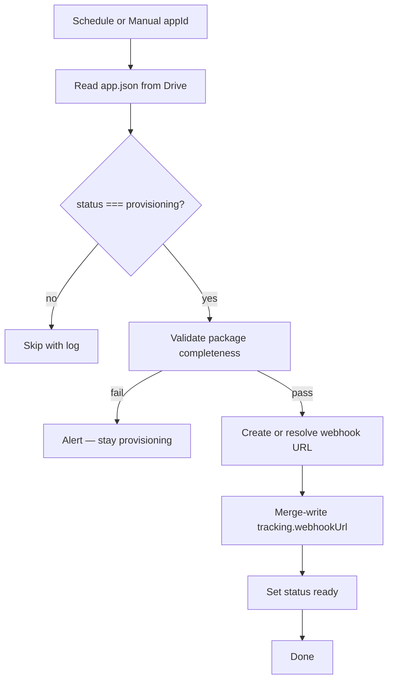
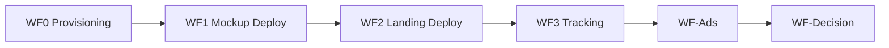

# WF0 — Provisioning Pipeline

**Blueprint for n8n AI / human workflow builders**  
**Status:** Blueprint only — no workflow JSON yet  
**Spec version:** 1.4.0  
**Last updated:** 2026-07-07  
**n8n target:** n8n Cloud

---

## 1. Purpose

WF0 provisions **tracking infrastructure** for App Packages on Google Drive before the deploy pipeline runs.

**WF0 does:**

1. Trigger on `status: provisioning` (schedule poll or manual `appId`)
2. Read `App Validation/{appId}/app.json` from Google Drive
3. Validate package completeness (`experiment`, `analytics`, `ads`)
4. Create or resolve n8n webhook URL for landing events
5. Merge-write `tracking.webhookUrl` to Drive `app.json`
6. Set `status` to `"ready"`

**WF0 does NOT:**

| Out of scope | Owned by |
|--------------|----------|
| Mockup or landing deploy | **WF1**, **WF2** |
| Meta ads | **WF-Ads** |
| Metrics / decision | **WF-Decision** |
| Modify `deployment.*`, `ads.meta`, `validation` | Other workflows |

**App Package on Drive remains SSOT.** WF0 never changes author content sections.

---

## 2. Where each value goes

| Value | n8n Credentials | Config Set node | `.env` | `PLATFORM_SETUP_VALUES.md` | Drive `app.json` |
|-------|-----------------|-----------------|----------------|---------------------------|------------------|
| Google Service Account JSON | ✅ | — | optional | redacted | — |
| Drive folder ID | — | ✅ | ✅ | ✅ | — |
| `N8N_BASE_URL` | — | ✅ | ✅ | ✅ | — |
| `tracking.webhookUrl` | — | — | — | — | ✅ **written by WF0** |
| `status` | — | — | — | — | Human sets `provisioning`; WF0 sets `ready` |

---

## 3. Workflow config (Set node — no secrets)

```json
{
  "driveParentFolderId": "1O3RHwYFhJlPRBygNKxc7HGHmWtfiaB5A",
  "n8nBaseUrl": "https://scooter.app.n8n.cloud",
  "webhookPathPrefix": "app-validation"
}
```

Webhook URL pattern: `{n8nBaseUrl}/webhook/{webhookPathPrefix}/{appId}-events` (or per-app n8n Webhook node path).

---

## 4. Flow



---

## 5. Node inventory

| # | Node | Type |
|---|------|------|
| 1 | Schedule Poll | Schedule Trigger (e.g. every 15 min) **or** Manual Trigger (`appId`) |
| 2 | Workflow Config | Set |
| 3 | List Drive folders / Read app.json | Google Drive |
| 4 | Parse + Gate status | Code |
| 5 | Gate: status provisioning | IF |
| 6 | Validate package completeness | Code |
| 7 | Validation Pass? | IF |
| 8 | Resolve Webhook URL | Code |
| 9 | Re-read app.json | Google Drive |
| 10 | Merge-Write app.json | Code + Drive Upload |
| 11 | Notify Failure | HTTP (optional) |

---

## 6. Validation

**Required before WF0 runs:**

| Gate | Rule |
|------|------|
| `status` | Must be `"provisioning"` |
| `experiment` | Full section: name, hypothesis, successCriteria, testBudget, decisionRules |
| `analytics` | `projectId`, `experimentId`, `experimentRunId`, `landingVariantId`, `mockupVersionId` |
| `ads` | `campaignName`, `platforms`, at least one headline and primaryText |
| `appId` | Matches folder name (warn on mismatch) |

**Optional:** `ads.targeting`, `experiment.thresholds` (recommended before WF-Ads/WF-Decision).

---

## 7. Webhook provisioning

1. Use n8n Webhook node (production URL) or construct stable path from Config Set + `appId`
2. URL must be HTTPS and reachable from deployed Vercel landing pages
3. Store in `tracking.webhookUrl` only — not in `tracking.webhooks.*` legacy keys

WF3 (separate workflow) receives POSTs at this URL and appends Google Sheets rows.

---

## 8. Write-back (merge only)

```json
{
  "tracking": {
    "webhookUrl": "https://scooter.app.n8n.cloud/webhook/app-validation/human-lab-events"
  },
  "status": "ready"
}
```

**Never modify:** `appId`, `specVersion`, `deployment.*`, `ads.meta`, `validation`, author sections.

---

## 9. Error handling

| Error | Action |
|-------|--------|
| `status !== provisioning` | Log; skip |
| Package incomplete | Alert; stay `provisioning` |
| Webhook creation fail | Retry 3×; alert; stay `provisioning` |
| Drive write-back fail | **Critical alert** — webhook may exist but SSOT stale |

---

## 10. Testing

**Prerequisites:**

1. Package on Drive with full `experiment`, `analytics`, `ads`
2. `status: "provisioning"`

**Test steps:**

1. Trigger WF0 with `appId=human-lab`
2. Verify `tracking.webhookUrl` on Drive
3. Verify `status: "ready"`
4. POST test payload to webhook URL; confirm WF3 appends Sheet row (when WF3 is built)

---

## 11. Related workflows



---

## 12. Definition of done

- [ ] Schedule poll and/or manual trigger with `appId`
- [ ] Gates on `status: provisioning` only
- [ ] Validates experiment, analytics, ads completeness
- [ ] Provisions non-null `tracking.webhookUrl`
- [ ] Merge-write `tracking.webhookUrl` and `status: ready` only
- [ ] Never modifies `deployment.*`, `ads.meta`, `validation`
- [ ] Export JSON to `n8n-workflows/WF0-provisioning.json` when built

---

*Normative contract: [APP_PACKAGE_SPEC.md](../app-validation-spec/APP_PACKAGE_SPEC.md). Setup: [PLATFORM_SETUP_VALUES.md](../PLATFORM_SETUP_VALUES.md).*
