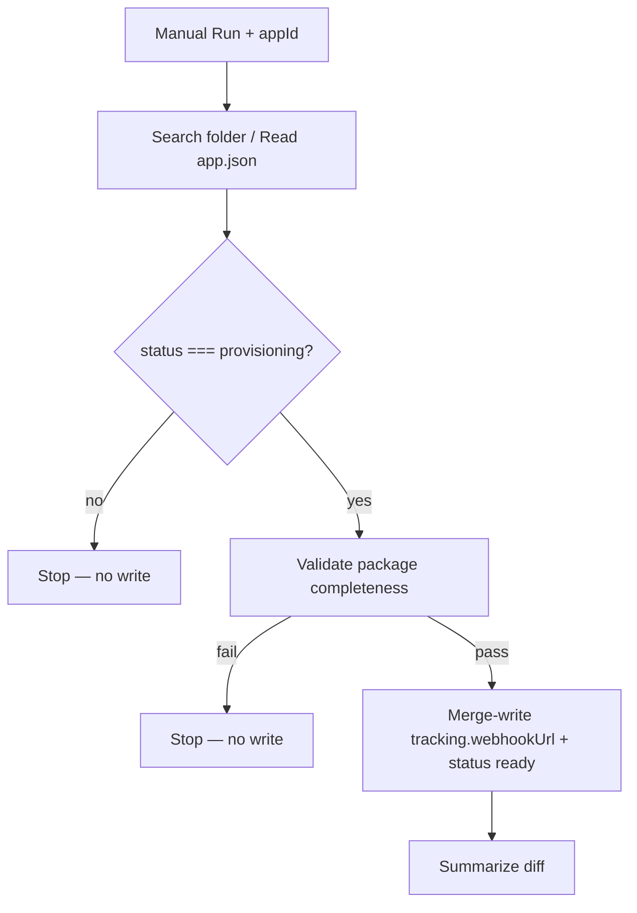
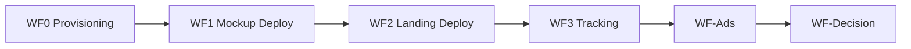

# WF0 — Provisioning Pipeline

**Blueprint for n8n AI / human workflow builders**  
**Status:** **Complete — canonical workflow deployed and proven**  
**Spec version:** 1.5.0  
**Last updated:** 2026-07-15  
**n8n target:** n8n Cloud

**Proof report:** [rehearsals/wf0-provisioning-test-report.md](../rehearsals/wf0-provisioning-test-report.md)

---

## Deployed workflow

| Field | Value |
|-------|-------|
| Name | `WF0 Provisioning` |
| Workflow ID | `kM6JiXaJMVje5sxR` |
| URL | `https://scottyo.app.n8n.cloud/workflow/kM6JiXaJMVje5sxR` |
| Export | `n8n-workflows/WF0-provisioning.json` |
| SDK source | `n8n-workflows/wf0-provisioning.workflow.ts` |
| Active | `false` — manual only |
| Scope | **Canonical generic provisioning** — not sandbox-only; change only `appId` per run |

Initial proof target: `human-lab-wf1-sandbox`  
Canonical sandbox `app.json` Drive file ID: `17JpSbiHXgdayoPEiTuPpQfvX7Kfvs5n9`

---

## 1. Purpose

WF0 provisions **tracking infrastructure** for App Packages on Google Drive before the deploy pipeline runs.

**WF0 is the sole owner of `tracking.webhookUrl`.** No other workflow may create, overwrite, or clear this field. WF3 receives POSTs at the URL; WF2 only embeds whatever value is already on `app.json`.

**Production Drive (1.5.0):** `App Validation/{appId}/app.json` **ONLY** — no `copy/`, `media/`, `mockup/`, `docs/`, `logs/`, `reports/`, README, package files, or lockfiles. Warn if the folder contains anything else.

**WF0 does:**

1. Trigger manually with `appId` in Workflow Config
2. Read `App Validation/{appId}/app.json` from Google Drive (resolve by folder + filename, not hardcoded file ID)
3. Validate package completeness (`experiment`, `analytics`, `ads`) and Drive hygiene (`app.json` only)
4. Merge-write the **fixed shared** WF3 webhook URL to `tracking.webhookUrl`
5. Set `status` to `"ready"`

**WF0 does NOT:**

| Out of scope | Owned by |
|--------------|----------|
| Mockup or landing deploy | **WF1**, **WF2** |
| Receive webhook events / Sheets | **WF3** |
| Meta ads | **WF-Ads** |
| Metrics / decision | **WF-Decision** |
| Modify `deployment.*`, `ads.meta`, `validation` | Other workflows |
| Derive per-app webhook URLs | — (shared URL only) |
| Store webhook auth secrets in `app.json` | n8n env / Credentials only (see WF3) |

**Drive `app.json` remains control-plane SSOT.** WF0 never changes author content sections.

---

## 2. Where each value goes

| Value | n8n Credentials | Config Set node | `.env` | `PLATFORM_SETUP_VALUES.md` | Drive `app.json` |
|-------|-----------------|-----------------|----------------|---------------------------|------------------|
| Google Service Account JSON | ✅ | — | optional | redacted | — |
| Drive folder ID | — | ✅ | ✅ | ✅ | — |
| `N8N_BASE_URL` | — | ✅ | ✅ | ✅ | — |
| `tracking.webhookUrl` | — | — | — | — | ✅ **written by WF0 only** |
| `status` | — | — | — | — | Human sets `provisioning`; WF0 sets `ready` |
| Webhook auth secret | n8n env / Credentials | — | — | — | **never** in Drive `app.json` |

---

## 3. Workflow config (Set node — no secrets)

```json
{
  "appId": "human-lab-wf1-sandbox",
  "driveParentFolderId": "1O3RHwYFhJlPRBygNKxc7HGHmWtfiaB5A",
  "sharedWebhookUrl": "https://scottyo.app.n8n.cloud/webhook/app-validation/events"
}
```

**Shared webhook (every app):** WF0 writes the exact `sharedWebhookUrl` constant above. It does **not** construct per-app paths like `{appId}-events`. WF3 distinguishes apps by payload fields.

To provision another app: change only `appId` in Workflow Config.

---

## 4. Flow



---

## 5. Node inventory (deployed — 13 nodes)

| # | Node | Type |
|---|------|------|
| 1 | Manual Run | Manual Trigger |
| 2 | Workflow Config | Set (`appId`, `driveParentFolderId`, `sharedWebhookUrl`) |
| 3 | Search App Folder | Google Drive |
| 4 | List Folder Files | Google Drive |
| 5 | Resolve app.json | Code |
| 6 | Download app.json | Google Drive |
| 7 | Parse + Validate Provisioning | Code |
| 8 | Status Provisioning? | IF |
| 9 | Validation Passed? | IF |
| 10 | Re-download app.json | Google Drive |
| 11 | Merge Write + Diff Guard | Code |
| 12 | Update Drive app.json | Google Drive |
| 13 | Summarize Result | Code |

False IF branches are terminal (no write-back).

---

## 6. Validation

**Required before WF0 runs:**

| Gate | Rule |
|------|------|
| `status` | Must be `"provisioning"` |
| Drive hygiene | Folder contains **only** `app.json` (warn/error on extra files) |
| `experiment` | Full section: name, hypothesis, successCriteria, testBudget, decisionRules |
| `analytics` | `projectId`, `experimentId`, `experimentRunId`, `landingVariantId`, `mockupVersionId` |
| `ads` | `campaignName`, `platforms`, at least one headline and primaryText |
| Landing copy (production) | Enabled sections use `source: "inline"`; `landingPage.content` for long-form |
| Media refs | Used assets have `url` or `githubPath` (not Drive `path`) |
| `appId` | Matches folder name (warn on mismatch) |
| `sharedWebhookUrl` | Must equal the approved constant exactly |

---

## 7. Webhook provisioning

**Ownership:** WF0 alone writes `tracking.webhookUrl`. WF1/WF2/WF3/WF-Ads/WF-Decision must not overwrite it.

1. **Fixed shared URL** — `https://scottyo.app.n8n.cloud/webhook/app-validation/events` for every app
2. URL must be HTTPS and reachable from deployed Vercel landing pages
3. Store in `tracking.webhookUrl` only — not in `tracking.webhooks.*` legacy keys
4. Do **not** write auth secrets into `app.json` — future Bearer auth lives in n8n env / Credentials (WF3)

WF3 (workflow `7G2fJmqKsr8CGVID`) receives POSTs at this URL and appends Google Sheets rows.

---

## 8. Write-back (merge only)

WF0 writes **only** these two fields:

```json
{
  "tracking": {
    "webhookUrl": "https://scottyo.app.n8n.cloud/webhook/app-validation/events"
  },
  "status": "ready"
}
```

**Never modify:** `appId`, `specVersion`, `deployment.*`, `ads.meta`, `validation`, author sections.

Merge Write + Diff Guard aborts if any other field would change.

---

## 9. Error handling

| Error | Action |
|-------|--------|
| `status !== provisioning` | Stop; no write |
| Package incomplete | Stop; no write |
| `sharedWebhookUrl` mismatch | Stop; no write |
| Diff guard detects extra changes | Abort before upload |
| Drive write-back fail | Execution fails — SSOT not updated |

---

## 10. Testing (completed)

**Initial proof target:** `human-lab-wf1-sandbox`

**WF0 proof (execution 27):**

- `status`: `provisioning` → `ready`
- `tracking.webhookUrl`: `null` → shared WF3 URL
- Protected-field hash unchanged (`24508687`)
- No unrelated fields changed

**End-to-end proof (post-WF0):**

1. WF2 re-read `app.json` and redeployed landing with embedded webhook URL
2. Deployed landing page sent a live event to WF3
3. WF3 recorded the event in the Google Sheet

See [wf0-provisioning-test-report.md](../rehearsals/wf0-provisioning-test-report.md) for full evidence.

---

## 11. Related workflows



---

## 12. Definition of done

- [x] Manual trigger with `appId` in Workflow Config
- [x] Gates on `status: provisioning` only
- [x] Validates experiment, analytics, ads completeness + Drive `app.json`-only hygiene
- [x] Sole owner: provisions non-null `tracking.webhookUrl` (fixed shared URL)
- [x] Merge-write `tracking.webhookUrl` and `status: ready` only
- [x] Never stores auth secrets in Drive `app.json`
- [x] Never modifies `deployment.*`, `ads.meta`, `validation`
- [x] Export JSON to `n8n-workflows/WF0-provisioning.json`
- [x] Sandbox proof execution `27` passed
- [x] End-to-end chain verified (WF2 → landing → WF3 → Sheet)
- [x] Workflow remains inactive/manual pending production promotion

**WF0 is complete. No remaining WF0 work.**

---

*Normative contract: [APP_PACKAGE_SPEC.md](../app-validation-spec/APP_PACKAGE_SPEC.md). Setup: [PLATFORM_SETUP_VALUES.md](../PLATFORM_SETUP_VALUES.md).*
