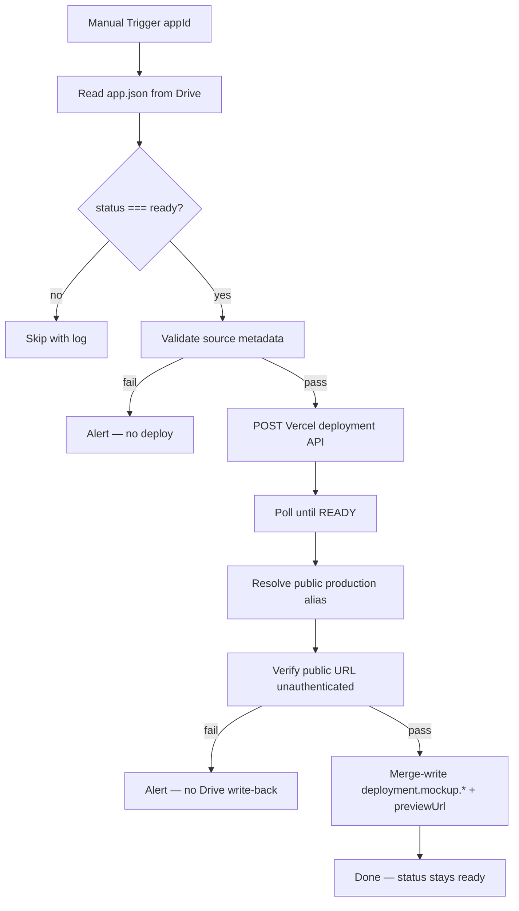
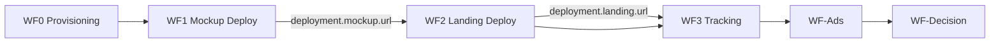

# WF1 — Mockup Deploy Pipeline

**Blueprint for n8n AI / human workflow builders**  
**Status:** Blueprint only — no workflow JSON yet  
**Spec version:** 1.4.0  
**Last updated:** 2026-07-05  
**n8n target:** n8n Cloud (no local Node/npm)

---

## 1. Purpose

WF1 deploys the **interactive mockup only** for App Packages on Google Drive.

**WF1 v1 assumes mockup infrastructure is already provisioned:**

- GitHub repo already exists for the mockup app
- Vercel project already exists for the mockup app
- Vercel project is already connected to the GitHub repo
- Vercel project root directory is already configured correctly (e.g. `mockup`)

**WF1 does:**

1. Manual trigger with input `appId`
2. Read `App Validation/{appId}/app.json` from Google Drive
3. Confirm `status === "ready"`
4. Validate required mockup deploy metadata in `source.*`
5. Read deploy metadata from `app.json` (`source.mockupGithubRepo`, branch, root directory, Vercel project ID or name)
6. Trigger Vercel deployment via Vercel API (`gitSource` from GitHub)
7. Poll deployment until `readyState === "READY"`
8. Resolve the **public production alias** (not the raw deployment URL)
9. Verify the public URL is incognito-safe and iframe-safe
10. **Merge-write** only `deployment.mockup.*` and `mockup.previewUrl` back to Drive `app.json` (only if verification passes)
11. Leave `status` as `"ready"`

**WF1 does NOT:**

| Out of scope | Future workflow |
|--------------|-----------------|
| Create GitHub repos | Human / separate tooling |
| Create Vercel projects | Human one-time setup in vercel.com |
| Download `mockup/` from Drive or push to GitHub | GitHub is code SSOT; code lives in repo |
| Landing transform + deploy | **WF2** |
| Webhook provisioning, tracking, Google Sheets | **WF3** |
| Meta ads | **WF-Ads** |
| Experiment decisions | **WF-Decision** |

**WF1 does NOT require `tracking.webhookUrl`.** Webhooks belong to WF3.

**App Package on Drive remains SSOT.** WF1 never changes `appId`, `specVersion`, `source.*`, or author content.

---

## 2. Where each value goes

| Value | n8n Credentials | n8n Config Set node | `.env` (local) | `PLATFORM_SETUP_VALUES.md` | Drive `app.json` | Vercel / GitHub |
|-------|-----------------|---------------------|----------------|---------------------------|------------------|-----------------|
| Google Service Account JSON | ✅ paste JSON | — | optional copy | tracker only (redacted) | — | — |
| Vercel API token | ✅ Bearer auth | — | optional copy | tracker only | — | — |
| Drive folder ID | — | ✅ | ✅ | ✅ | — | — |
| Vercel team ID | — | ✅ | ✅ | ✅ | — | query param on API |
| `source.mockupGithubRepo` | — | — | — | — | ✅ **human sets** | repo must exist |
| `source.mockupBranch` | — | — | — | — | ✅ **human sets** | branch in repo |
| `source.mockupRootDirectory` | — | — | — | — | ✅ **human sets** | Vercel root directory |
| `source.vercelMockupProjectId` | — | — | — | — | ✅ **human sets** | project must exist |
| `source.vercelMockupProjectName` | — | — | — | — | ✅ **human sets** (or ID) | project must exist |
| `deployment.mockup.*` | — | — | — | — | ✅ **written by WF1** | deploy output |
| `mockup.previewUrl` | — | — | — | — | ✅ **written by WF1** | — |
| `tracking.webhookUrl` | — | — | — | — | WF3 writes | — |
| `status` | — | — | — | — | Human sets `ready` to trigger WF1 | — |

**Rules:**

- **Secrets** → n8n Credentials only (not Config node, not committed markdown, not `app.json`).
- **`.env`** → local reference; n8n Cloud does not read it automatically.
- **`PLATFORM_SETUP_VALUES.md`** → human tracker; no real secrets.
- **Drive `app.json`** → SSOT for package content; WF1 reads `source.*` and writes only mockup deploy output fields.
- **`deployment.mockup.url` and `mockup.previewUrl`** → public production alias only (e.g. `https://human-lab.vercel.app`). Never the raw SSO-protected deployment hostname.
- **`deployment.mockup.deploymentUrl`** → optional debug field for the raw Vercel deployment URL; WF2 must never use it.

### What “Vercel project connected” means (one-time human setup)

In **vercel.com**:

1. Add project → Import GitHub repo from `source.mockupGithubRepo` (e.g. `scootero/Human-Lab`)
2. Set **Root Directory** = `source.mockupRootDirectory` (e.g. `mockup`)
3. Framework = Vite (or match mockup stack)
4. Deploy once manually to confirm build works
5. Record `vercelMockupProjectId` and/or `vercelMockupProjectName` in `app.json` → `source`

After that, WF1 triggers redeploys via Vercel API using the same connected project.

### Drive status for WF1

| `status` | WF1 behavior |
|----------|--------------|
| **`ready`** | ✅ Process when manually triggered |
| `draft`, `provisioning` | Skip |
| `validating`, `paused`, `winner`, `killed`, `built` | Skip |

Human sets `status: "ready"` when the package is complete, `source.*` is filled, and mockup infrastructure is provisioned.

---

## 3. Workflow config (Set node — no secrets)

```json
{
  "driveParentFolderId": "1O3RHwYFhJlPRBygNKxc7HGHmWtfiaB5A",
  "vercelTeamId": "team_CvzW7iL13TaNbaIiaCHfjafe",
  "vercelPollIntervalSeconds": 15,
  "vercelPollMaxMinutes": 10
}
```

Per-app deploy metadata lives in Drive `app.json` → `source`, not in the Config Set node.

---

## 4. Flow



---

## 5. Node inventory

| # | Node | Type |
|---|------|------|
| 1 | Manual Run | Manual Trigger (`appId` string, required) |
| 2 | Workflow Config | Set |
| 3 | Read app.json | Google Drive (download `App Validation/{appId}/app.json`) |
| 4 | Parse + Gate status | Code |
| 5 | Gate: status ready | IF |
| 6 | Validate source metadata | Code |
| 7 | Validation Pass? | IF |
| 8 | Notify Failure | HTTP (optional) |
| 9 | Trigger Vercel Deploy | HTTP Request |
| 10 | Poll Vercel | HTTP + Wait |
| 11 | Extract URLs | Code — resolve public alias + raw deployment URL |
| 12 | Get Project Domains | HTTP Request (conditional fallback) |
| 13 | Verify Public URL | HTTP Request (unauthenticated HEAD/GET) |
| 14 | Public URL OK? | IF |
| 15 | Merge-Write app.json | Code + Drive Upload (pass branch only) |

**v1 has no:** Schedule trigger, Drive folder listing, mockup download, GitHub nodes.

---

## 6. Validation

**Schema:** `app-validation-spec/schemas/app.schema.json` for `specVersion`, `appId`.

**Required `source` fields for WF1:**

| Field | Rule |
|-------|------|
| `source.mockupGithubRepo` | Non-empty; `org/repo` or GitHub URL |
| `source.mockupBranch` | Non-empty (e.g. `main`) |
| `source.mockupRootDirectory` | Non-empty (e.g. `mockup`) |
| `source.vercelMockupProjectId` | At least one of project ID **or** project name |
| `source.vercelMockupProjectName` | At least one of project ID **or** project name |

**Optional checks:**

- `appId` matches folder name (warn if mismatch)
- `mockup` section present (informational)

**Not required for WF1:** `copy/`, `media/`, `mockup/` files on Drive, `landingPage`, `tracking.webhookUrl`, full `experiment`/`ads` completeness (those gate WF2/WF3/ads).

---

## 7. Mockup deploy

### Vercel API

Parse `source.mockupGithubRepo` into `org` and `repo` (strip `https://github.com/` prefix if present).

```http
POST https://api.vercel.com/v13/deployments?teamId={vercelTeamId}
Authorization: Bearer {VERCEL_API_TOKEN}

{
  "name": "{source.vercelMockupProjectName}",
  "project": "{source.vercelMockupProjectId}",
  "target": "production",
  "gitSource": {
    "type": "github",
    "org": "{org}",
    "repo": "{repo}",
    "ref": "{source.mockupBranch}"
  }
}
```

Use `project` when `vercelMockupProjectId` is set; otherwise use `name` with `vercelMockupProjectName`. Vercel builds from the connected repo using the configured root directory (`source.mockupRootDirectory` must match Vercel project settings).

Poll `GET /v13/deployments/{id}?teamId={vercelTeamId}` until `readyState === "READY"` (interval: `vercelPollIntervalSeconds`, max: `vercelPollMaxMinutes`).

### Resolve public production alias

**Never** write the deployment response `url` to `deployment.mockup.url` or `mockup.previewUrl`. On team projects with Deployment Protection, that hostname redirects to Vercel SSO and sets `X-Frame-Options: DENY`.

After poll succeeds, resolve the public alias (priority order):

1. From deployment `alias[]` — pick a hostname ending in `.vercel.app` that is **not** a team-protected pattern (`*-{teamSlug}.vercel.app`, hash-prefixed deployment hostnames like `human-ji7v1j84i-scooteros-projects.vercel.app`)
2. Fallback: `GET /v9/projects/{source.vercelMockupProjectId}/domains?production=true&target=production&teamId={vercelTeamId}` — first verified production domain
3. Normalize to `https://{hostname}`

Store the raw deployment response URL separately:

- `https://{response.url}` → `deployment.mockup.deploymentUrl` (debug only; WF2 must never use for `mockup.embedUrl`)

Also capture:

- `projectId` → `deployment.mockup.vercelProjectId`
- `createdAt` or current timestamp → `deployment.mockup.lastDeployedAt`

### Public URL verification gate (before Drive write-back)

HTTP request to the resolved public URL with **no auth headers**. **Fail** if any of:

- Status is not 200
- `Location` header redirects to `vercel.com/sso-api`
- Response includes `X-Frame-Options: DENY`

On failure: alert with deployment ID, public URL, and raw deployment URL; **do not** write mockup URL fields to Drive.

---

## 8. Write-back (merge only)

Only write to Drive when the public URL verification gate passes.

```json
{
  "mockup": {
    "previewUrl": "https://human-lab.vercel.app"
  },
  "deployment": {
    "mockup": {
      "vercelProjectId": "prj_hF5X5kvGbfgPQlajR5qf1KZ7rjUt",
      "url": "https://human-lab.vercel.app",
      "deploymentUrl": "https://human-ji7v1j84i-scooteros-projects.vercel.app",
      "lastDeployedAt": "2026-07-02T12:00:00.000Z"
    }
  }
}
```

**Invariants:**

- `mockup.previewUrl === deployment.mockup.url` (public production alias only)
- `deployment.mockup.deploymentUrl` is optional debug field; never used by WF2 transform

**Never modify:** `appId`, `specVersion`, `source`, `identity`, `copy`, `experiment`, `tracking`, `deployment.landing.*`

**Status after success:** stays `ready`

---

## 9. Error handling

| Error | Action |
|-------|--------|
| Validation fail (status or source) | Alert optional; no deploy; status stays `ready` |
| Vercel deploy fail | Retry 3× with backoff; alert |
| Vercel poll timeout | Alert; status stays `ready` |
| Public alias resolution fail | Alert; no Drive write-back |
| Public URL verification fail | Alert with deployment ID + both URLs; no Drive write-back |
| Drive write-back fail | **Critical alert** — deploy may be live but SSOT stale |

---

## 10. Testing

**Prerequisites (one-time):**

1. GitHub repo exists with mockup code pushed
2. Vercel project connected to repo; root directory = `mockup`; manual deploy succeeded
3. `source.*` filled in Drive `app.json`
4. `status: "ready"` in `app.json`

**Test steps:**

1. Manual trigger WF1 with `appId=human-lab`
2. Verify `deployment.mockup.url` and `mockup.previewUrl` on Drive
3. Confirm URL is production alias shape (`https://{projectName}.vercel.app`), not `*-scooteros-projects.vercel.app`
4. Open mockup URL in **incognito** — must load without Vercel login
5. Open `{url}?embed=1` — nav bar hidden, mockup UI renders correctly

---

## 11. Future workflows



| Workflow | Scope |
|----------|-------|
| **WF0** | Provision `tracking.webhookUrl`; `provisioning` → `ready` |
| **WF1** | Mockup deploy only (this doc) |
| **WF2** | Landing transform + deploy; writes `deployment.landing.*` |
| **WF3** | Webhook receiver + Google Sheets append |
| **WF-Ads** | Meta ads using `deployment.landing.url` (paused by default) |
| **WF-Decision** | Metrics monitoring; writes `validation.*` and root `status` |

---

## 12. Definition of done

- [ ] Manual trigger only with `appId` input
- [ ] Reads single package from Drive by `appId`
- [ ] Picks up only `status: ready` packages
- [ ] Validates `source.*` metadata; no Drive mockup file checks
- [ ] No GitHub nodes; no repo or Vercel project creation
- [ ] No `tracking.webhookUrl` gate
- [ ] Mockup deploys via Vercel API against pre-provisioned project
- [ ] Resolves public production alias (not raw deployment URL)
- [ ] Verifies public URL before Drive write-back (200, no SSO redirect, no X-Frame-Options DENY)
- [ ] Writes `deployment.mockup.deploymentUrl` for raw deployment hostname (debug only)
- [ ] Merge-write mockup fields only when verification passes
- [ ] `appId`, `specVersion`, and `source` unchanged
- [ ] No app-specific hardcoding in Code nodes
- [ ] Export JSON to `n8n-workflows/WF1-mockup-deploy.json` when built

---

## 13. n8n AI prompt

See **[WF1-N8N-AI-PROMPT.md](./WF1-N8N-AI-PROMPT.md)** — copy-paste prompt for n8n's AI workflow builder.

---

*Normative contract: [APP_PACKAGE_SPEC.md](../app-validation-spec/APP_PACKAGE_SPEC.md). Setup tracker: [PLATFORM_SETUP_VALUES.md](../PLATFORM_SETUP_VALUES.md).*
