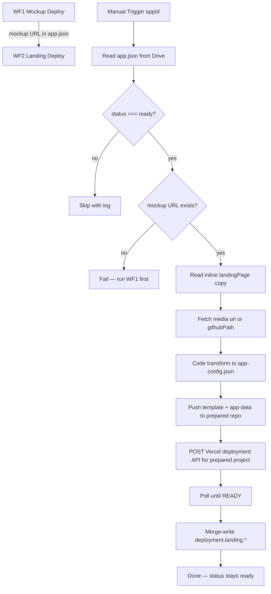
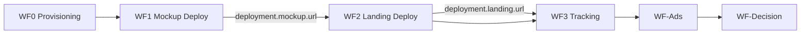

# WF2 — Landing Deploy Pipeline

**Blueprint for n8n AI / human workflow builders**  
**Status:** Blueprint only — no workflow JSON yet  
**Spec version:** 1.5.0  
**Last updated:** 2026-07-09  
**n8n target:** n8n Cloud (no local Node/npm)  
**Upstream:** [WF1 — Mockup Deploy](./WF1-DEPLOY-PIPELINE-BLUEPRINT.md) must have run successfully

---

## 1. Purpose

WF2 deploys the **landing page only** for App Packages on Google Drive. It runs **after WF1** and treats WF1's mockup deploy URL as required upstream input.

**Production Drive (spec 1.5.0):** `App Validation/{appId}/app.json` **ONLY** — no `copy/`, `media/`, `mockup/`, `docs/`, `logs/`, `reports/`, README, package files, or lockfiles. Landing copy and media references live **inside** `app.json`.

**WF2 v1 assumes platform-level setup only (not per-app):**

- Vercel team has **GitHub integration** installed (one-time at [vercel.com](https://vercel.com) → team settings)
- n8n Credentials: Google Service Account, Vercel API token, GitHub PAT
- WF1 has already written `deployment.mockup.url` or `mockup.previewUrl` for this `appId`

**WF2 uses approval-gated per-app infrastructure:**

- Landing GitHub repo exists before WF2 external writes
- Vercel landing project exists and is linked to that repo before WF2 deploys
- Vercel Root Directory is repository root/default (empty/unset); never `..`
- WF2 pushes the landing-template tree plus generated `app-data/` to that prepared repo, then deploys the prepared Vercel project

**WF2 does NOT require:** Drive `copy/`/`media/` folders, mockup source downloads, npm inside n8n Cloud, or `tracking.webhookUrl` (WF0 owns webhook URL; WF3 receives events).

**WF2 does:**

1. Manual trigger with input `appId`
2. Read `App Validation/{appId}/app.json` from Google Drive (**only** Drive file)
3. Confirm `status === "ready"`
4. Require `deployment.mockup.url` or `mockup.previewUrl` from WF1 (non-empty HTTPS URL)
5. Read landing copy from **inline** `landingPage.sections[].inline` + `landingPage.content` (never Drive `copy/`)
6. Resolve media via `url` or `githubPath`; fetch declared assets only from `source.assetsGithubRepo ?? source.mockupGithubRepo` (never mockup source code)
7. Transform into `app-data/app-config.json` (equivalent of `generate-app-config.js`)
8. Set `mockup.embedUrl` from WF1's deployed mockup URL
9. Stage resolved media into `app-data/images/`
10. Push template + generated `app-data/` to the prepared landing GitHub repo
11. Trigger Vercel landing deployment via Vercel API (`project` + `gitSource` from GitHub)
12. Poll deployment until `readyState === "READY"`
13. **Merge-write** only `deployment.landing.*` and related deployment metadata back to Drive `app.json`
14. Leave `status` as `"ready"`

**WF2 does NOT:**

| Out of scope | Future workflow |
|--------------|-----------------|
| Deploy or modify the mockup | **WF1** |
| Re-run WF1 | Operator runs WF1 separately |
| Provision `tracking.webhookUrl` | **WF0** |
| Write Google Sheets analytics | **WF3** |
| Launch Meta ads | WF-Ads |
| Change App Package content/copy | Human edits `app.json` on Drive / GitHub assets |
| Download Drive `copy/`, `media/`, or mockup code | Spec 1.5.0 — not on production Drive |
| Use npm/local build inside n8n Cloud | GitHub → Vercel handles builds |
| Set `status: validating` | WF-Ads or operator sets later |
| Create landing GitHub repo or Vercel landing project without approval | Human/setup step before WF2 external writes |

**Drive `app.json` remains control-plane SSOT.** WF2 never changes `appId`, `specVersion`, `source.*`, author `landingPage`, `experiment`, `tracking`, or `deployment.mockup.*`.

### Upstream contract (WF1 output)

WF2 **must not run** until WF1 has written a live mockup URL. Accept either field (prefer `deployment.mockup.url`):

| Field | Example (human-lab) |
|-------|---------------------|
| `deployment.mockup.url` | `https://human-lab.vercel.app` |
| `mockup.previewUrl` | Same URL — must match `deployment.mockup.url` when both set |

This URL becomes `mockup.embedUrl` in generated `app-config.json`. The landing page adds `?embed=1` client-side at iframe load time (`LiveMockupEmbed.tsx`).

WF2 reads `deployment.mockup.url ?? mockup.previewUrl` only — **never** `deployment.mockup.deploymentUrl` (raw SSO-protected deployment hostname; debug only).

---

## 2. Where each value goes

| Value | n8n Credentials | n8n Config Set node | `.env` (local) | `PLATFORM_SETUP_VALUES.md` | Drive `app.json` | Vercel / GitHub |
|-------|-----------------|---------------------|----------------|---------------------------|------------------|-----------------|
| Google Service Account JSON | ✅ paste JSON | — | optional copy | tracker only (redacted) | — | — |
| Vercel API token | ✅ Bearer auth | — | optional copy | tracker only | — | — |
| GitHub PAT | ✅ | — | optional copy | tracker only (redacted) | — | WF2 push + asset fetch |
| Drive folder ID | — | ✅ | ✅ | ✅ | — | — |
| Vercel team ID | — | ✅ | ✅ | ✅ | — | query param on API |
| `githubOrgOrUser` | — | ✅ | ✅ | ✅ | — | repo org/user |
| `landingTemplateRepo` | — | ✅ | ✅ | ✅ | — | source template to seed landing repo |
| `landingTemplateBranch` | — | ✅ | ✅ | ✅ | — | template branch |
| `landingTargets` / overrides | — | ✅ | — | — | — | prepared landing repo/project values |
| Landing repo `{org}/{appId}-landing` | — | **derived or supplied** | — | — | — | must exist before external write |
| Vercel project `{appId}-landing` | — | **derived or supplied** | — | — | — | must exist before deploy |
| Landing copy (`landingPage.*`) | — | — | — | — | ✅ **human sets** (inline) | — |
| Media refs (`media.*` url/githubPath) | — | — | — | — | ✅ **human sets** | binaries in assets/mockup GitHub |
| `deployment.mockup.*`, `mockup.previewUrl` | — | — | — | — | ✅ **written by WF1** | WF2 reads only |
| `deployment.landing.*` | — | — | — | — | ✅ **written by WF2** | deploy output |
| `deployment.githubRepoUrl` | — | — | — | — | ✅ **written by WF2** (if null) | repo link |
| `mockup.embedUrl` (in app-config) | — | — | — | — | — | generated disposable output |
| `tracking.webhookUrl` | — | — | — | — | **WF0** writes | — |
| `status` | — | — | — | — | Human → `provisioning`; WF0 → `ready` | — |

**Rules:**

- **Secrets** → n8n Credentials only (not Config node, not committed markdown, not `app.json`).
- **`.env`** → local reference; n8n Cloud does not read it automatically.
- **`PLATFORM_SETUP_VALUES.md`** → human tracker; no real secrets.
- **Drive `app.json`** → control-plane SSOT; WF2 reads inline package + WF1 output; writes only landing deploy fields.
- **No new `source.*` fields for WF2 v1** — landing repo and Vercel project names are derived from Config Set + `appId`.

### Repo and project resolution

```javascript
const override = landingTargets[appId] ?? repoOverrides[appId] ?? {};
const landingGithubRepo =
  override.landingGithubRepo ?? `${githubOrgOrUser}/${appId}-landing`;
const vercelLandingProjectName =
  override.vercelLandingProjectName ?? `${appId}-landing`;
const vercelLandingProjectId = override.vercelLandingProjectId ?? null;
```

`landingTargets` example (Workflow Config Set node):

```json
"landingTargets": {
  "human-lab": {
    "landingGithubRepo": "scootero/custom-landing-repo",
    "vercelLandingProjectName": "custom-vercel-name",
    "vercelLandingProjectId": "prj_optional"
  }
}
```

### Platform prerequisites (one-time, not per-app)

| Prerequisite | Who sets it |
|--------------|-------------|
| Vercel team **GitHub integration** installed | Human once in vercel.com team settings |
| n8n Credentials (Google SA, Vercel token, GitHub PAT) | Human in n8n UI |
| `landingTemplateRepo` in Config Set | Human in workflow Config |

Per-app landing repo/project creation is an approval-gated setup step. WF2 must stop with a clear setup error if the prepared repo or Vercel project ID/name is missing.

**Recovery only:** If Vercel deploy fails with a GitHub permission error, confirm the Vercel GitHub app has access to `{githubOrgOrUser}/{appId}-landing` — this is a platform fix, not a per-app manual deploy step.

### Drive status for WF2

| `status` | WF2 behavior |
|----------|--------------|
| **`ready`** | ✅ Process when manually triggered (and WF1 mockup URL present) |
| `draft`, `provisioning` | Skip |
| `validating`, `paused`, `winner`, `killed`, `built` | Skip |

---

## 3. Workflow config (Set node — no secrets)

```json
{
  "driveParentFolderId": "1O3RHwYFhJlPRBygNKxc7HGHmWtfiaB5A",
  "vercelTeamId": "team_CvzW7iL13TaNbaIiaCHfjafe",
  "githubOrgOrUser": "scootero",
  "landingTemplateRepo": "scootero/Landing-Page-Template",
  "landingTemplateBranch": "main",
  "vercelPollIntervalSeconds": 15,
  "vercelPollMaxMinutes": 10,
  "landingTargets": {},
  "repoOverrides": {}
}
```

Per-app landing repo and Vercel project are **derived** from `appId` + config above or supplied in `landingTargets`. They are not stored in Drive `app.json` before WF2; WF2 writes only `deployment.landing.*` and `deployment.githubRepoUrl` after deployment succeeds.

---

## 4. Flow



**Numbered steps (matches scope):**

1. Discover/load App Package from Drive by `appId` — **`app.json` only**
2. Gate: `status === "ready"`
3. Gate: `deployment.mockup.url` or `mockup.previewUrl` exists
4. Read landing copy from `landingPage.sections[].inline` + `landingPage.content`
5. Resolve and fetch media (`url` preferred; else `githubPath` from assets repo)
6. Transform package → `app-data/app-config.json`
7. Set `mockup.embedUrl` from WF1 mockup URL
8. Stage images for `app-data/images/`
9. Commit landing-template tree + generated `app-data/` to the prepared landing GitHub repo
10. POST Vercel `/v13/deployments` with `project` + `gitSource` (project exists before deploy)
11. Poll until `readyState === "READY"`
12. Merge-write `deployment.landing.*` (+ `githubRepoUrl` if null) to Drive `app.json`
13. Leave `status` unchanged (`ready`)

---

## 5. Node inventory

| # | Node | Type |
|---|------|------|
| 1 | Manual Run | Manual Trigger (`appId` string, required) |
| 2 | Workflow Config | Set |
| 3 | Read app.json | Google Drive (download `App Validation/{appId}/app.json` **only**) |
| 4 | Parse + Gate status | Code |
| 5 | Gate: status ready | IF |
| 6 | Validate WF1 mockup URL | Code |
| 7 | WF1 URL present? | IF |
| 8 | Resolve landing repo + Vercel project | Code |
| 9 | Resolve assets repo | Code (`assetsGithubRepo ?? mockupGithubRepo`) |
| 10 | Fetch media assets | HTTP / GitHub Contents (declared `url`/`githubPath` only) |
| 11 | Transform to app-config | Code (port `generate-app-config.js`; inline copy) |
| 12 | GitHub: verify prepared landing repo | GitHub API / GitHub node |
| 13 | GitHub: commit landing tree + app-data | GitHub API / GitHub node |
| 14 | Trigger Vercel Deploy | HTTP Request |
| 15 | Poll Vercel | HTTP + Wait |
| 16 | Extract landing URLs | Code |
| 17 | Re-read app.json | Google Drive |
| 18 | Merge-Write app.json | Code |
| 19 | Upload app.json | Google Drive |
| 20 | Notify Failure | HTTP (optional) |

**v1 has no:** Schedule trigger, Drive folder listing beyond `app.json`, Drive `copy/`/`media/` downloads, mockup deploy, npm/Execute Command nodes, webhook provisioning, Google Sheets nodes.

---

## 6. Validation

**Schema:** `app-validation-spec/schemas/app.schema.json` for `specVersion`, `appId` (informational).

**Required gates for WF2:**

| Gate | Rule |
|------|------|
| `status` | Must be `"ready"` |
| WF1 mockup URL | `deployment.mockup.url` OR `mockup.previewUrl` — non-empty `https://` URI |
| `appId` | Present; warn if folder name mismatch |
| `app.json` | Valid JSON; `identity`, `landingPage`, `commerce`, `branding` present |
| Drive hygiene | Folder contains **only** `app.json` (warn/error on extra files) |
| Landing copy | Enabled sections use `source: "inline"` (or `media` for screenshots); `landingPage.content` for benefits/features/FAQ/testimonials. `screenshots.enabled: false` omits the gallery and skips screenshot binary copy into the landing repo. |
| Media | Each used asset has `url` or `githubPath` (not Drive `path`); fetch declared assets only |

**Optional checks:**

- `specVersion` matches expected range (informational; current **1.5.0**)
- `deployment.mockup.url === mockup.previewUrl` when both set (warn on mismatch)

**Not required for WF2:**

| Not required | Owned by |
|--------------|----------|
| `tracking.webhookUrl` | **WF0** |
| Full `experiment` / `ads` completeness | WF-Ads / validator |
| Drive `copy/`, `media/`, `mockup/` | Not on production Drive (1.5.0) |
| `source.*` landing fields | Derived from Config Set for WF2 v1 |

---

## 7. Transform (landing generation)

`app-data/app-config.json` is **disposable** — regenerated on every WF2 run. Never treat it as SSOT.

**Normative reference:** [`landing-template/scripts/generate-app-config.js`](../landing-template/scripts/generate-app-config.js) and [`APP_PACKAGE_TRANSFORM.md`](../landing-template/scripts/APP_PACKAGE_TRANSFORM.md).

### Inputs (production — from Drive `app.json` + GitHub/HTTP assets)

| Source | Used for |
|--------|----------|
| `app.json` | Identity, audience, commerce, branding, sections, analytics, tracking, deployment |
| `landingPage.sections[].inline` | Hero, pricing, CTA, footer headlines/body/placeholder |
| `landingPage.content.benefits` | `benefits[]` |
| `landingPage.content.features` | `features[]` |
| `landingPage.content.faq` | `faq.items[]` |
| `landingPage.content.testimonials` | `testimonials.items[]` |
| `media.*` via `url` or `githubPath` | Binaries staged to `app-data/images/` |

**Do not** download Drive `copy/*.md` or Drive `media/*`. Local-dev `source: "file"` / `path` is for local transform only — not production WF2.

### Media resolution

```javascript
function resolveAssetsRepo(app) {
  const source = app.source ?? {};
  return {
    repo: source.assetsGithubRepo ?? source.mockupGithubRepo,
    branch: source.assetsBranch ?? source.mockupBranch ?? "main",
    root: source.assetsRootDirectory ?? "",
  };
}

// For each mediaAsset: prefer url; else fetch githubPath from resolveAssetsRepo.
// Fetch DECLARED asset paths only — never mockup source (src/, package.json, etc.).
```

### Critical: mockup.embedUrl

```javascript
const mockupUrl =
  app.deployment?.mockup?.url ??
  app.deployment?.mockupUrl ?? // legacy
  app.mockup?.previewUrl ??
  "";
// assign to config.mockup.embedUrl
```

Real human-lab example after WF1:

`https://human-lab.vercel.app`

### Functions to port into n8n Code node

| Script function | Purpose |
|-----------------|---------|
| Map `sections[hero].inline` | `heroHeadline`, `heroSubheadline`, `heroBody` |
| Map `landingPage.content.benefits` | `benefits[]` |
| Map `landingPage.content.features` | `features[]` |
| Map `landingPage.content.faq` | `faq.items[]` |
| `mapTracking` | Fold `analytics.*`, `tracking.*`, `ads.campaignName`, `deployment.landing.*` into `tracking` block |
| `mapAccentColor`, `mapLandingStyle`, `mapBadgeText`, etc. | Theme and commerce helpers |
| Stage images | Binary → `app-data/images/` paths from fetched assets |

`tracking.webhookUrl` may be empty until WF0 — pass through as `""` (current script behavior).

### Image output paths

| Source asset | GitHub path in landing repo |
|--------------|----------------------------|
| Screenshot binary (basename) | `app-data/images/01-home.png` |
| Logo | `app-data/images/logo.png` |
| OG image | `app-data/images/og-image.png` |

**Vercel build note:** `landing-template` runs `prebuild: node scripts/copy-app-data-images.js` which mirrors `app-data/images/` → `public/app-data/images/` during Vercel build. WF2 **only pushes `app-data/`** — do not duplicate images to `public/` in GitHub commits.

---

## 8. GitHub push strategy

### Prepared repo requirement

The landing GitHub repo must exist before WF2 performs external writes. If it does not exist, WF2 stops and reports the exact repo to create. Creating the repo is an approval-gated setup step.

If the repo exists but is empty, WF2 seeds the landing-template tree and generated `app-data/` in the first commit.

### Every run

1. Resolve `landingGithubRepo` from config + `landingTargets` / overrides
2. Verify the repo exists and the GitHub credential can write to it
3. Commit the landing-template tree when seeding an empty repo
4. Commit `app-data/app-config.json` (UTF-8 JSON, pretty-printed)
5. Commit binary files under `app-data/images/` (base64 via GitHub Contents API)
6. Commit message: `WF2 deploy {appId} {ISO8601}`

The pushed repository root is the landing project root. Vercel Root Directory must remain empty/default (`.`), never `..`.

### deployment.githubRepoUrl

If `deployment.githubRepoUrl` is still `null` after a successful push, merge-write:

`https://github.com/{org}/{repo}`

---

## 9. Landing deploy (Vercel API)

Parse `landingGithubRepo` into `org` and `repo` (strip `https://github.com/` prefix if present).

WF2 deploys an existing prepared Vercel project. Use `project` from `landingTargets[appId].vercelLandingProjectId`, `deployment.landing.vercelProjectId`, or the approved setup value. Do not rely on first-run project creation.

```http
POST https://api.vercel.com/v13/deployments?teamId={vercelTeamId}
Authorization: Bearer {VERCEL_API_TOKEN}

{
  "name": "{vercelLandingProjectName}",
  "project": "{vercelLandingProjectId}",
  "target": "production",
  "gitSource": {
    "type": "github",
    "org": "{org}",
    "repo": "{repo}",
    "ref": "main"
  }
}
```

Root Directory is intentionally absent from the deployment body; Vercel project settings use repository root/default. Use the landing repo branch WF2 commits to (default `main`) for `gitSource.ref`.

Poll `GET /v13/deployments/{id}?teamId={vercelTeamId}` until `readyState === "READY"` (interval: `vercelPollIntervalSeconds`, max: `vercelPollMaxMinutes`).

On success, capture from response:

| Vercel response | Write to |
|-----------------|----------|
| Production alias / canonical URL | `deployment.landing.url` |
| Deployment `url` | `deployment.landing.deploymentUrl` |
| `projectId` | `deployment.landing.vercelProjectId` |
| `createdAt` or current timestamp | `deployment.landing.lastDeployedAt` |

`deployment.landing.url` is the **canonical public URL** (ad destination). `deployment.landing.deploymentUrl` is the latest deployment URL and may differ during preview deploys.

---

## 10. Write-back (merge only)

```json
{
  "deployment": {
    "landing": {
      "vercelProjectId": "prj_xxx",
      "url": "https://human-lab-landing.vercel.app",
      "deploymentUrl": "https://human-lab-landing-abc123.vercel.app",
      "lastDeployedAt": "2026-07-02T12:00:00.000Z"
    },
    "githubRepoUrl": "https://github.com/scootero/human-lab-landing"
  }
}
```

**Never modify:** `appId`, `specVersion`, `status`, `source`, `identity`, `landingPage`, `experiment`, `tracking`, `deployment.mockup.*`, `mockup.previewUrl`.

**Status after success:** stays `ready`

---

## 11. Error handling

| Error | Action |
|-------|--------|
| `status !== "ready"` | Log; stop; no deploy |
| Missing WF1 mockup URL | Fail with clear message: "Run WF1 first" |
| Missing required inline copy | Fail or alert; no deploy |
| `source: "file"` on production package | Fail — convert to inline before Drive sync |
| Missing media (`url`/`githubPath`) | Warn; continue (transform marks `missing: true`) |
| Transform Code error | Alert; no GitHub push |
| GitHub push fail | Retry 3× with backoff; alert |
| Vercel deploy fail | Retry 3× with backoff; alert |
| Vercel poll timeout | Alert; status stays `ready` |
| Drive write-back fail | **Critical alert** — deploy may be live but SSOT stale |

---

## 12. Idempotency / re-run behavior

- **Safe to re-trigger** with the same `appId` while `status` is `ready` and WF1 URL is present.
- Each run regenerates `app-config.json`, re-commits the landing tree/app-data, triggers a new Vercel deployment, and updates `deployment.landing.lastDeployedAt`.
- Does **not** re-deploy the mockup or modify `deployment.mockup.*` / `mockup.previewUrl`.
- `landingTargets` / overrides in Config Set are stable across runs.
- Re-running after inline copy or GitHub media changes picks up latest package content.

---

## 13. Pre-WF2 mockup URL gate

Before triggering WF2, confirm WF1 wrote a **public production alias** — not a team-protected deployment hostname.

| Check | Pass criteria |
|-------|---------------|
| Public alias | `deployment.mockup.url` is not a `*-scooteros-projects.vercel.app` hostname |
| Incognito | Opens without Vercel SSO login |
| Embed mode | `{url}?embed=1` renders mockup UI in browser |
| WF2 must reject | URLs that redirect to `vercel.com/sso-api` or have `X-Frame-Options: DENY` |

WF2 transform uses `deployment.mockup.url ?? mockup.previewUrl` for `mockup.embedUrl`. Never use `deployment.mockup.deploymentUrl`.

---

## 14. Testing (human-lab)

**Prerequisites (platform — one-time):**

1. Vercel team GitHub integration installed
2. n8n Credentials: Google Service Account, Vercel Bearer token, GitHub PAT
3. Workflow Config Set populated (see §3)

**Prerequisites (per app — before WF2 trigger):**

1. WF1 completed for `human-lab` — `deployment.mockup.url` populated (e.g. `https://human-lab.vercel.app`); verified incognito + `?embed=1`
2. `status: "ready"` on Drive `app.json`
3. Drive folder is **`app.json` only**; landing copy is inline; media uses `url`/`githubPath`

**Required before external writes:** prepared landing GitHub repo and Vercel landing project. **Not required:** Drive `copy/`/`media/` folders, manual npm build inside n8n, or mockup source downloads.

**Test steps:**

1. Manual trigger WF2 with `appId=human-lab` after landing repo/project setup values are available
2. Verify GitHub commit updating `app-data/app-config.json` and `app-data/images/`
3. Verify Drive `deployment.landing.url` and `deployment.landing.deploymentUrl`
4. Open `deployment.landing.url` in browser
5. Confirm live mockup embed loads (iframe uses WF1 URL + `?embed=1`)
6. Confirm `status` is still `ready`
7. Confirm `deployment.mockup.*` and `mockup.previewUrl` unchanged

---

## 15. Definition of done

- [ ] Manual trigger only with `appId` input
- [ ] Reads single package from Drive by `appId` — **`app.json` only**
- [ ] Picks up only `status: ready` packages
- [ ] Gates on WF1 mockup URL (`deployment.mockup.url` or `mockup.previewUrl`)
- [ ] Reads inline `landingPage` copy; does **not** download Drive `copy/` or `media/`
- [ ] Fetches media via `url`/`githubPath` from assets repo only (never mockup code)
- [ ] Transform matches `generate-app-config.js` behavior (no app-specific hardcoding)
- [ ] Sets `mockup.embedUrl` from WF1 output
- [ ] Verifies prepared landing GitHub repo/project values before external writes
- [ ] Pushes landing-template tree + generated `app-data/` to the prepared landing repo
- [ ] No npm / Execute Command nodes
- [ ] Landing deploys via Vercel API (`project` + `gitSource`; root directory omitted/default repo root)
- [ ] Prepared project is reused on subsequent runs
- [ ] Merge-write `deployment.landing.*` (+ `githubRepoUrl` if null) only
- [ ] `appId`, `specVersion`, `status`, `source`, and WF1 fields unchanged
- [ ] No mockup deploy, webhook provisioning, Sheets, or ads logic
- [ ] `landingTargets` / overrides supported in Config Set
- [ ] Export JSON to `n8n-workflows/WF2-landing-deploy.json` when built

---

## 16. n8n AI prompt

See **[WF2-N8N-AI-PROMPT.md](./WF2-N8N-AI-PROMPT.md)** — staged and consolidated copy-paste prompts for n8n's AI workflow builder.

---

## 17. Related workflows



| Workflow | Scope |
|----------|-------|
| **WF0** | Provision `tracking.webhookUrl`; `provisioning` → `ready` |
| **WF1** | Mockup deploy; writes `deployment.mockup.*`, `mockup.previewUrl` |
| **WF2** | Landing transform + deploy (this doc); writes `deployment.landing.*` |
| **WF3** | Webhook receiver + Google Sheets append |
| **WF-Ads** | Meta ads using `deployment.landing.url` (paused by default) |
| **WF-Decision** | Metrics monitoring; writes `validation.*` + `latestReportUrl`; root `status` |

---

*Normative contract: [APP_PACKAGE_SPEC.md](../app-validation-spec/APP_PACKAGE_SPEC.md). Transform: [APP_PACKAGE_TRANSFORM.md](../landing-template/scripts/APP_PACKAGE_TRANSFORM.md). Architecture: [N8N_PLATFORM_ARCHITECTURE.md](../N8N_PLATFORM_ARCHITECTURE.md). Upstream: [WF1-DEPLOY-PIPELINE-BLUEPRINT.md](./WF1-DEPLOY-PIPELINE-BLUEPRINT.md). Setup tracker: [PLATFORM_SETUP_VALUES.md](../PLATFORM_SETUP_VALUES.md).*
