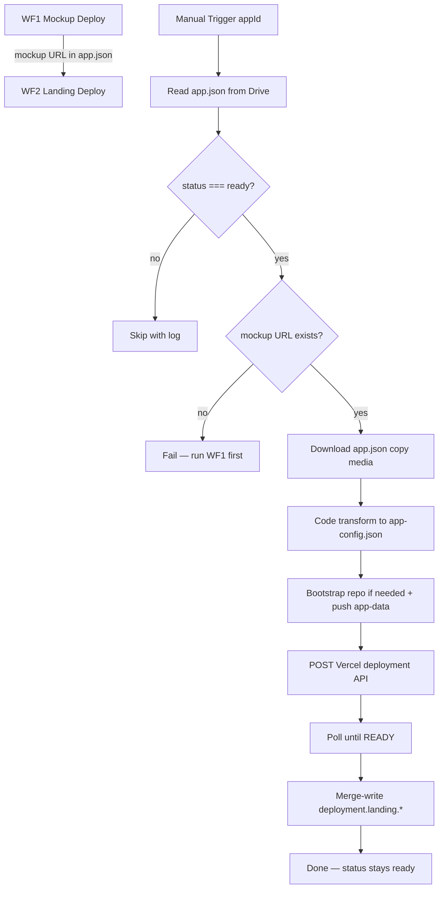
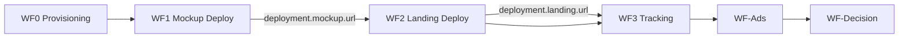

# WF2 — Landing Deploy Pipeline

**Blueprint for n8n AI / human workflow builders**  
**Status:** Blueprint only — no workflow JSON yet  
**Spec version:** 1.4.0  
**Last updated:** 2026-07-02  
**n8n target:** n8n Cloud (no local Node/npm)  
**Upstream:** [WF1 — Mockup Deploy](./WF1-DEPLOY-PIPELINE-BLUEPRINT.md) must have run successfully

---

## 1. Purpose

WF2 deploys the **landing page only** for App Packages on Google Drive. It runs **after WF1** and treats WF1's mockup deploy URL as required upstream input.

**WF2 v1 assumes platform-level setup only (not per-app):**

- Vercel team has **GitHub integration** installed (one-time at [vercel.com](https://vercel.com) → team settings)
- n8n Credentials: Google Service Account, Vercel API token, GitHub PAT
- WF1 has already written `deployment.mockup.url` or `mockup.previewUrl` for this `appId`

**WF2 handles per-app infrastructure on first run (no manual Vercel dashboard steps):**

- Bootstrap landing GitHub repo `{githubOrgOrUser}/{appId}-landing` from `landingTemplateRepo` if missing
- Push generated `app-data/` to that repo
- **Create and deploy** Vercel landing project via API (`name` + `gitSource`) — first run creates the project; subsequent runs redeploy

**WF2 does NOT require:** manual Vercel project creation, manual first deploy in vercel.com, or `tracking.webhookUrl` (WF3).

**WF2 does:**

1. Manual trigger with input `appId`
2. Read `App Validation/{appId}/app.json` from Google Drive
3. Confirm `status === "ready"`
4. Require `deployment.mockup.url` or `mockup.previewUrl` from WF1 (non-empty HTTPS URL)
5. Read `app.json`, `copy/`, and `media/` from Drive
6. Transform the App Package into `app-data/app-config.json` (equivalent of `generate-app-config.js`)
7. Set `mockup.embedUrl` from WF1's deployed mockup URL
8. Copy required media into `app-data/images/`
9. Bootstrap landing GitHub repo if missing; push template + generated `app-data/`
10. Trigger Vercel landing deployment via Vercel API (`name` + `gitSource` from GitHub)
11. Poll deployment until `readyState === "READY"`
12. **Merge-write** only `deployment.landing.*` and related deployment metadata back to Drive `app.json`
13. Leave `status` as `"ready"`

**WF2 does NOT:**

| Out of scope | Future workflow |
|--------------|-----------------|
| Deploy or modify the mockup | **WF1** |
| Re-run WF1 | Operator runs WF1 separately |
| Provision `tracking.webhookUrl` | **WF3** |
| Write Google Sheets analytics | **WF3** |
| Launch Meta ads | WF-Ads |
| Change App Package content/copy | Human edits package on Drive |
| Use npm/local build inside n8n Cloud | GitHub → Vercel handles builds |
| Set `status: validating` | WF-Ads or operator sets later |
| Manual per-app Vercel setup | WF2 triggers deploy API; project auto-created on first run |

**App Package on Drive remains SSOT.** WF2 never changes `appId`, `specVersion`, `source.*`, author `copy/`, `landingPage`, `experiment`, `tracking`, or `deployment.mockup.*`.

### Upstream contract (WF1 output)

WF2 **must not run** until WF1 has written a live mockup URL. Accept either field (prefer `deployment.mockup.url`):

| Field | Example (human-lab) |
|-------|---------------------|
| `deployment.mockup.url` | `https://human-lab.vercel.app` |
| `mockup.previewUrl` | Same URL — must match `deployment.mockup.url` when both set |

This URL becomes `mockup.embedUrl` in generated `app-config.json`. The landing page adds `?embed=1` client-side at iframe load time (`LiveMockupEmbed.tsx`).

WF2 reads `deployment.mockup.url ?? mockup.previewUrl` only — **never** `deployment.mockup.deploymentUrl` (raw SSO-protected deployment hostname; debug only).

---

## 2. Where each value goes

| Value | n8n Credentials | n8n Config Set node | `.env` (local) | `PLATFORM_SETUP_VALUES.md` | Drive `app.json` | Vercel / GitHub |
|-------|-----------------|---------------------|----------------|---------------------------|------------------|-----------------|
| Google Service Account JSON | ✅ paste JSON | — | optional copy | tracker only (redacted) | — | — |
| Vercel API token | ✅ Bearer auth | — | optional copy | tracker only | — | — |
| GitHub PAT | ✅ | — | optional copy | tracker only (redacted) | — | WF2 push only |
| Drive folder ID | — | ✅ | ✅ | ✅ | — | — |
| Vercel team ID | — | ✅ | ✅ | ✅ | — | query param on API |
| `githubOrgOrUser` | — | ✅ | ✅ | ✅ | — | repo org/user |
| `landingTemplateRepo` | — | ✅ | ✅ | ✅ | — | bootstrap source |
| `landingTemplateBranch` | — | ✅ | ✅ | ✅ | — | bootstrap branch |
| `repoOverrides` | — | ✅ | — | — | — | nonstandard repo/project |
| Landing repo `{org}/{appId}-landing` | — | **derived** | — | — | — | WF2 bootstraps if missing |
| Vercel project `{appId}-landing` | — | **derived** | — | — | — | WF2 creates via deploy API on first run |
| Package content (`copy/`, `media/`, `landingPage`) | — | — | — | — | ✅ **human sets** | — |
| `deployment.mockup.*`, `mockup.previewUrl` | — | — | — | — | ✅ **written by WF1** | WF2 reads only |
| `deployment.landing.*` | — | — | — | — | ✅ **written by WF2** | deploy output |
| `deployment.githubRepoUrl` | — | — | — | — | ✅ **written by WF2** (if null) | repo link |
| `mockup.embedUrl` (in app-config) | — | — | — | — | — | generated disposable output |
| `tracking.webhookUrl` | — | — | — | — | WF3 writes | — |
| `status` | — | — | — | — | Human sets `ready` | — |

**Rules:**

- **Secrets** → n8n Credentials only (not Config node, not committed markdown, not `app.json`).
- **`.env`** → local reference; n8n Cloud does not read it automatically.
- **`PLATFORM_SETUP_VALUES.md`** → human tracker; no real secrets.
- **Drive `app.json`** → SSOT for package content; WF2 reads package files and WF1 output; writes only landing deploy fields.
- **No new `source.*` fields for WF2 v1** — landing repo and Vercel project names are derived from Config Set + `appId`.

### Repo and project resolution

```javascript
const override = repoOverrides[appId] ?? {};
const landingGithubRepo =
  override.landingGithubRepo ?? `${githubOrgOrUser}/${appId}-landing`;
const vercelLandingProjectName =
  override.vercelLandingProjectName ?? `${appId}-landing`;
const vercelLandingProjectId = override.vercelLandingProjectId ?? null;
```

`repoOverrides` example (Workflow Config Set node):

```json
"repoOverrides": {
  "human-lab": {
    "landingGithubRepo": "scootero/custom-landing-repo",
    "vercelLandingProjectName": "custom-vercel-name",
    "vercelLandingProjectId": "prj_optional"
  }
}
```

### Platform prerequisites (one-time, not per-app)

| Prerequisite | Who sets it |
|--------------|-------------|
| Vercel team **GitHub integration** installed | Human once in vercel.com team settings |
| n8n Credentials (Google SA, Vercel token, GitHub PAT) | Human in n8n UI |
| `landingTemplateRepo` in Config Set | Human in workflow Config |

No per-app steps in vercel.com or github.com are required before the first WF2 run. WF2 bootstraps the landing repo and triggers the first Vercel deployment via API.

**Recovery only:** If Vercel deploy fails with a GitHub permission error, confirm the Vercel GitHub app has access to `{githubOrgOrUser}/{appId}-landing` — this is a platform fix, not a per-app manual deploy step.

### Drive status for WF2

| `status` | WF2 behavior |
|----------|--------------|
| **`ready`** | ✅ Process when manually triggered (and WF1 mockup URL present) |
| `draft`, `provisioning` | Skip |
| `validating`, `paused`, `winner`, `killed`, `built` | Skip |

---

## 3. Workflow config (Set node — no secrets)

```json
{
  "driveParentFolderId": "1O3RHwYFhJlPRBygNKxc7HGHmWtfiaB5A",
  "vercelTeamId": "team_CvzW7iL13TaNbaIiaCHfjafe",
  "githubOrgOrUser": "scootero",
  "landingTemplateRepo": "scootero/Landing-Page-Template",
  "landingTemplateBranch": "main",
  "vercelPollIntervalSeconds": 15,
  "vercelPollMaxMinutes": 10,
  "repoOverrides": {}
}
```

Per-app landing repo and Vercel project are **derived** from `appId` + config above — not stored in `app.json` `source.*` for WF2 v1.

---

## 4. Flow



**Numbered steps (matches scope):**

1. Discover/load App Package from Drive by `appId`
2. Gate: `status === "ready"`
3. Gate: `deployment.mockup.url` or `mockup.previewUrl` exists
4. Download `app.json`, `copy/*.md`, and referenced `media/*` from Drive
5. Transform package → `app-data/app-config.json`
6. Set `mockup.embedUrl` from WF1 mockup URL
7. Stage images for `app-data/images/`
8. Bootstrap landing GitHub repo if missing; commit `app-data/` (and template tree on first run)
9. POST Vercel `/v13/deployments` with `name` + `gitSource` (creates project on first run)
10. Poll until `readyState === "READY"`
11. Merge-write `deployment.landing.*` (+ `githubRepoUrl` if null) to Drive `app.json`
12. Leave `status` unchanged (`ready`)

---

## 5. Node inventory

| # | Node | Type |
|---|------|------|
| 1 | Manual Run | Manual Trigger (`appId` string, required) |
| 2 | Workflow Config | Set |
| 3 | Read app.json | Google Drive (download `App Validation/{appId}/app.json`) |
| 4 | Parse + Gate status | Code |
| 5 | Gate: status ready | IF |
| 6 | Validate WF1 mockup URL | Code |
| 7 | WF1 URL present? | IF |
| 8 | Resolve landing repo + Vercel project | Code |
| 9 | Download copy files | Google Drive (parallel: `copy/hero.md`, `benefits.md`, `features.md`, `faq.md`) |
| 10 | Download media files | Google Drive (paths from `app.json` → `media`) |
| 11 | Transform to app-config | Code (port `generate-app-config.js`) |
| 12 | GitHub: bootstrap repo if missing | GitHub API / GitHub node |
| 13 | GitHub: commit app-data | GitHub API / GitHub node |
| 14 | Trigger Vercel Deploy | HTTP Request |
| 15 | Poll Vercel | HTTP + Wait |
| 16 | Extract landing URLs | Code |
| 17 | Re-read app.json | Google Drive |
| 18 | Merge-Write app.json | Code |
| 19 | Upload app.json | Google Drive |
| 20 | Notify Failure | HTTP (optional) |

**v1 has no:** Schedule trigger, Drive folder listing, mockup deploy, npm/Execute Command nodes, webhook provisioning, Google Sheets nodes.

---

## 6. Validation

**Schema:** `app-validation-spec/schemas/app.schema.json` for `specVersion`, `appId` (informational).

**Required gates for WF2:**

| Gate | Rule |
|------|------|
| `status` | Must be `"ready"` |
| WF1 mockup URL | `deployment.mockup.url` OR `mockup.previewUrl` — non-empty `https://` URI |
| `appId` | Present; warn if folder name mismatch |
| `app.json` | Valid JSON; `identity`, `landingPage`, `commerce`, `branding` present |
| Copy files | Download enabled `landingPage.sections` where `source === "file"`; always read `copy/benefits.md` when present |
| Media | Download paths from `media.screenshots[]`, `media.logo`, `media.ogImage`; warn if missing (transform sets `screenshots[].missing: true`) |

**Optional checks:**

- `specVersion` matches expected range (informational)
- `deployment.mockup.url === mockup.previewUrl` when both set (warn on mismatch)

**Not required for WF2:**

| Not required | Owned by |
|--------------|----------|
| `tracking.webhookUrl` | WF3 |
| Full `experiment` / `ads` completeness | WF-Ads / validator |
| Drive `mockup/` folder | WF1 uses GitHub, not Drive mockup |
| `source.*` landing fields | Derived from Config Set for WF2 v1 |

---

## 7. Transform (landing generation)

`app-data/app-config.json` is **disposable** — regenerated on every WF2 run. Never treat it as SSOT.

**Normative reference:** [`landing-template/scripts/generate-app-config.js`](../landing-template/scripts/generate-app-config.js) and [`APP_PACKAGE_TRANSFORM.md`](../landing-template/scripts/APP_PACKAGE_TRANSFORM.md).

### Inputs (from Drive)

| App Package path | Used for |
|------------------|----------|
| `app.json` | Identity, audience, commerce, branding, sections, analytics, tracking, deployment |
| `copy/hero.md` | `heroHeadline`, `heroSubheadline`, `heroBody` |
| `copy/benefits.md` | `benefits[]` |
| `copy/features.md` | `features[]` |
| `copy/faq.md` | `faq.items[]` |
| `media/screenshots/*` | Copied to `app-data/images/`; paths in `screenshots[].image` |
| `media/logo.png` | `app-data/images/logo.png` |
| `media/og-image.png` | `app-data/images/og-image.png` |

### Critical: mockup.embedUrl

```javascript
const mockupUrl =
  app.deployment?.mockup?.url ??
  app.deployment?.mockupUrl ?? // legacy
  app.mockup?.previewUrl ??
  "";
// assign to config.mockup.embedUrl
```

Real human-lab example after WF1:

`https://human-lab.vercel.app`

### Functions to port into n8n Code node

| Script function | Purpose |
|-----------------|---------|
| `parseHeroSection` | Parse `copy/hero.md` |
| `parseBenefits` | Parse `copy/benefits.md` |
| `parseFeatures` | Parse `copy/features.md` |
| `parseFaq` | Parse `copy/faq.md` |
| `mapTracking` | Fold `analytics.*`, `tracking.*`, `ads.campaignName`, `deployment.landing.*` into `tracking` block |
| `mapAccentColor`, `mapLandingStyle`, `mapBadgeText`, etc. | Theme and commerce helpers |
| `copyPackageImages` | Binary → `app-data/images/` paths |

`tracking.webhookUrl` may be empty until WF3 — pass through as `""` (current script behavior).

### Image output paths

| Source | GitHub path |
|--------|-------------|
| `media/screenshots/01-home.png` | `app-data/images/01-home.png` (basename) |
| `media/logo.png` | `app-data/images/logo.png` |
| `media/og-image.png` | `app-data/images/og-image.png` |

**Vercel build note:** `landing-template` runs `prebuild: node scripts/copy-app-data-images.js` which mirrors `app-data/images/` → `public/app-data/images/` during Vercel build. WF2 **only pushes `app-data/`** — do not duplicate images to `public/` in GitHub commits.

---

## 8. GitHub push strategy

### First run — bootstrap repo if missing

If `{githubOrgOrUser}/{appId}-landing` does not exist:

1. Create repo via GitHub API (`POST /user/repos` or org equivalent)
2. Copy landing template tree from `landingTemplateRepo@landingTemplateBranch` (GitHub API or archive fetch)
3. Commit initial template + generated `app-data/` in one or more commits

If repo exists but is empty, seed template tree the same way before committing `app-data/`.

### Every run

1. Resolve `landingGithubRepo` from config + `repoOverrides`
2. Commit `app-data/app-config.json` (UTF-8 JSON, pretty-printed)
3. Commit binary files under `app-data/images/` (base64 via GitHub Contents API)
4. Commit message: `WF2 deploy {appId} {ISO8601}`

No human GitHub setup per app is required when WF2 bootstraps from `landingTemplateRepo`.

### deployment.githubRepoUrl

If `deployment.githubRepoUrl` is still `null` after a successful push, merge-write:

`https://github.com/{org}/{repo}`

---

## 9. Landing deploy (Vercel API)

Parse `landingGithubRepo` into `org` and `repo` (strip `https://github.com/` prefix if present).

**First run:** omit `project` — Vercel creates the project from `name` + `gitSource` when the team GitHub integration is installed.

**Subsequent runs:** use `project` when `deployment.landing.vercelProjectId` is already on Drive or `repoOverrides.vercelLandingProjectId` is set; otherwise keep using `name`.

```http
POST https://api.vercel.com/v13/deployments?teamId={vercelTeamId}
Authorization: Bearer {VERCEL_API_TOKEN}

{
  "name": "{vercelLandingProjectName}",
  "target": "production",
  "gitSource": {
    "type": "github",
    "org": "{org}",
    "repo": "{repo}",
    "ref": "main"
  }
}
```

When `vercelLandingProjectId` is known (re-deploy or override), add `"project": "{vercelLandingProjectId}"` and you may omit `name`.

Use `ref` from `landingTemplateBranch` (default `main`) for the landing repo branch WF2 commits to.

Poll `GET /v13/deployments/{id}?teamId={vercelTeamId}` until `readyState === "READY"` (interval: `vercelPollIntervalSeconds`, max: `vercelPollMaxMinutes`).

On success, capture from response:

| Vercel response | Write to |
|-----------------|----------|
| Production alias / canonical URL | `deployment.landing.url` |
| Deployment `url` | `deployment.landing.deploymentUrl` |
| `projectId` | `deployment.landing.vercelProjectId` |
| `createdAt` or current timestamp | `deployment.landing.lastDeployedAt` |

`deployment.landing.url` is the **canonical public URL** (ad destination). `deployment.landing.deploymentUrl` is the latest deployment URL and may differ during preview deploys.

---

## 10. Write-back (merge only)

```json
{
  "deployment": {
    "landing": {
      "vercelProjectId": "prj_xxx",
      "url": "https://human-lab-landing.vercel.app",
      "deploymentUrl": "https://human-lab-landing-abc123.vercel.app",
      "lastDeployedAt": "2026-07-02T12:00:00.000Z"
    },
    "githubRepoUrl": "https://github.com/scootero/human-lab-landing"
  }
}
```

**Never modify:** `appId`, `specVersion`, `status`, `source`, `identity`, `copy`, `experiment`, `tracking`, `deployment.mockup.*`, `mockup.previewUrl`, author `landingPage` content.

**Status after success:** stays `ready`

---

## 11. Error handling

| Error | Action |
|-------|--------|
| `status !== "ready"` | Log; stop; no deploy |
| Missing WF1 mockup URL | Fail with clear message: "Run WF1 first" |
| Missing required copy files | Fail or alert; no deploy |
| Missing media binaries | Warn; continue (transform marks `missing: true`) |
| Transform Code error | Alert; no GitHub push |
| GitHub push fail | Retry 3× with backoff; alert |
| Vercel deploy fail | Retry 3× with backoff; alert |
| Vercel poll timeout | Alert; status stays `ready` |
| Drive write-back fail | **Critical alert** — deploy may be live but SSOT stale |

---

## 12. Idempotency / re-run behavior

- **Safe to re-trigger** with the same `appId` while `status` is `ready` and WF1 URL is present.
- Each run regenerates `app-config.json`, re-commits `app-data/`, triggers a new Vercel deployment, and updates `deployment.landing.lastDeployedAt`.
- Does **not** re-deploy the mockup or modify `deployment.mockup.*` / `mockup.previewUrl`.
- `repoOverrides` in Config Set are stable across runs.
- Re-running after copy/media changes on Drive picks up latest package content (SSOT).

---

## 13. Pre-WF2 mockup URL gate

Before triggering WF2, confirm WF1 wrote a **public production alias** — not a team-protected deployment hostname.

| Check | Pass criteria |
|-------|---------------|
| Public alias | `deployment.mockup.url` is not a `*-scooteros-projects.vercel.app` hostname |
| Incognito | Opens without Vercel SSO login |
| Embed mode | `{url}?embed=1` renders mockup UI in browser |
| WF2 must reject | URLs that redirect to `vercel.com/sso-api` or have `X-Frame-Options: DENY` |

WF2 transform uses `deployment.mockup.url ?? mockup.previewUrl` for `mockup.embedUrl`. Never use `deployment.mockup.deploymentUrl`.

---

## 14. Testing (human-lab)

**Prerequisites (platform — one-time):**

1. Vercel team GitHub integration installed
2. n8n Credentials: Google Service Account, Vercel Bearer token, GitHub PAT
3. Workflow Config Set populated (see §3)

**Prerequisites (per app — before WF2 trigger):**

1. WF1 completed for `human-lab` — `deployment.mockup.url` populated (e.g. `https://human-lab.vercel.app`); verified incognito + `?embed=1`
2. `status: "ready"` on Drive `app.json`
3. Package on Drive includes `copy/` and `media/` for human-lab

**Not required:** pre-created GitHub landing repo, pre-created Vercel project, manual Vercel deploy, or `tracking.webhookUrl`.

**Test steps:**

1. Manual trigger WF2 with `appId=human-lab` (first run bootstraps repo + creates Vercel project)
2. Verify GitHub commit updating `app-data/app-config.json` and `app-data/images/`
3. Verify Drive `deployment.landing.url` and `deployment.landing.deploymentUrl`
4. Open `deployment.landing.url` in browser
5. Confirm live mockup embed loads (iframe uses WF1 URL + `?embed=1`)
6. Confirm `status` is still `ready`
7. Confirm `deployment.mockup.*` and `mockup.previewUrl` unchanged

---

## 15. Definition of done

- [ ] Manual trigger only with `appId` input
- [ ] Reads single package from Drive by `appId`
- [ ] Picks up only `status: ready` packages
- [ ] Gates on WF1 mockup URL (`deployment.mockup.url` or `mockup.previewUrl`)
- [ ] Downloads `app.json`, `copy/`, and `media/` from Drive
- [ ] Transform matches `generate-app-config.js` behavior (no app-specific hardcoding)
- [ ] Sets `mockup.embedUrl` from WF1 output
- [ ] Bootstrap landing GitHub repo from `landingTemplateRepo` when missing
- [ ] Pushes `app-data/` to config-derived `{org}/{appId}-landing` repo
- [ ] No npm / Execute Command nodes
- [ ] Landing deploys via Vercel API (`name` + `gitSource`; no manual Vercel setup per app)
- [ ] First run creates Vercel project via API; subsequent runs redeploy
- [ ] Merge-write `deployment.landing.*` (+ `githubRepoUrl` if null) only
- [ ] `appId`, `specVersion`, `status`, `source`, and WF1 fields unchanged
- [ ] No mockup deploy, webhook provisioning, Sheets, or ads logic
- [ ] `repoOverrides` supported in Config Set
- [ ] Export JSON to `n8n-workflows/WF2-landing-deploy.json` when built

---

## 16. n8n AI prompt

See **[WF2-N8N-AI-PROMPT.md](./WF2-N8N-AI-PROMPT.md)** — staged and consolidated copy-paste prompts for n8n's AI workflow builder.

---

## 17. Related workflows



| Workflow | Scope |
|----------|-------|
| **WF0** | Provision `tracking.webhookUrl`; `provisioning` → `ready` |
| **WF1** | Mockup deploy; writes `deployment.mockup.*`, `mockup.previewUrl` |
| **WF2** | Landing transform + deploy (this doc); writes `deployment.landing.*` |
| **WF3** | Webhook receiver + Google Sheets append |
| **WF-Ads** | Meta ads using `deployment.landing.url` (paused by default) |
| **WF-Decision** | Metrics monitoring; writes `validation.*` and root `status` |

---

*Normative contract: [APP_PACKAGE_SPEC.md](../app-validation-spec/APP_PACKAGE_SPEC.md). Transform: [APP_PACKAGE_TRANSFORM.md](../landing-template/scripts/APP_PACKAGE_TRANSFORM.md). Architecture: [N8N_PLATFORM_ARCHITECTURE.md](../N8N_PLATFORM_ARCHITECTURE.md). Upstream: [WF1-DEPLOY-PIPELINE-BLUEPRINT.md](./WF1-DEPLOY-PIPELINE-BLUEPRINT.md). Setup tracker: [PLATFORM_SETUP_VALUES.md](../PLATFORM_SETUP_VALUES.md).*
