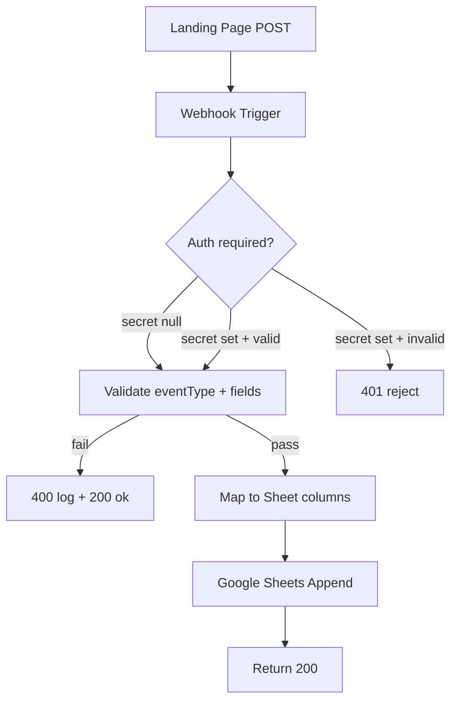
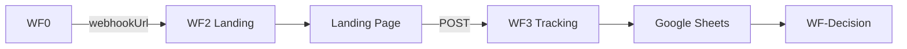

# WF3 — Tracking + Google Sheets Pipeline

**Blueprint for n8n AI / human workflow builders**  
**Status:** Blueprint only — no workflow JSON yet  
**Spec version:** 1.5.0  
**Last updated:** 2026-07-09  
**n8n target:** n8n Cloud  
**Upstream:** [WF0 — Provisioning](./WF0-PROVISIONING-PIPELINE-BLUEPRINT.md) writes `tracking.webhookUrl`; [WF2](./WF2-LANDING-DEPLOY-PIPELINE-BLUEPRINT.md) embeds URL in landing config

---

## 1. Purpose

WF3 is the **always-on event receiver** for deployed landing pages. It validates tracking payloads and appends one row per event to the unified Google Sheet.

**Auth strategy (1.5.0):** Production default is **no auth** (`webhookAuthSecret: null`). Secrets must **never** be stored in Drive `app.json`. Future Bearer auth (if enabled) lives in **n8n Credentials / environment only**.

**WF3 does:**

1. Expose n8n Webhook trigger (POST `application/json`)
2. Optionally validate Bearer auth when `webhookAuthSecret` is set in n8n env (default: skip / null)
3. Validate `eventType` and required attribution fields
4. Map payload to canonical Sheet column order
5. Append row to Google Sheets
6. Return HTTP 200 immediately (do not block client)

**WF3 does NOT:**

| Out of scope | Owned by |
|--------------|----------|
| Provision `tracking.webhookUrl` | **WF0** (sole owner) |
| Deploy mockup or landing | **WF1**, **WF2** |
| Create Meta ads | **WF-Ads** |
| Write `validation.*` or change root `status` | **WF-Decision** |
| Overwrite author `ads` copy in `app.json` | Human / **WF-Ads** (`ads.meta` only) |
| Store secrets in Drive `app.json` | — |

**Runtime model:** WF3 is primarily a webhook receiver workflow. It does not routinely write `app.json` except optional health/debug fields on `tracking`.

---

## 2. Where each value goes

| Value | n8n Credentials | Config Set node | Drive `app.json` |
|-------|-----------------|-----------------|------------------|
| Google Service Account JSON | ✅ | — | — |
| `GOOGLE_SHEET_ID` | — | ✅ | — |
| `GOOGLE_SHEET_TAB_NAME` | — | ✅ | — |
| `WEBHOOK_AUTH_SECRET` | ✅ optional (n8n env / Credentials) | default `null` | **never** |
| `tracking.webhookUrl` | — | — | ✅ read only (set by **WF0**) |

---

## 3. Workflow config (Set node — no secrets)

```json
{
  "googleSheetId": "YOUR_SHEET_ID",
  "googleSheetTabName": "Sheet1",
  "webhookAuthSecret": null
}
```

**Auth rules:**

- Default: `webhookAuthSecret: null` — accept POSTs without Bearer (production v1)
- If set later: compare `Authorization: Bearer …` against the secret from **n8n Credentials / env**
- Never read or write auth secrets from Drive `app.json`

---

## 4. Flow



---

## 5. Node inventory

| # | Node | Type |
|---|------|------|
| 1 | Landing Event Webhook | Webhook (POST, production URL) |
| 2 | Workflow Config | Set |
| 3 | Validate Auth | Code — skip when `webhookAuthSecret` is null; else Bearer from n8n env |
| 4 | Validate Payload | Code |
| 5 | Map to Sheet Row | Code |
| 6 | Append Row | Google Sheets |
| 7 | Respond 200 | Respond to Webhook |

---

## 6. Validation

**Canonical `eventType` values:**

| eventType | When |
|-----------|------|
| `page_view` | Once on page load |
| `email_captured` | Waitlist form submit |
| `buy_now_clicked` | Pricing fake-door submit |
| `mockup_interacted` | First mockup engagement |

**Required payload fields** (see [N8N_PLATFORM_ARCHITECTURE.md](../N8N_PLATFORM_ARCHITECTURE.md) §6):

`eventType`, `appId`, `appName`, `experimentId`, `experimentRunId`, `timestamp` at minimum.

Reject or log malformed payloads; still return 200 to avoid client retry storms unless auth fails.

---

## 7. Google Sheet append

**Canonical column order** (MUST match for dashboard compatibility):

```
timestamp | eventType | appId | appName | experimentId | experimentRunId | projectId | deploymentId | landingVersion | landingVariantId | mockupVersionId | campaignName | visitorId | sessionId | email | price | pageUrl | referrer | utmSource | utmMedium | utmCampaign | utmContent | utmTerm | timeOnPageSeconds | mockupInteracted
```

One row = one event. WF-Decision reads signup rows filtered by `appId`, `experimentRunId`, and `eventType in (email_captured, buy_now_clicked)`.

---

## 8. Write-back

WF3 **does not** routinely merge-write `app.json`. Optional debug:

```json
{
  "tracking": {
    "lastEventAt": "2026-07-07T12:00:00.000Z"
  }
}
```

Only if explicitly added to spec later — v1 blueprint avoids Drive writes from hot path.

---

## 9. Error handling

| Error | Action |
|-------|--------|
| Invalid auth (only when secret configured) | 401 |
| Auth secret present in Drive `app.json` | Ignore Drive value; use n8n env only; alert if found |
| Unknown `eventType` | Log; return 200 |
| Sheets append fail | Retry 3×; alert; return 200 (event may be lost — monitor alerts) |
| Missing `appId` | Log; return 200 |

---

## 10. Testing

1. WF0 provisioned `tracking.webhookUrl` for test `appId`
2. WF2 deployed landing with webhook in `app-config.json`
3. Open landing in browser; submit email
4. Confirm Sheet row with `eventType: email_captured`
5. Confirm `experimentRunId` matches `app.json` → `analytics.experimentRunId`

---

## 11. Related workflows



---

## 12. Definition of done

- [ ] Webhook trigger accepts POST JSON from landing template
- [ ] Default auth: `webhookAuthSecret: null` (no Bearer required)
- [ ] Future Bearer secret from n8n env only — never Drive `app.json`
- [ ] Validates four canonical `eventType` values
- [ ] Appends rows in canonical column order
- [ ] Returns 200 within 2 seconds
- [ ] Does not write author `ads` copy to Drive
- [ ] Does not provision or overwrite `tracking.webhookUrl` (WF0)
- [ ] Export JSON to `n8n-workflows/WF3-tracking.json` when built

---

*Normative contract: [APP_PACKAGE_SPEC.md](../app-validation-spec/APP_PACKAGE_SPEC.md). Architecture: [N8N_PLATFORM_ARCHITECTURE.md](../N8N_PLATFORM_ARCHITECTURE.md) §6.*
