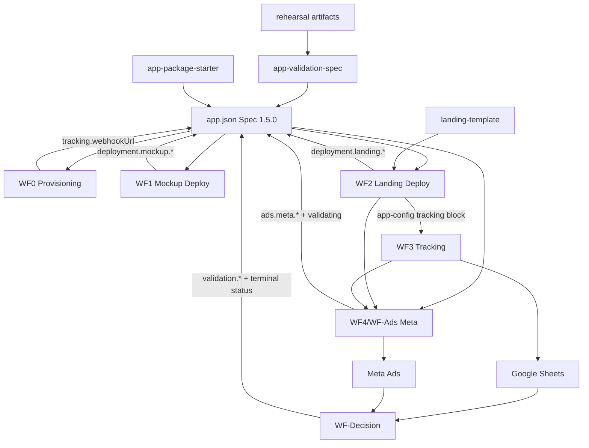

# WF1-WF4 Dependency Graph

## Workflow Graph



## Edge List

| From | To | Dependency |
|------|----|------------|
| `app-validation-spec` | `app.json` | Defines schema and field meanings |
| `app-package-starter` | New app packages | Provides initial `app.json` scaffold |
| WF0 | WF1/WF2/WF3 | Provisions `tracking.webhookUrl` and `status: ready` |
| WF1 | WF2 | Provides `deployment.mockup.url` / `mockup.previewUrl` |
| WF2 | WF3 | Embeds `tracking.webhookUrl` and analytics IDs in landing app-config |
| WF3 | WF-Ads | Must prove event capture before paid traffic |
| WF3 | WF-Decision | Provides conversion rows in Google Sheets |
| WF-Ads | WF-Decision | Provides spend/click metrics and `ads.meta.*` IDs |
| WF-Decision | `app.json` | Writes `validation.*` and terminal root `status` |
| `landing-template/lib/tracking.ts` | WF3 n8n mapping | Defines payload fields and Sheet row order (production sync pending Spec 1.5.0) |
| Sandbox landing attribution | WF3 Sheet rows | Persists UTMs + `fbclid`; generates `eventId` per event |
| WF3 n8n Map To Sheet Row | Google Sheets | Always sets `receivedAt`; fallback `eventId` / `consentStatus`; Meta columns blank until WF4 |
| WF4 / WF-Ads | Google Sheets Meta columns | Later populates `metaCampaignId`, `metaAdSetId`, `metaAdId`, `placement` |
| Google Sheets | WF-Decision | Raw v1 analytics store (33-column schema) |
| Rehearsal artifacts | Final Spec 1.5.0 update | Evidence for coordinated docs/schema/starter/workflow sync |

## Critical Path

```txt
WF0 webhook -> WF1 mockup URL -> WF2 landing URL + app-config -> WF3 Sheet rows (33 cols) -> WF4 dry-run/create-paused -> WF-Decision
```

## Current Blockers

- WF3 **local contract is frozen** (`EXTERNAL-SETUP-HANDOFF.md`); external proof is blocked on sandbox Sheet (33 headers) and n8n webhook values.
- WF4 live work is blocked on WF3 proof and current Meta API verification.
- Production `landing-template` attribution/`eventId` sync is deferred to Spec 1.5.0 (sandbox landing already updated).
- Final production update is blocked until WF3 proof and WF4 dry-run contract are reviewed.
