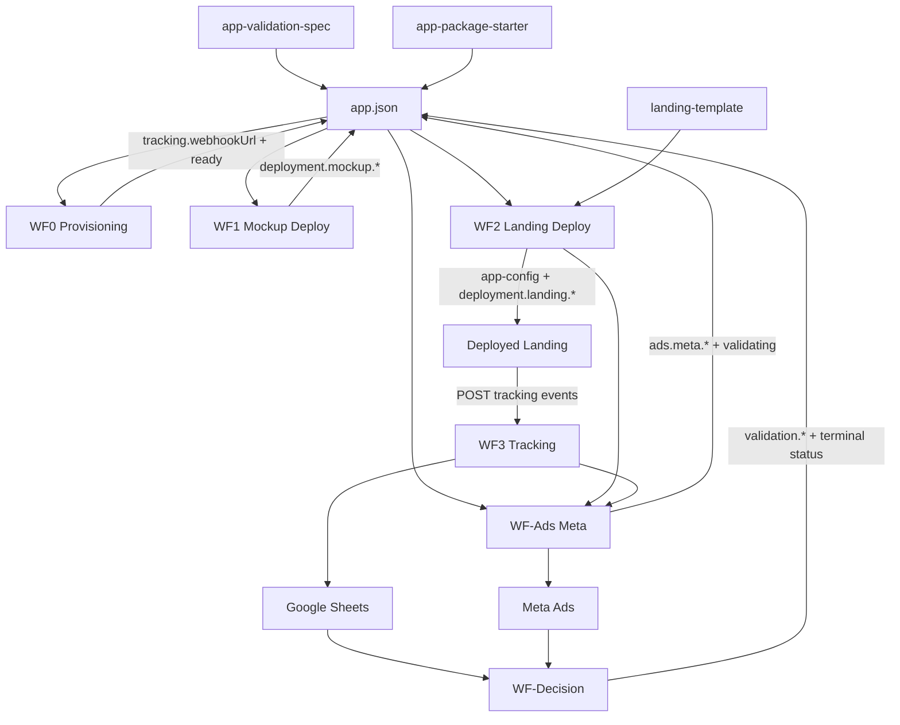

# Sandbox Master Backlog — Spec 1.5.0 Coordinated Update

**Status:** Sandbox coordination artifact  
**Scope:** WF3 implementation rehearsal and WF4 research/design  
**Rule:** Do not modify production docs, schemas, READMEs, `app-package-starter`, `landing-template`, `app-validation-spec`, workflow blueprints, or Spec 1.5.0 until the final coordinated update pass.

## Proven Behavior

- WF1 sandbox behavior is canonical: mockup deploy request, Vercel polling, public alias verification, iframe-safe URL, and merge-write field ownership are proven in rehearsal artifacts.
- WF2 sandbox behavior is canonical: local transform, build, runtime, app-config generation, landing deploy contract, and landing write-back fields are proven or in final external rehearsal.
- WF3 client-side tracking is implemented in the sandbox landing project pattern: `page_view`, `email_captured`, `buy_now_clicked`, and `mockup_interacted` payloads match the documented **33-column** Sheet contract (including `eventId`, persisted UTMs/`fbclid`, `consentStatus`; Meta columns blank until WF4).
- **WF3 event contract is frozen and ready for external implementation** (`rehearsals/wf3-human-lab-sandbox/EXTERNAL-SETUP-HANDOFF.md`). Local `wf3-rehearse.js` passes.
- Spec 1.5.0 already supports WF3 and WF4 v1 requirements through existing `tracking`, `analytics`, `ads`, `media`, `source`, `deployment`, `experiment`, and `validation` fields.

## Assumptions

- WF1 and WF2 remain architecturally canonical unless a critical defect is discovered.
- WF3 uses one unified n8n webhook receiver and one unified Google Sheet event log for v1.
- WF4 maps to the existing WF-Ads Meta and WF-Decision architecture; it remains dry-run/research until WF3 is proven.
- Secrets and platform-level IDs stay in n8n Credentials or Config Set nodes, not `app.json`.

## Master Backlog

| ID | Priority | Category | Affected repository/folder | Reason | Dependencies | Blocks implementation? | Classification |
|----|----------|----------|----------------------------|--------|--------------|-------------------------|----------------|
| BL-001 | P0 | WF3-PROOF | `rehearsals/wf3-human-lab-sandbox/` | ~~WF3 had no structured rehearsal artifact.~~ **Done** — contract frozen; handoff ready. | WF1/WF2 sandbox contracts | No (local) | Implementation task |
| BL-002 | P0 | WF3-PROOF | `rehearsals/wf3-human-lab-sandbox/scripts/wf3-rehearse.js` | ~~Local payload and Sheet-row validation needed.~~ **Done** — `wf3-rehearse.js` passes. | BL-001 | No (local) | Code update |
| BL-003 | P0 | EXTERNAL-SETUP | Sandbox Google Sheet | WF3 external proof requires a sandbox Sheet with canonical **33-column** headers. | Google SA Editor access | Yes | Manual setup |
| BL-004 | P0 | N8N-BUILD | Future `n8n-workflows/WF3-tracking.json` | WF3 blueprint exists, but no executable n8n receiver is exported. | BL-003, n8n builder | Yes | Workflow blueprint/update |
| BL-005 | P0 | N8N-BUILD | WF0 sandbox provisioning workflow | Sandbox `tracking.webhookUrl` is currently null; WF3 browser E2E depends on a provisioned webhook. | n8n webhook path decision | Yes | Workflow blueprint/update |
| BL-006 | P0 | WF3-PROOF | WF2 sandbox landing config/deploy | Browser E2E requires `tracking.webhookUrl` embedded in `app-config.json`. | BL-005, WF2 re-transform/redeploy approval | Yes | Implementation task |
| BL-007 | P0 | SHARED-LIB | n8n shared validation/map snippets | WF3 row mapping must stay in lockstep with landing `TrackingPayload`. | BL-002 | Yes | Reusable component |
| BL-008 | P1 | DOC-SYNC | `n8n-workflows/WF3-N8N-AI-PROMPT.md` | WF1/WF2 have n8n AI prompts; WF3 does not. | BL-004 design | No | n8n prompt update |
| BL-009 | P1 | DOC-SYNC | `PLATFORM_SETUP_VALUES.md` | Add sandbox Sheet setup, webhook, and WF3 proof status after rehearsal. | BL-003, BL-004 | No | Documentation update |
| BL-010 | P1 | SPEC-SYNC | `app-validation-spec/examples/full-app/app.json` | Align `tracking.events[]` examples to canonical event names only. | Final Spec update pass | No | Documentation/schema example update |
| BL-011 | P1 | SPEC-SYNC | `app-validation-spec/docs/validator-gate.md` and future validator CLI | Lifecycle gates require analytics/experiment fields at `provisioning`, but enforcement is not implemented. | Validator phase | No | Future implementation |
| BL-012 | P1 | DOC-SYNC | `AI_IMPLEMENTATION_GUIDE.md` | Current-state text is stale versus WF1/WF2 rehearsal and n8n blueprint status. | Final Spec update pass | No | Documentation update |
| BL-013 | P1 | SHARED-LIB | Shared Drive read/merge-write helper | WF0, WF1, WF2, WF-Ads, and WF-Decision need identical safe merge-write behavior. | n8n workflow builds | Yes for production | Reusable component |
| BL-014 | P1 | SHARED-LIB | Shared logging/error handling convention | All workflows need consistent execution evidence, retries, and alerts. | Error handler decision | Yes for production | Reusable component |
| BL-015 | P1 | WF4-RESEARCH | `rehearsals/wf4-meta-ads-sandbox/` | WF4 needs dry-run payloads, Meta prerequisites, and safety gates before live writes. | WF3 proof | No until WF3 proven | Research/design |
| BL-016 | P1 | WF4-RESEARCH | Future WF-Ads n8n workflow | Meta campaign creation must remain dry-run until WF3 is proven and user approves paused creation. | BL-015, Meta API verification | Yes for WF4 | Workflow blueprint/update |
| BL-017 | P1 | WF4-RESEARCH | Meta API verification docs | Meta objectives, permissions, Page/IG ownership, budget minimums, and special ad categories need current API confirmation. | Read-only Meta research | Yes for WF4 | Open question |
| BL-018 | P1 | SPEC-SYNC | `app.schema.json`, `APP_PACKAGE_SPEC.md`, starter/examples | Consider `ads.specialAdCategories` only if Meta verification shows it is required for safe v1. | BL-017 | Conditional | Schema update |
| BL-019 | P2 | SPEC-SYNC | `app.schema.json`, `APP_PACKAGE_SPEC.md` | Optional `tracking.lastEventAt` is mentioned as a future debug write-back but not in schema. | WF3 implementation decision | No | Future improvement |
| BL-020 | P2 | SPEC-SYNC | `ads.targeting`, future WF-Ads docs | Placements, optimization goals, and structured geo targeting may be needed beyond current v1 fields. | WF4 dry-run findings | No | Future improvement |
| BL-021 | P2 | DOC-SYNC | `landing-template/README.md` | Minor path/listing drift around `TrackingProvider` should be cleaned up later. | Final docs pass | No | Documentation update |
| BL-022 | P2 | STARTER-SYNC | `app-package-starter` and template examples | Ensure starter guidance includes WF3/WF4 setup expectations after proof. | Final docs pass | No | README/starter update |
| BL-023 | P2 | PROD-READINESS | `test-app-packages/human-lab/media/` | Production validation needs real media binaries for all `githubPath` refs. | Asset production | Yes for real traffic | Implementation task |
| BL-024 | P2 | SHARED-LIB | Shared Vercel helpers | WF1/WF2 can reuse deploy, poll, alias resolution, and public verification helpers. | WF1/WF2 build hardening | No for WF3 | Reusable component |
| BL-025 | P2 | SHARED-LIB | Shared Google Sheets helpers | WF3 append and WF-Decision read should share column constants and filter logic. | BL-002, BL-004 | Yes for analytics integrity | Reusable component |
| BL-026 | P2 | SHARED-LIB | Shared Meta Ads helpers | WF-Ads and WF-Decision need common Meta auth, request, status, and pause helpers. | BL-017 | Yes for WF4 | Reusable component |
| BL-027 | P0 | WF3-PROOF | `rehearsals/wf2-human-lab-sandbox/landing-project/` | ~~Sandbox landing must generate `eventId`, persist UTMs+`fbclid`, send `consentStatus`.~~ **Done** in sandbox landing libs. | BL-002 | No (code); Yes until webhook embedded for E2E | Code update |
| BL-028 | P1 | SPEC-SYNC | `landing-template/lib/tracking.ts` (+ session) | Sync sandbox attribution/`eventId`/`consentStatus` into production landing-template. | Spec 1.5.0 pass | No for sandbox | Code update |
| BL-029 | P1 | WF4-RESEARCH | WF3 Sheet Meta columns | `metaCampaignId`, `metaAdSetId`, `metaAdId`, `placement` reserved blank until WF4 populates. | WF3 proof, WF4 dry-run | No until WF4 | Research/design |
| BL-030 | P0 | DOC-SYNC | `rehearsals/wf3-human-lab-sandbox/EXTERNAL-SETUP-HANDOFF.md` | ~~Web AI needs final 33-col Sheet + n8n handoff.~~ **Done** — frozen handoff A–E. | BL-002, BL-003 | No (docs); BL-003 still blocks external proof | Documentation update |

## Rehearsal Deliverables Template

Every workflow rehearsal must produce:

- Rehearsal folder.
- Execution log.
- Gap analysis.
- Proven behavior.
- Remaining blockers.
- Exact n8n node list.
- External setup instructions.
- Cursor tasks.
- Web AI tasks.
- Production implementation checklist.

## Dependency Graph



## Implementation Order

1. Create and use `rehearsals/SANDBOX-MASTER-BACKLOG.md` as the coordination surface.
2. Create `rehearsals/wf3-human-lab-sandbox/` and prove local payload/row mapping.
3. Prepare sandbox Google Sheet headers and n8n WF3 node plan.
4. Provision or stub sandbox `tracking.webhookUrl`, then re-embed it into the WF2 sandbox landing.
5. Run external WF3 curl/browser tests only after sandbox webhook and Sheet values are available.
6. Keep WF4 in dry-run research and payload design until WF3 produces Sheet-row evidence.
7. Apply one final coordinated Spec 1.5.0 update across docs, starter, schema examples, workflow prompts, and shared component guidance.

## Manual Setup Guide

### WF3

Return these values to Cursor before external tests:

```yaml
GOOGLE_SHEET_ID_SANDBOX: "<spreadsheet-id>"
GOOGLE_SHEET_TAB_NAME: "Sheet1"
GOOGLE_SHEET_URL: "https://docs.google.com/spreadsheets/d/<spreadsheet-id>/edit#gid=0"
GOOGLE_SHEET_COLUMN_COUNT: 33
GOOGLE_SERVICE_ACCOUNT_EMAIL: "app-validation-sa@app-validation-501106.iam.gserviceaccount.com"
N8N_CREDENTIAL_GOOGLE_SA_LABEL: "Google Service Account"
N8N_BASE_URL: "https://scooter.app.n8n.cloud"
WF3_WEBHOOK_URL_SANDBOX: "https://scooter.app.n8n.cloud/webhook/app-validation/human-lab-wf1-sandbox-events"
WF3_WEBHOOK_AUTH_SECRET: null
SANDBOX_APP_ID: "human-lab-wf1-sandbox"
SANDBOX_EXPERIMENT_RUN_ID: "run_human-lab_2026q2_001"
SANDBOX_LANDING_URL: "https://human-lab-wf2-sandbox.vercel.app"
WF3_WORKFLOW_NAME: "WF3 - Tracking Sandbox"
WF3_WORKFLOW_ACTIVE: true
ALERT_WEBHOOK_URL: null
```

Canonical handoff: `rehearsals/wf3-human-lab-sandbox/EXTERNAL-SETUP-HANDOFF.md`.

### WF4

Return read-only Meta context only:

```yaml
META_BUSINESS_MANAGER_ID: "<read-only or sandbox>"
META_AD_ACCOUNT_ID: "<read-only or sandbox>"
META_PAGE_ID: "<page allowed for ad creation>"
META_INSTAGRAM_ACTOR_ID: "<optional>"
DEFAULT_DAILY_BUDGET_CAP: "<amount>"
SPECIAL_AD_CATEGORY_DECISION: "<NONE or required category>"
```

Do not return access tokens or secrets in files.

## External Setup Guide

- Create sandbox Google Sheet named `App Validation - WF3 Sandbox`.
- Use tab `Sheet1`.
- Add the **33** canonical WF3 headers in row 1 (see `EXTERNAL-SETUP-HANDOFF.md`).
- Share the sheet with the Google service account as Editor.
- Build WF3 n8n workflow from `EXTERNAL-SETUP-HANDOFF.md` (includes Route Valid Events IF).
- Do not send live webhook POSTs until the sandbox Sheet ID and webhook URL are confirmed.
- Inspect Meta account/Page/ad account ownership read-only for WF4; do not create ads.

## Reusable Components Registry

| Component | Shared by | Notes |
|-----------|-----------|-------|
| Common validation | WF0, WF1, WF2, WF3, WF-Ads, WF-Decision | Validate status, required fields, payloads, and lifecycle gates. |
| Common merge-write logic | WF0, WF1, WF2, WF-Ads, WF-Decision | Read full `app.json`, patch owned keys only, preserve author content. |
| Common logging | All workflows | Structured execution logs with appId, workflow, phase, external IDs, and retry context. |
| Common error handling | All workflows | Retry transient errors, alert on persistent failure, preserve recoverable state. |
| Common status handling | WF0, WF-Ads, WF-Decision | Enforce canonical lifecycle transitions only. |
| Common `app.json` parsing | All Drive-backed workflows | Parse, validate `specVersion`, check folder/appId match. |
| Common HTTP helpers | WF1, WF2, WF3, WF-Ads, WF-Decision | Standard headers, timeout, retry, response normalization. |
| Common Google Drive helpers | WF0, WF1, WF2, WF-Ads, WF-Decision | Read, merge-write, backup previous value metadata. |
| Common Google Sheets helpers | WF3, WF-Decision | Canonical columns, append rows, filter by app/run/event. |
| Common Vercel helpers | WF1, WF2 | Deploy, poll, alias resolve, public/iframe verification. |
| Common Meta Ads helpers | WF-Ads, WF-Decision | Dry-run bundle, create paused entities, insights read, pause-on-kill. |

## Production Readiness Checklist

- [ ] WF0 webhook provisioning proven in sandbox.
- [ ] WF1/WF2 canonical sandbox behavior preserved.
- [x] WF3 local rehearsal passes (contract frozen).
- [ ] WF3 sandbox external rehearsal passes for all four events.
- [ ] Google Sheet rows match canonical **33-column** order.
- [ ] WF4 dry-run payloads verified against current Meta API docs.
- [ ] No production assets modified during rehearsal.
- [ ] No secrets committed or stored in `app.json`.
- [ ] Final Spec 1.5.0 coordinated update plan reviewed.
- [ ] Shared component recommendations captured before production workflow builds.
